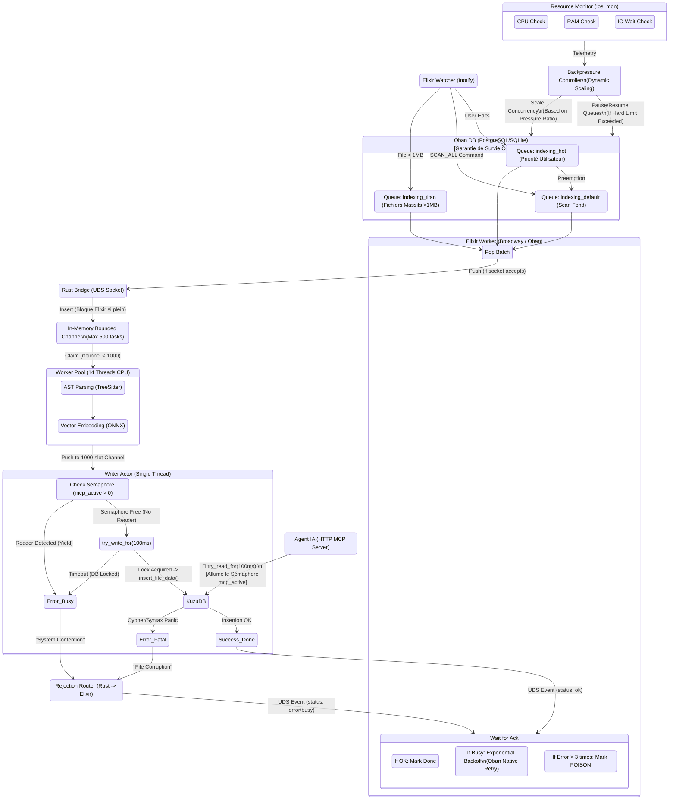

# Architecture V2.1 : Native Backpressure & Traffic Shaping (TOC)

Ce diagramme décrit la mécanique "Mission-Critical" finale du flux de données Axon. Il prend en compte l'élimination de la double-persistance (le SQLite de Rust est supprimé) au profit d'une "Backpressure Naturelle" TCP/UDS gérée nativement par Elixir et Oban (qui garantit la survie aux crashs). Il intègre également les limites matérielles (CPU/RAM/IO) et le circuit breaker dynamique.

### Principes Architecturaux Clefs (TOC & BEAM)

1. **Éradication de la Double Persistance :** Rust est devenu un moteur "Stateless" pur calcul. La file d'attente sur disque n'existe que dans le Control Plane Elixir (Oban). Si l'OS crashe, Oban relancera automatiquement les travaux interrompus au redémarrage de la machine.
2. **Backpressure Naturelle (UDS) :** Si la base de Graphe bloque, les 14 Workers s'arrêtent, le canal en mémoire (`RAMQueue`) se remplit, et le socket Unix (UDS) arrête de lire. Elixir est contraint de ralentir naturellement son émission de tâches sans saturer la RAM.
3. **Traffic Shaping (Priorité au Read) :** La ligne de vie de l'IA (Agent) coupe systématiquement la route à l'indexation. Si `mcp_active` est allumé, le Writer Rust renvoie `Error_Busy`.
4. **Smart Retry externalisé :** C'est Oban (Elixir) qui gère l'Exponential Backoff. Un fichier ralenti par le trafic retournera dans la base SQL avec un délai mathématique avant sa prochaine tentative, garantissant la dilution parfaite de la charge au fil du temps. Les erreurs fatales (Corruptions) seront classées en POISON par le Dashboard Elixir.
5. **Circuit Breaker Dynamique (Hardware limits) :** Un `ResourceMonitor` OS-level scrute la RAM, le CPU et l'I/O Wait. Si les limites matérielles (ex: 70% RAM) sont atteintes, le `BackpressureController` ordonne à Oban de suspendre les envois ou de réduire l'échelle de concurrence pour éviter un crash OOM Linux.
6. **Titan Mode :** Les fichiers monstrueux (>1MB) sont déviés vers la file isolée `indexing_titan` (à concurrence unitaire) pour éviter la famine des threads CPU Rust sur les petits fichiers de la `indexing_hot`.