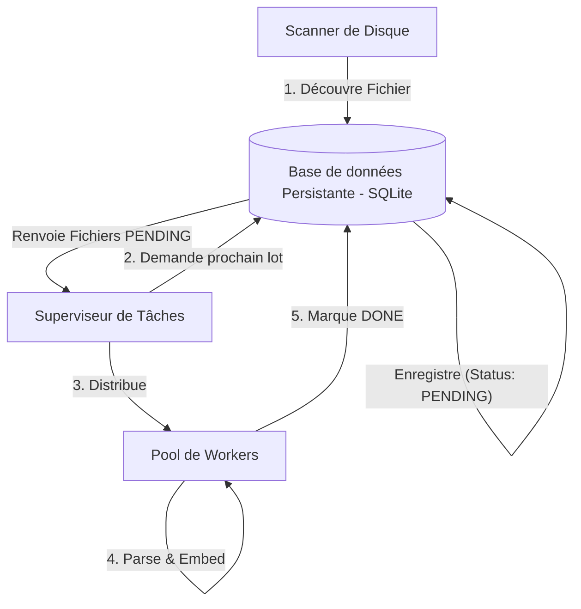
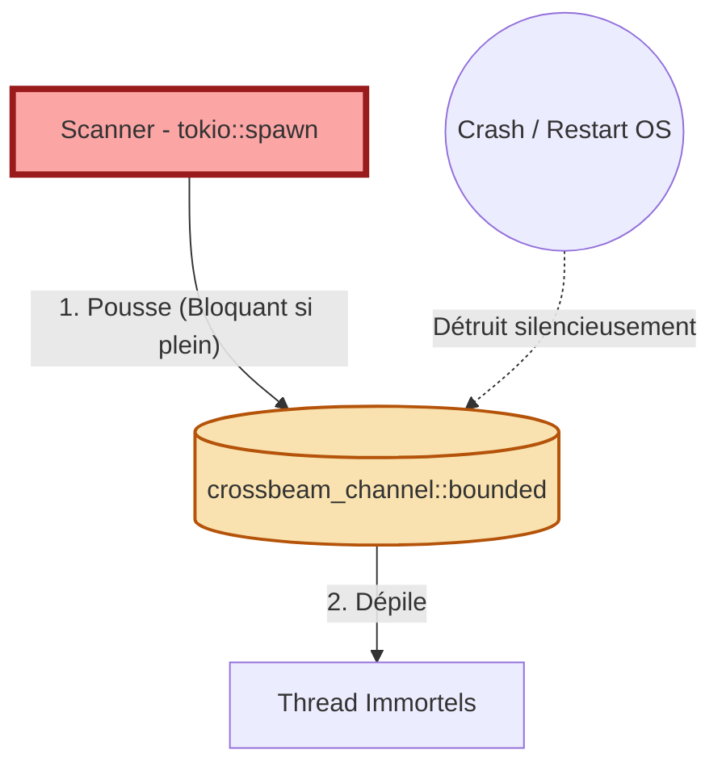

# System Observability Tracer : Analyse de la File d'Attente (Ingestion Queue)

**Niveau d'Analyse : Tier 2 (Meso - State Persistence Boundaries)**

Ce document applique la méthodologie du `system-observability-tracer` pour diagnostiquer et résoudre le problème de "fuite d'attente" (perte de contexte lors du scan de 35 000 fichiers) au sein du moteur Axon.

## Phase 1 : La Théorie (Architectural Intent)

Dans une architecture résiliente, le processus de découverte des fichiers (Scanner) doit être découplé du processus de traitement lourd (Workers). L'état d'avancement doit être conservé en dur pour survivre à tout arrêt inopiné (OOM, redémarrage).

## Phase 2 : La Réalité (Code Audit)

Le code actuel contourne la persistance pour des raisons de facilité d'implémentation initiale, créant un goulot d'étranglement purement en mémoire vive (RAM).

## Phase 3 : Delta Diagnostics & Remediation

### Les Deltas (Friction Structurelle)
1. **Vulnérabilité d'État (Danger) :** Le canal `crossbeam` réside à 100% en RAM. Si le scanner trouve 35 000 fichiers, il remplit la limite de 10 000. S'il y a une micro-coupure, les 10 000 fichiers dans le tuyau et les 25 000 autres non encore poussés sont "oubliés". C'est l'origine exacte du symptôme de "Cliché incomplet".
2. **Couplage Temporel (Critical) :** Le Scanner est couplé temporellement à la vitesse des workers. Si les workers sont lents (calcul d'embeddings), le scanner est bloqué et ne peut pas finir de lister les fichiers.

### Stratégie de Remédiation (Refactoring SQLite)
Pour respecter les contraintes industrielles (zéro perte, RAM plafonnée à 16Go), nous devons implémenter le pattern **Persistent Work Queue** :

1. **Coupling Reduction :**
   - Création d'une base de données SQLite locale (`.axon/run/tasks.db`).
   - Le Scanner ne poussera plus dans `crossbeam_channel`, mais fera des `INSERT INTO queue (path, status) VALUES (?, 'PENDING')`. Il pourra ainsi lister 35 000 fichiers en 2 secondes, libérant le thread de scan.
2. **Execution Guards :**
   - Remplacement de l'attente sur le channel par un *Polling* intelligent. Les workers interrogeront SQLite (`SELECT path FROM queue WHERE status = 'PENDING' LIMIT 1`), traiteront le fichier, puis feront un `UPDATE queue SET status = 'DONE'`.
3. **Telemetry Placement :**
   - Ajout d'une sonde `tracing::info_span!("sqlite_insert_batch")` dans le Scanner pour tracer la vitesse de découverte.
   - Ajout d'une sonde `tracing::info_span!("sqlite_fetch_task")` dans les workers.
