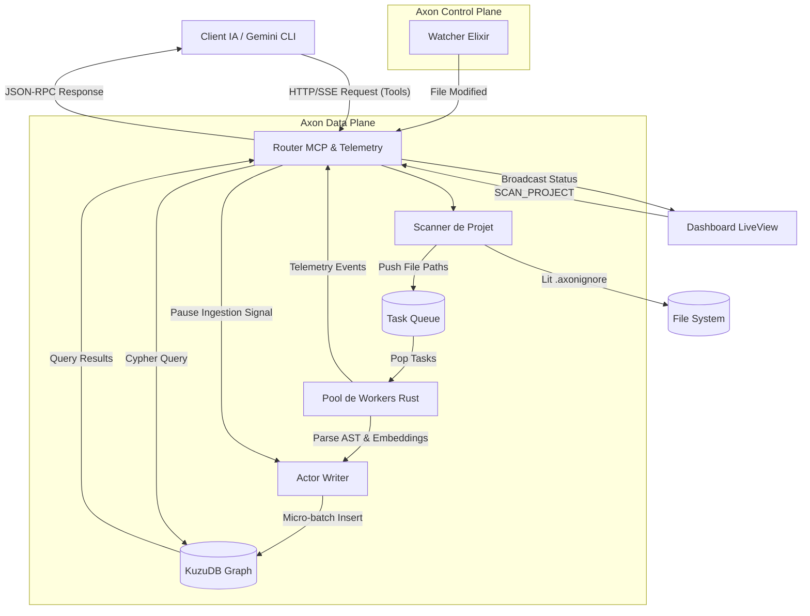

# Analyse Macro-Architecturale : Le Cycle de Vie Axon

Ce document présente la modélisation des flux de données et de contrôle du système Axon, de l'activation (démarrage) jusqu'à la réponse aux requêtes IA/Dashboard. Il expose la différence entre la théorie architecturale (ce qui a été documenté) et la réalité du code actuel.

## 1. Version 1 : La Théorie (Documentation & Design Initial)

Ce diagramme représente la vision idéale d'Axon, telle que pensée lors des spécifications initiales : un système fluide, hautement asynchrone, où l'ingestion et le requêtage cohabitent sans friction.



---

## 2. Version 2 : La Réalité du Code (Audit Actuel)

Ce diagramme expose comment le code actuel (Rust) se comporte *réellement* sous le capot. Il met en évidence les goulets d'étranglement structurels (Deadlocks) et les raccourcis pris par rapport au design initial.

```mermaid
graph TD
    %% Entités Externes
    Client[Client IA / Gemini CLI]
    Dash[Dashboard LiveView]
    FS[(File System)]

    %% Composants Axon
    subgraph Axon Data Plane (main.rs)
        Router[HTTP/SSE & Unix Socket Listener]
        Flag((mcp_active_flag))
        
        subgraph Ingestion Pipeline
            Scanner[tokio::spawn - Scanner]
            MemQueue[(Bounded Channel MPSC)]
            Workers[8 Threads Immortels]
            WriterActor[Writer Thread]
            RwLock{RwLock<GraphStore>}
        end
    end
    DB[(KuzuDB)]

    %% Flux d'Ingestion
    Dash -- "SCAN_ALL / SCAN_PROJECT" --> Router
    Router --> Scanner
    Scanner -- "Bloque si plein" --> MemQueue
    MemQueue --> Workers
    Workers -- "Parse & Embed" --> WriterActor
    
    %% LA ZONE DE CONFLIT (DEADLOCK)
    WriterActor -- "1. Vérifie" --> Flag
    WriterActor -- "2. Tente d'écrire" --> RwLock
    RwLock -- "Write Transaction" --> DB

    %% Flux de Requêtage IA
    Client -- "POST /mcp" --> Router
    Router -- "A. Set = True" --> Flag
    Router -- "B. tokio::spawn_blocking" --> QueryTask[Thread de Requête]
    QueryTask -- "C. Tente de lire" --> RwLock
    RwLock -- "Read Query" --> DB
    QueryTask --> Router
    Router -- "D. Set = False" --> Flag

    classDef danger fill:#f9e2af,stroke:#b45309,stroke-width:2px;
    classDef critical fill:#fca5a5,stroke:#991b1b,stroke-width:4px;
    
    class RwLock critical;
    class Flag danger;
    class MemQueue danger;
```

---

## 3. Analyse des Deltas et Explication des Pannes

La comparaison entre la **V1 (Théorie)** et la **V2 (Réalité)** met en lumière trois failles critiques dans l'implémentation actuelle, qui expliquent les instabilités ("Not connected", "OOM", etc.) :

### A. La Faille du "Deadlock Asynchrone" (Le Croisement Flag/RwLock)
* **Théorie :** L'IA demande une pause, le Writer s'arrête, l'IA interroge la base.
* **Réalité :** C'est une "Race Condition" (Course critique). 
  1. Le `WriterActor` prend le `RwLock` en écriture pour insérer un fichier lourd (ce qui prend du temps).
  2. *Pendant ce temps*, l'IA envoie une requête. Le `Router` passe le `mcp_active_flag` à TRUE, puis demande le `RwLock` en lecture.
  3. Le `Router` est bloqué (il attend que l'écriture se termine).
  4. Le `WriterActor` termine son écriture, relâche le lock, boucle, et voit le `mcp_active_flag` à TRUE. Il se met donc en pause infinie.
  5. **Résultat : DEADLOCK.** Le Router attend la DB, mais la DB est freezée. Le client Gemini "timeout" et affiche *Not connected*.

### B. La Vulnérabilité de la File d'Attente (MemQueue)
* **Théorie :** Une `Task Queue` robuste gère les milliers de fichiers à scanner sans perte.
* **Réalité :** Le code utilise un `crossbeam_channel::bounded` entièrement en RAM.
  * Si l'application crashe (ex: OOM, Deadlock, coupure), tous les fichiers en attente dans la RAM sont **définitivement perdus**. Au redémarrage, le système croit avoir fini alors qu'il n'a indexé que ce qu'il a pu avant le crash. C'est la cause racine de la "Fuite d'attente" et du cliché incomplet.

### C. L'Absence Totale d'Observabilité
* **Théorie :** Le système sait ce qu'il fait et remonte ses erreurs.
* **Réalité :** Les threads `Worker`, `Scanner` et `WriterActor` opèrent "en silence". S'ils sont coincés sur un `RwLock`, aucune ligne de log ne prévient l'administrateur. Le Dashboard affiche "🟢 Running" parce que le processus OS existe, mais à l'intérieur, le système est dans le coma.

---

## 4. Conclusion Stratégique
L'implémentation de la **Télémétrie Tracée (Observabilité)** et de **Files d'attente Persistantes (SQLite)** avant toute autre fonctionnalité métier n'est pas une option, c'est une urgence vitale. Le code actuel "marche par chance" lorsque le timing des requêtes IA ne tombe pas exactement pendant une transaction d'écriture lourde.
