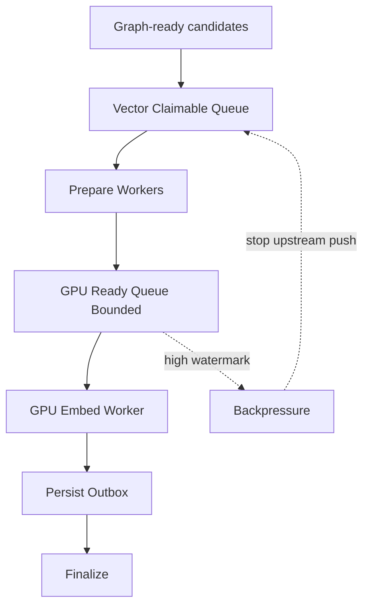

# Vector GPU Big-Bang Push/Backpressure Design

**Status:** Validated for planning

**Goal:** Replace the current wave-based vector refill flow with a single continuous push pipeline that keeps the GPU fed through bounded backpressure instead of local refill heuristics.

## Context

The current vector lane can produce strong initial bursts, then collapse into long starvation periods even while the global backlog remains large. The root architectural issue is not the GPU oven itself. The starvation is created upstream, before the prepare path, because the runtime:

- reasons from an aggregated backlog that mixes claimable work with non-claimable work,
- builds local refill waves in the GPU worker instead of sustaining a continuous producer,
- lets the prepare path behave like a passive consumer of sporadic dispatches rather than a continuously fed stage.

This design adopts a **big-bang** migration. The old refill model is removed rather than kept in compatibility mode.

## Theory

## Design Principles

1. The GPU worker must stop acting as its own refill orchestrator.
2. The prepare stage must be fed continuously while the ready queue is below target.
3. Backpressure must be applied at the GPU-ready queue boundary, not through indirect graph/vector priority heuristics.
4. Operational state must distinguish:
   - claimable vector backlog,
   - prepare inflight,
   - ready queue,
   - persist/outbox.
5. VRAM safety remains mandatory:
   - budget `7000 MB`
   - admission `6300 MB`
   - current safe token target baseline `16000`

## Target Architecture

### 1. Claimable Vector Backlog as a First-Class Boundary

The system must stop using a single aggregate `file_backlog_depth` as the main control input for the GPU lane. The control loop needs a backlog boundary that answers one question only:

> How much work is immediately claimable for vector preparation?

Queued vector work, inflight vector work, and persist/outbox work are different physical states and cannot be treated as interchangeable supply.

### 2. Dedicated Upstream Producer

The lane needs one producer responsibility:

- claim claimable vector work,
- feed prepare requests continuously,
- stop only when backpressure is asserted.

This producer can live in the vector lane, but it must be a distinct control responsibility from GPU consumption. The worker that consumes `ready` batches should no longer also be the primary owner of refill reconstruction.

### 3. Prepare as Continuous Transformer

Prepare workers remain responsible for:

- fetching unembedded chunks,
- forming batches,
- pre-tokenizing and splitting micro-batches,
- pushing directly into the shared GPU-ready queue.

They should not depend on one-shot refill waves to stay busy.

### 4. Shared GPU-Ready Queue as the Control Surface

The shared ready queue becomes the real near-GPU stock:

- below `low watermark`: producer pushes aggressively,
- between `low` and `high`: producer continues normally,
- at `high`: producer blocks or stops claiming more work.

This queue becomes the canonical backpressure boundary for the vector lane.

### 5. GPU Worker Reduced to Admission + Consumption

The GPU worker should become simpler:

- check VRAM admission guard,
- pop from ready queue,
- embed,
- hand off to persist,
- repeat.

It should not be responsible for rebuilding a file-level working set during normal operation.

### 6. Persist/Finalize Remain Downstream

Persist and finalize stay asynchronous and downstream. They must not be counted as upstream supply for GPU refill decisions.

## Reality-to-Theory Delta

### Delta A: Aggregated backlog hides starvation

Current control mixes queued, inflight, and outbox states. That allows the system to believe supply is healthy when the claimable queue is actually dry.

### Delta B: Refill is wave-based

Current refill is driven from a local `active_works` reservoir that is claimed, partially topped up, then drained. That creates bursts followed by starvation.

### Delta C: Prepare is passive

Prepare workers only work when the GPU-side loop emits requests. They are not the bottleneck by themselves; they are underfed.

### Delta D: Backpressure is indirect

The runtime tries to regulate through scheduler policy and local refill targets instead of a direct “ready queue full / not full” contract.

## Big-Bang Migration Rules

1. Remove the old local refill model. Do not leave dual control paths alive.
2. Remove control decisions that use aggregated backlog as a proxy for claimable supply.
3. Keep the existing VRAM guards intact during the migration.
4. Preserve lease correctness and failure recovery semantics before performance tuning.

## Acceptance Criteria

The migration is successful only if all of the following become true:

1. The vector lane no longer exhibits a single strong burst followed by long starvation while claimable work exists.
2. The shared ready queue becomes a stable bounded stock rather than an occasional burst artifact.
3. Prepare workers become visibly and consistently active when ready depth is below target.
4. The GPU worker no longer owns the main refill loop.
5. No run exceeding the accepted benchmark profile violates the VRAM budget.

## Non-Goals

- No new telemetry in this migration phase.
- No bucketed stock strategy in this phase.
- No adaptive batch-size controller redesign in this phase.

