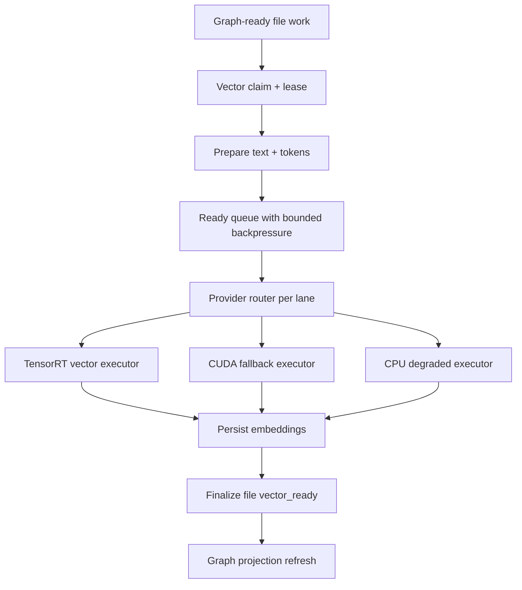
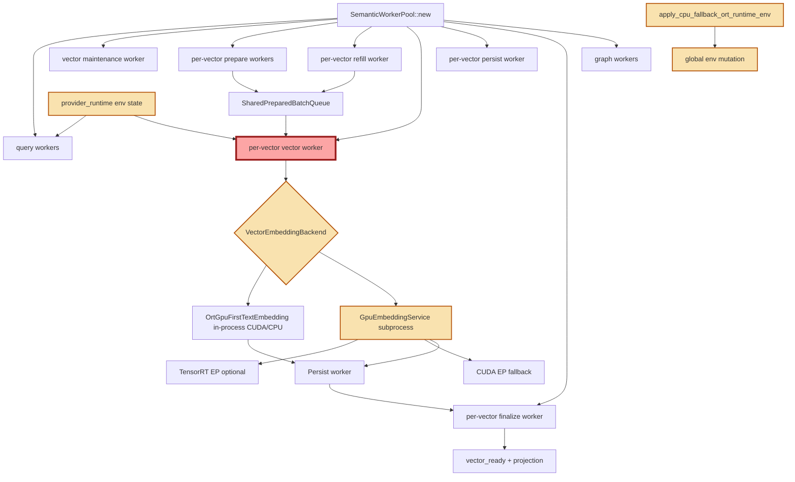

# TensorRT-Ready Vector Pipeline Redesign Implementation Plan

> **For Claude:** REQUIRED SUB-SKILL: Use superpowers:executing-plans to implement this plan task-by-task.

**Goal:** Make Axon's vectorization pipeline clean, observable, and TensorRT-ready before promoting TensorRT as the central semantic acceleration path.

**Architecture:** TensorRT must become an explicit vector execution strategy inside a stable lane contract, not a secondary flag hidden behind the GPU subprocess path. The redesign separates provider authority, lane orchestration, fallback semantics, and stage telemetry before the hard-cut TensorRT qualification.

**Tech Stack:** Rust, ONNX Runtime, TensorRT Execution Provider, CUDA Execution Provider, fastembed/tokenizers, crossbeam channels, Axon MCP/SOLL, Nix artifact manifests.

---

## Skills Applied

- `axon-engineering-protocol`: MCP-first truth, SOLL mutation, validation and commit discipline.
- `mission-critical-architect`: theory/reality flow comparison, backpressure, blast radius, contention and degradation analysis.
- `hardware-aware-scaling`: hardware/profile-driven GPU, VRAM, fallback and batch-size behavior.
- `writing-plans`: small delivery slices, exact files, test gates and frequent commits.

## External Build References

- ONNX Runtime build documentation requires TensorRT to be supplied as `--tensorrt_home` and states that ORT uses the TensorRT built-in parser from that home by default in build-script mode.
- NVIDIA TensorRT 10.14.1 tarball documentation defines the expected extracted layout: `bin`, `include`, `lib`, `python`, `targets`.
- ONNX Runtime TensorRT EP documentation recommends timing/engine caches because first TensorRT engine creation can take minutes; Axon qualification must enable and observe those caches before promotion.

## Two-Lane Purity Contract

Axon has one ingestion/control substrate and two production lanes:

- **Graph lane:** persisted file work becomes graph-ready structural truth.
- **Vector lane:** graph-ready work becomes vector-ready semantic acceleration.

The query embedding worker, TensorRT GPU service, provider diagnostics, queue maintenance, admission controller and optimizer are not product lanes. They are support components. They must not create extra runtime topology concepts, extra public modes, or hidden lane authorities.

Current purity verdict:

- **Pure enough to preserve:** `RuntimePriorityContractState` already orders `graphing_after_enqueue` before `vectorization_after_graph_ready`; `GraphStore` remains the shared persistence boundary; `SharedPreparedBatchQueue` and vector batch lanes are internal vector scheduling, not product lanes.
- **Impure and must be corrected in this redesign:** `EmbeddingLaneConfig` currently mixes query, vector and graph worker sizing; `SemanticWorkerPool::new` still advertises a "split semantic runtime"; provider state is process-global and environment-backed; CPU fallback mutates graph/vector sizing variables; optimizer policy mutates vector-side controls without a lane-scoped provider contract.
- **Rule for this phase:** no refactor may introduce a third production lane. If a component needs a name, use `GraphLane`, `VectorLane`, or a support role such as `QuerySupport`, `VectorExecutor`, `ProviderResolver`, `AdmissionController`, or `TelemetryReporter`.

## Phase 1: Theory

Ideal TensorRT-ready flow:



Expected properties:

- Provider state is lane-scoped and authoritative.
- TensorRT/CUDA/CPU paths share one executor contract.
- Fallback is explicit, observable and does not silently mutate global runtime sizing.
- Every stage emits latency, queue depth, throughput and failure reason metrics.
- Backpressure is bounded at prepare, ready, persist and finalize boundaries.

## Phase 2: Reality

Current physical execution:



## Delta Diagnostics

- **Provider authority is not clean enough.** Query, vector and GPU service paths publish overlapping provider state through environment-backed global state. This can blur whether CUDA, TensorRT service, CPU fallback or unavailable state is authoritative.
- **TensorRT is not central yet.** TensorRT is only preferred inside the GPU service provider list; the in-process vector path remains CUDA/CPU.
- **TensorRT artifact build must use the built-in parser.** ONNX Runtime 1.24.4 defaults `onnxruntime_USE_TENSORRT_BUILTIN_PARSER` to `OFF`; leaving it unset triggers `onnx-tensorrt` FetchContent and can fail late under Nix with `FETCHCONTENT_FULLY_DISCONNECTED` or `TENSORRT_LIBRARY_INFER-NOTFOUND`. Axon must force the built-in parser and validate `NvInfer`/`NvOnnxParser` headers and libs before the long ORT build.
- **Fallback mutates global sizing.** CPU fallback can rewrite worker and batch sizing environment variables after runtime startup, which is not a reliable lane reconfiguration boundary.
- **Orchestration remains monolithic.** `embedder.rs` still owns pool construction, refill, vector execution, prepare, persist, finalize, provider construction, fallback, restart and tests.
- **Observability is rich but not contract-shaped.** Metrics exist, but TensorRT qualification needs a stable stage report: prepare, ready wait, TensorRT build/cache, inference, extraction, persist, finalize, recycle, fallback.
- **Backpressure exists but is hard to reason about.** Prepare, ready, persist and finalize are bounded, but the decision model is distributed across `embedder.rs`, `vector_control`, `vector_pipeline`, and `gpu_policy`.

## Task 1: Freeze Provider Contract

**Files:**
- Create: `src/axon-core/src/embedder/provider_contract.rs`
- Modify: `src/axon-core/src/embedder.rs`
- Modify: `src/axon-core/src/embedder/provider_runtime.rs`
- Test: `src/axon-core/src/embedder.rs`

**Steps:**

1. Add `ProductionLane` enum with only `Graph` and `Vector`.
2. Add support-role enum for non-lane participants: `QuerySupport`, `VectorGpuService`, `ProviderResolver`, `TelemetryReporter`.
3. Add `ProviderStrategy` enum: `Cpu`, `Cuda`, `TensorRt`, `Unavailable`.
4. Add `ProviderResolution` struct with requested/effective strategy, production lane when applicable, support role when not applicable, reason, artifact manifest, provider libraries and fallback origin.
5. Route provider diagnostics through `ProviderResolution` instead of free string labels.
6. Keep compatibility labels until MCP/live consumers are updated.
7. Add tests for TensorRT service, CUDA fallback and CPU missing provider cases.
8. Rename runtime/operator strings that imply obsolete topology (`split semantic runtime`) to role-based wording.

**Gate:**

```bash
cargo test --manifest-path src/axon-core/Cargo.toml embedding_provider --lib
```

## Task 2: Make Fallback Transactional

**Files:**
- Modify: `src/axon-core/src/embedder.rs`
- Modify: `src/axon-core/src/runtime_profile.rs`
- Test: `src/axon-core/src/embedder.rs`

**Steps:**

1. Replace direct global env mutation in `apply_cpu_fallback_ort_runtime_env` with a returned `FallbackAdjustment`.
2. Record whether adjustment is advisory or applied-before-pool-start.
3. Prevent fallback from pretending to resize already-spawned graph or vector workers.
4. Expose fallback adjustment in provider diagnostics.
5. Add tests proving worker count is not silently considered resized after pool startup.
6. Keep fallback scoped to the vector provider path unless it is explicitly applied before both graph and vector lanes are started.

**Gate:**

```bash
cargo test --manifest-path src/axon-core/Cargo.toml cpu_fallback --lib
```

## Task 3: Extract Vector Orchestrator

**Files:**
- Create: `src/axon-core/src/embedder/vector_orchestrator.rs`
- Modify: `src/axon-core/src/embedder.rs`
- Test: `src/axon-core/src/embedder.rs`

**Steps:**

1. Move `VectorRefillProducerState`, `VectorRefillCommand`, liveness guards and vector loop helpers into `vector_orchestrator.rs`.
2. Keep public behavior unchanged.
3. Preserve existing tests; move only if necessary.
4. Commit after compile and targeted loop tests pass.
5. Keep graph-lane code out of the vector orchestrator except for the explicit `graph_ready -> vector_ready` source boundary.

**Gate:**

```bash
cargo test --manifest-path src/axon-core/Cargo.toml vector_refill_ownership --lib
cargo test --manifest-path src/axon-core/Cargo.toml gpu_worker_consumption --lib
```

## Task 4: Normalize Executor Boundary

**Files:**
- Create: `src/axon-core/src/embedder/vector_executor.rs`
- Modify: `src/axon-core/src/embedder.rs`
- Modify: `src/axon-core/src/embedder/gpu_backend.rs`
- Test: `src/axon-core/src/embedder.rs`

**Steps:**

1. Define one `VectorExecutor` trait or enum facade for `embed_prepared_batch_with_breakdown`.
2. Make TensorRT, CUDA service, CUDA in-process and CPU in-process variants explicit.
3. Ensure all variants return the same breakdown fields and fallback reason fields.
4. Keep subprocess isolation for TensorRT unless benchmark evidence proves in-process is safe.
5. Ensure TensorRT is modeled as a vector executor strategy, not as its own lane.

**Gate:**

```bash
cargo test --manifest-path src/axon-core/Cargo.toml test_gpu_service_provider_effective_label_tracks_tensorrt_toggle --lib
cargo test --manifest-path src/axon-core/Cargo.toml test_request_query_embedding_round_trips_through_registered_worker --lib
```

## Task 5: TensorRT-Ready Telemetry Contract

**Files:**
- Modify: `src/axon-core/src/service_guard.rs`
- Modify: `src/axon-core/src/embedder.rs`
- Modify: `src/axon-core/src/mcp/tools_framework_runtime_status.rs`
- Test: `src/axon-core/src/mcp/tests/runtime_surface.rs`

**Steps:**

1. Add stable stage metrics: prepare_ms, ready_wait_ms, inference_ms, output_extract_ms, persist_ms, finalize_ms.
2. Add provider metrics: strategy, fallback_count, TensorRT cache_dir, TensorRT engine_cache_hit if available, recycle_count, provider_init_error.
3. Expose compact runtime status fields optimized for LLM clients.
4. Add tests locking the public MCP shape.

**Gate:**

```bash
cargo test --manifest-path src/axon-core/Cargo.toml runtime_surface --lib
```

## Task 6: TensorRT Qualification Harness

**Files:**
- Modify: `scripts/qualify-dev-indexer-tensorrt-cold.sh`
- Modify: `scripts/build-and-qualify-tensorrt-cold.sh`
- Modify: `scripts/measure_mcp_suite.py` if MCP quality metrics are added
- Test: script smoke runs after manifest exists

**Steps:**

1. Require manifest validation before runtime start.
2. Start indexer with TensorRT service explicitly enabled.
3. Capture provider diagnostics, stage metrics and MCP quality before/after indexing.
4. Compare CUDA vs TensorRT using the same workload and token/batch profile.
5. Attach results to `REQ-AXO-025` and `REQ-AXO-031`.

**Gate:**

```bash
bash scripts/qualify-dev-indexer-tensorrt-cold.sh --duration 120 --interval 5 --label tensorrt-hard-cut
```

## Task 7: Promotion Gate

**Files:**
- Modify only if the qualification surfaces gaps.
- SOLL: attach validation nodes to `REQ-AXO-025` and `REQ-AXO-031`.

**Steps:**

1. Run full targeted Rust gates.
2. Run MCP quality gate.
3. Promote only after TensorRT improves throughput/control without degrading MCP public read quality.
4. Verify live status/help/project_status from the promoted runtime.

**Gate:**

```bash
cargo fmt --manifest-path src/axon-core/Cargo.toml
cargo test --manifest-path src/axon-core/Cargo.toml --bins --no-run
./scripts/axon quality-mcp
./scripts/axon promote-live-safe
```

## Delivery Order

1. Provider contract.
2. Transactional fallback.
3. Vector orchestrator extraction.
4. Executor boundary normalization.
5. TensorRT-ready telemetry.
6. TensorRT cold qualification.
7. Promotion.

## Non-Goals

- Do not rewrite the whole vector pipeline in one commit.
- Do not make TensorRT the default until fallback and telemetry are explicit.
- Do not optimize by increasing batch sizes before measuring stage-level latency and VRAM.
- Do not use live promotion as the first validation environment.

## Success Definition

- `embedder.rs` no longer acts as the sole orchestration/provider/fallback/telemetry hub.
- TensorRT is an explicit provider strategy with a stable qualification report.
- Fallback cannot silently change runtime meaning after startup.
- MCP status exposes enough compact diagnostics for an LLM to understand provider health without reading Axon code.
- SOLL contains evidence and validations for both `REQ-AXO-025` and `REQ-AXO-031`.
