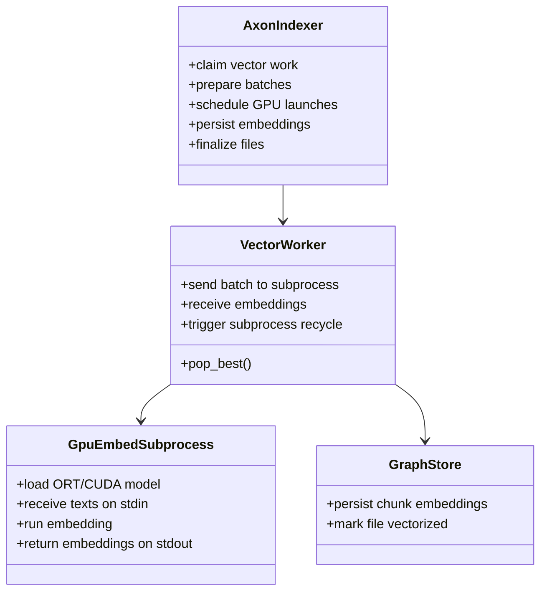
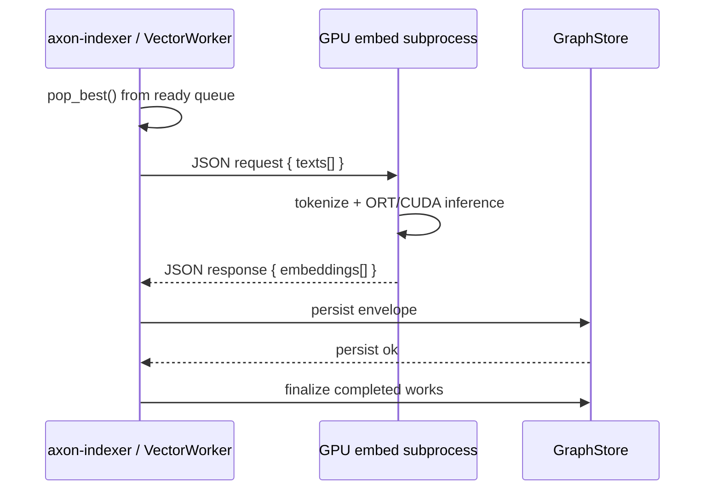
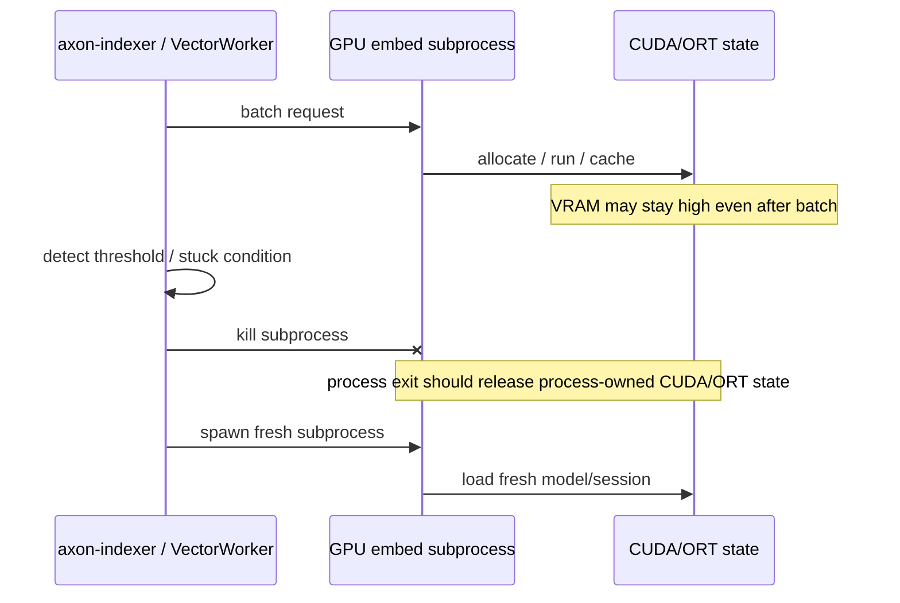
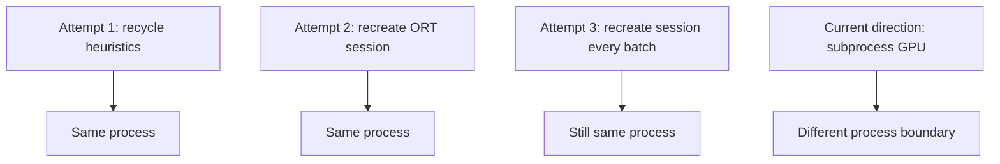

# GPU Subprocess Embedding Sketch

## Intent

Ce que je suis en train d’implémenter n’est pas un “GPU dans le CPU”.

L’idée est:
- garder le pipeline CPU principal dans `axon-indexer`
- sortir **uniquement l’exécution embedding ORT/CUDA** dans un **sous-processus dédié**
- pouvoir tuer ce sous-processus quand on veut vraiment remettre à zéro l’état VRAM / ORT / CUDA

Le but est de tester un vrai `process boundary`, parce que:
- détruire une `Session` ORT dans le même process n’a pas suffi
- recréer la session après chaque batch n’a pas suffi
- la mémoire semble rester accrochée plus haut, au niveau process/runtime ORT/CUDA

## Vue Macro


## Répartition des responsabilités



## Séquence nominale



## Séquence de recovery VRAM



## Ce que ce design teste

### Hypothèse

Le vrai problème n’est pas seulement la `Session` ORT.
Le vrai problème est plus probablement:
- le process ORT
- l’`Environment` global
- le contexte CUDA associé

### Donc

Si on tue le **sous-processus GPU**:
- on détruit tout l’état ORT/CUDA de ce process
- sans redémarrer tout `axon-indexer`

## Différence avec ce qu’on a déjà essayé



## Ce que j’attends comme observation

### Si ça marche

- la VRAM doit retomber beaucoup plus franchement quand on tue le sous-processus
- on aura prouvé que le bon levier est bien `process boundary`

### Si ça ne marche pas

- alors le problème est encore plus bas niveau
- par exemple driver/runtime CUDA global à la machine
- ou mauvaise lecture de la VRAM observée

## MVP d’implémentation

```mermaid
flowchart TD
    A[VectorWorker] --> B[GpuEmbedSubprocess.spawn()]
    B --> C[Handshake init OK]
    C --> D[embed_texts(texts)]
    D --> E[JSON over stdin/stdout]
    E --> F[Embeddings back to parent]
    F --> G[Persist as today]
    G --> H[Optional kill/restart subprocess]
```

## Point important

Ce design ne dit pas encore:
- que ce sera le meilleur throughput final

Il dit:
- que c’est le prochain test propre si on veut savoir si la maîtrise VRAM exige un vrai `process boundary`
