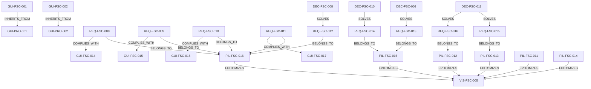

# SOLL Extraction

*Généré le : 2026-04-06 19:29:06*

*Portée : projet `Fiscaly`*

## Topologie (Mermaid)

## Entités : Concept
### CPT-FSC-014 - Pipeline Law-to-Logic
**Description:** Extraction PDF -> JSON Pivot -> Validation Oracle -> Transpilation Production.
**Status:** current
**Meta:** `{"updated_at":1775420964582}`

### CPT-FSC-015 - Séparation des Plans
**Description:** La logique fiscale réside dans les moteurs (TypeDB/CozoDB). L'orchestration dans Elixir.
**Status:** current
**Meta:** `{"updated_at":1775420964593}`

### CPT-FSC-016 - Conformance Paldivy
**Description:** Oracle (TypeDB) et Production (CozoDB) doivent correspondre à 100%.
**Status:** current
**Meta:** `{"updated_at":1775420964604}`

### CPT-FSC-017 - Taxonomie
**Description:** Gouvernance sémantique pour éviter les doublons.
**Status:** current
**Meta:** `{"updated_at":1775420964615}`

### CPT-FSC-018 - OfficialSource
**Description:** Pérennité des URLs légales.
**Status:** current
**Meta:** `{"updated_at":1775420964627}`

## Entités : Decision
### DEC-FSC-008 - Zero Docker Local -> Devenv
**Description:** Utilisation exclusive de Devenv (Nix) pour l'environnement local.
**Status:** current
**Meta:** `{"rationale":"Devenv assure une prédictibilité absolue et des health checks natifs, empêchant les faux succès Docker.","updated_at":1775418627193}`

### DEC-FSC-009 - Moteur Datalog de Production : CozoDB
**Description:** Utilisation de CozoDB comme moteur d'exécution en production.
**Status:** current
**Meta:** `{"rationale":"CozoDB offre les performances Datalog nécessaires actuellement. HydraDB reste une trajectoire long-terme.","updated_at":1775418627203}`

### DEC-FSC-010 - Single Source of Truth : JSON AST
**Description:** Adoption d'un JSON AST (Abstract Syntax Tree) formel comme pivot central.
**Status:** current
**Meta:** `{"rationale":"Le JSON AST permet de générer en parallèle le code TypeQL (pour l'Oracle) et le code Datalog (pour CozoDB) depuis une source unique et déterministe.","updated_at":1775418627214}`

### DEC-FSC-011 - Stockage Bitemporel et Spatial : PostgreSQL
**Description:** Utilisation de PostgreSQL 18 avec les extensions ltree et btree_gist.
**Status:** current
**Meta:** `{"rationale":"Seul PostgreSQL avec btree_gist (EXCLUDE USING gist) peut garantir mathématiquement l'absence de chevauchement temporel pour les barèmes. ltree gère la hiérarchie mondiale efficacement.","updated_at":1775418627224}`

## Entités : Guideline
### GUI-FSC-001 - TDD Obligatoire
**Description:** Les tests doivent être écrits avant ou avec le code source.
**Status:** active
**Meta:** `{"phase": "pre-code", "trigger_path": "src/axon-core/src/*", "required_path": "tests.rs", "enforcement": "strict"}`

### GUI-FSC-002 - Documentation MCP
**Description:** Toute modification de src/mcp/tools_*.rs nécessite la mise à jour de SKILL.md
**Status:** active
**Meta:** `{"phase": "post-code", "trigger_path": "src/axon-core/src/mcp/tools_*", "required_path": "SKILL.md", "enforcement": "strict"}`

### GUI-FSC-014 - Zéro Warning et Analyse Statique Stricte
**Description:** Le code doit être exempt de tout avertissement. L'utilisation des linters et analyseurs statiques est obligatoire avant chaque commit. Aucun warning ne doit être ignoré sans justification explicite en commentaire.
**Meta:** `{"updated_at":1775420816404}`

### GUI-FSC-015 - Approche Skill-First Obligatoire
**Description:** Avant toute intervention architecturale, opération de reprise ou implémentation, le développeur ou l'Agent IA doit obligatoirement rechercher et activer le skill le plus pertinent de l'espace de travail. Interdiction de travailler en Zero-Shot sans contexte méthodologique.
**Status:** current
**Meta:** `{"updated_at":1775420834530}`

### GUI-FSC-016 - Méthodologie Reality-First (Preuve Empirique)
**Description:** La documentation ment, le code s'exécute. Aucune déclaration de succès ou modification architecturale n'est autorisée sans fournir la preuve empirique du runtime (trace console, logs de build, tests au vert). L'absence de preuve est une preuve d'échec.
**Status:** current
**Meta:** `{"updated_at":1775420834542}`

### GUI-FSC-017 - Zéro Tolérance aux Silent Failures
**Description:** Interdiction absolue d'étouffer les erreurs système ou métier. L'usage de catch vides, de `|| true` dans les scripts critiques, ou le fallback silencieux de variables d'environnement est proscrit. Le système doit crasher explicitement (Fail-Fast).
**Status:** current
**Meta:** `{"updated_at":1775420834553}`

### GUI-FSC-018 - Refus de l'Obstination et Recherche Web Active
**Description:** Interdiction de s'obstiner sur une erreur ou une syntaxe incertaine. L'Agent IA ou le développeur doit impérativement utiliser la recherche web (Google Search, Web Fetch) pour consulter les documentations officielles récentes et les solutions à jour plutôt que de s'enfermer dans des boucles d'échecs basées sur des connaissances obsolètes.
**Meta:** `{"updated_at":1775425478182}`

### GUI-FSC-019 - IST-Driven Execution (Observation avant Action)
**Description:** Avant d'exécuter la moindre tâche d'un plan d'implémentation ou de modifier une intention SOLL, l'Agent IA doit obligatoirement interroger l'état réel du code (IST) via `mcp_axon_query` ou `mcp_axon_inspect` sur les fichiers ou symboles cibles. L'Agent doit formuler l'écart entre le plan et le code réel avant d'écrire la première ligne.
**Meta:** `{"updated_at":1775428228298}`

## Entités : Pillar
### PIL-FSC-011 - Vision: Fiabilité mathématique de la conformité fiscale
**Description:** Fournir une traçabilité légale et mathématique absolue pour chaque règle.
**Status:** current
**Meta:** `{"priority":"P1","updated_at":1775418627124}`

### PIL-FSC-012 - Pilier: Ontologie Géopolitique Globale
**Description:** Le monde est le nœud racine. Toute juridiction est modélisée hiérarchiquement (ltree). L'usage de termes locaux hardcodés (canton, etc.) est proscrit.
**Status:** current
**Meta:** `{"priority":"P1","updated_at":1775418627138}`

### PIL-FSC-013 - Pilier: Ingénierie Bitemporelle Stricte
**Description:** La fiscalité évolue. Le système trace le Application Time (validité légale) et le System Time (auditabilité). L'intégrité anti-chevauchement est garantie mathématiquement.
**Status:** current
**Meta:** `{"priority":"P1","updated_at":1775418627149}`

### PIL-FSC-014 - Pilier: Écosystème Multi-Agents (MAS)
**Description:** Fiscaly collabore nativement via Clustering Erlang/OTP avec d'autres agents (Hydra Collector, Nexus Orchestrator).
**Status:** current
**Meta:** `{"priority":"P1","updated_at":1775418627160}`

### PIL-FSC-015 - Pilier: Traçabilité Mathématique Absolue
**Description:** La fiabilité mathématique ne doit jamais être compromise par des facilités d'implémentation.
**Status:** current
**Meta:** `{"priority":"P1","updated_at":1775418627171}`

### PIL-FSC-016 - Pilier: Rigueur d'Ingénierie et de Gouvernance
**Description:** L'excellence d'ingénierie et l'intégrité opérationnelle priment sur la vitesse. La documentation doit refléter strictement la réalité.
**Status:** current
**Meta:** `{"priority":"P1","updated_at":1775418627182}`

## Entités : Requirement
### REQ-FSC-008 - Zéro Warning et Analyse Statique Stricte
**Description:** Le code doit être exempt de tout avertissement. L'utilisation des linters et analyseurs statiques est obligatoire avant chaque commit : `mix credo --strict`, `mix dialyzer` (Elixir) et `cargo clippy -- -D warnings` (Rust). Aucun warning ne doit être ignoré sans justification explicite en commentaire.
**Meta:** `{"updated_at":1775418524676}`

### REQ-FSC-009 - Approche Skill-First Obligatoire
**Description:** Avant toute intervention architecturale, opération de reprise ou implémentation, le développeur ou l'Agent IA doit obligatoirement rechercher et activer le skill le plus pertinent de l'espace de travail. Interdiction de travailler en Zero-Shot sans contexte méthodologique.
**Meta:** `{"updated_at":1775418524692}`

### REQ-FSC-010 - Méthodologie Reality-First (Preuve Empirique)
**Description:** La documentation ment, le code s'exécute. Aucune déclaration de succès ou modification architecturale n'est autorisée sans fournir la preuve empirique du runtime (trace console, logs de build, tests au vert). L'absence de preuve est une preuve d'échec.
**Meta:** `{"updated_at":1775418524710}`

### REQ-FSC-011 - Zéro Tolérance aux Silent Failures
**Description:** Interdiction absolue d'étouffer les erreurs système ou métier. L'usage de catch vides, de `|| true` dans les scripts critiques, ou le fallback silencieux de variables d'environnement est proscrit. Le système doit crasher explicitement (Fail-Fast).
**Meta:** `{"updated_at":1775418524727}`

### REQ-FSC-012 - Native Infrastructure Ready
**Description:** L'environnement doit démarrer sans Docker et avec des health checks.
**Status:** current
**Meta:** `{"priority":"P1","updated_at":1775420964509}`

### REQ-FSC-013 - Moteur d'Exécution Datalog Haute Performance
**Description:** Le système doit exécuter les calculs Datalog en production avec une faible latence et sans coût de licence.
**Status:** current
**Meta:** `{"priority":"P1","updated_at":1775420964520}`

### REQ-FSC-014 - Génération à Source Unique (Zero Semantic Drift)
**Description:** Le code métier (Oracle TypeQL et Prod Datalog) doit être généré depuis une source unique pour éviter la dérive sémantique.
**Status:** current
**Meta:** `{"priority":"P1","updated_at":1775420964532}`

### REQ-FSC-015 - Intégrité Bitemporelle Mathématique
**Description:** Le système doit garantir au niveau de la base de données l'interdiction stricte de tout chevauchement temporel des barèmes fiscaux.
**Status:** current
**Meta:** `{"priority":"P1","updated_at":1775420964543}`

### REQ-FSC-016 - Requêtage Hiérarchique Géopolitique Optimisé
**Description:** Le système doit pouvoir requêter instantanément la hiérarchie géographique mondiale complète sans requêtes récursives coûteuses.
**Status:** current
**Meta:** `{"priority":"P1","updated_at":1775420964556}`

## Entités : Vision
### VIS-FSC-005 - Vision: Fiscaly V3
**Description:** Fiabilité mathématique de la conformité fiscale. Fournir une traçabilité légale absolue pour chaque calcul.
**Meta:** `{"updated_at":1775420964570}`

