# SOLL Extraction

*Généré le : 2026-04-06 21:12:53*

## Topologie (Mermaid)

```mermaid
graph TD;
  GUI-FSC-001 -- INHERITS_FROM --> GUI-PRO-001;
  GUI-FSC-002 -- INHERITS_FROM --> GUI-PRO-002;
  REQ-FSC-008 -- BELONGS_TO --> PIL-FSC-016;
  REQ-FSC-009 -- BELONGS_TO --> PIL-FSC-016;
  REQ-FSC-010 -- BELONGS_TO --> PIL-FSC-016;
  REQ-FSC-011 -- BELONGS_TO --> PIL-FSC-016;
  REQ-FSC-008 -- COMPLIES_WITH --> GUI-FSC-014;
  REQ-FSC-009 -- COMPLIES_WITH --> GUI-FSC-015;
  REQ-FSC-010 -- COMPLIES_WITH --> GUI-FSC-016;
  REQ-FSC-011 -- COMPLIES_WITH --> GUI-FSC-017;
  DEC-FSC-008 -- SOLVES --> REQ-FSC-012;
  REQ-FSC-012 -- BELONGS_TO --> PIL-FSC-016;
  DEC-FSC-009 -- SOLVES --> REQ-FSC-013;
  REQ-FSC-013 -- BELONGS_TO --> PIL-FSC-015;
  DEC-FSC-010 -- SOLVES --> REQ-FSC-014;
  REQ-FSC-014 -- BELONGS_TO --> PIL-FSC-015;
  DEC-FSC-011 -- SOLVES --> REQ-FSC-015;
  REQ-FSC-015 -- BELONGS_TO --> PIL-FSC-013;
  DEC-FSC-011 -- SOLVES --> REQ-FSC-016;
  REQ-FSC-016 -- BELONGS_TO --> PIL-FSC-012;
  PIL-FSC-011 -- EPITOMIZES --> VIS-FSC-005;
  PIL-FSC-012 -- EPITOMIZES --> VIS-FSC-005;
  PIL-FSC-013 -- EPITOMIZES --> VIS-FSC-005;
  PIL-FSC-014 -- EPITOMIZES --> VIS-FSC-005;
  PIL-FSC-015 -- EPITOMIZES --> VIS-FSC-005;
  PIL-FSC-016 -- EPITOMIZES --> VIS-FSC-005;
  GUI-AXO-001 -- INHERITS_FROM --> GUI-PRO-001;
  GUI-AXO-002 -- INHERITS_FROM --> GUI-PRO-002;
  GUI-AXO-004 -- INHERITS_FROM --> GUI-PRO-001;
  GUI-AXO-005 -- INHERITS_FROM --> GUI-PRO-002;
  DEC-AXO-019 -- SOLVES --> REQ-AXO-025;
  REQ-AXO-025 -- BELONGS_TO --> PIL-AXO-018;
  DEC-AXO-020 -- COMPLIES_WITH --> GUI-AXO-011;
  DEC-AXO-020 -- COMPLIES_WITH --> GUI-AXO-014;
  DEC-AXO-020 -- SOLVES --> REQ-AXO-026;
  DEC-AXO-020 -- SOLVES --> REQ-AXO-027;
  DEC-AXO-020 -- SOLVES --> REQ-AXO-028;
  DEC-AXO-020 -- SOLVES --> REQ-AXO-029;
  DEC-AXO-021 -- SOLVES --> REQ-AXO-030;
  DEC-AXO-021 -- SOLVES --> REQ-AXO-031;
  DEC-AXO-021 -- SOLVES --> REQ-AXO-032;
  DEC-AXO-021 -- SOLVES --> REQ-AXO-033;
```

## Entités : Concept
### CPT-FSC-014 - Pipeline Law-to-Logic
**Description:** Extraction PDF -> JSON Pivot -> Validation Oracle -> Transpilation Production.
**Status:** current
**Meta:** `{"updated_at":1775420964582}`

### CPT-FSC-015 - Séparation des Plans
**Description:** La logique fiscale réside dans les moteurs (TypeDB/CozoDB). L'orchestration dans Elixir.
**Status:** current
**Meta:** `{"updated_at":1775420964593}`

### CPT-FSC-016 - Conformance Paldivy
**Description:** Oracle (TypeDB) et Production (CozoDB) doivent correspondre à 100%.
**Status:** current
**Meta:** `{"updated_at":1775420964604}`

### CPT-FSC-017 - Taxonomie
**Description:** Gouvernance sémantique pour éviter les doublons.
**Status:** current
**Meta:** `{"updated_at":1775420964615}`

### CPT-FSC-018 - OfficialSource
**Description:** Pérennité des URLs légales.
**Status:** current
**Meta:** `{"updated_at":1775420964627}`

## Entités : Decision
### DEC-AXO-019 - Partitionnement Sémantique par Project Slug
**Description:** Centraliser le stockage (soll.db, ist.db, et données vectorielles) dans un dossier global (~/.local/share/axon/db/) avec un partitionnement strict basé sur le `project_slug`. Les tables (Symbol, File, Node, Edge, CALLS) incluront `project_slug` comme clé de partitionnement pour isoler les scopes tout en permettant des requêtes transverses (ex: scope GLOBAL).
**Status:** proposed
**Meta:** `{"rationale":"L'architecture 'Sidecar' empêche la réflexion croisée. Une BDD unique partitionnée par slug permet la vue globale et maintient l'isolation RBAC locale.","updated_at":1775491817244}`

### DEC-AXO-020 - Validation par Graphe des Invariants Architecturaux
**Description:** Implémentation de requêtes SQL récursives (CTE) et pathfinding sur le Property Graph (CALLS, CONTAINS) pour détecter formellement les boucles infinies, les fuites de domaine et les risques de blocage NIF. Transforme Axon en Linter Architectural Global.
**Status:** accepted
**Meta:** `{"priority":"P1","updated_at":1775494415789}`

### DEC-AXO-021 - L'Agent Experience (AX) comme Citoyen de Première Classe
**Description:** L'ingénierie du serveur MCP d'Axon doit garantir un déterminisme mathématique absolu pour maximiser le taux de confiance et d'utilisation par les agents IA. Le serveur doit être idempotent, auto-réparateur (Self-Healing) et hautement sémantique (DX/AX) pour devenir l'outil privilégié de l'heuristique agentique.
**Status:** accepted
**Meta:** `{"priority":"P1","updated_at":1775499126346}`

### DEC-FSC-008 - Zero Docker Local -> Devenv
**Description:** Utilisation exclusive de Devenv (Nix) pour l'environnement local.
**Status:** current
**Meta:** `{"rationale":"Devenv assure une prédictibilité absolue et des health checks natifs, empêchant les faux succès Docker.","updated_at":1775418627193}`

### DEC-FSC-009 - Moteur Datalog de Production : CozoDB
**Description:** Utilisation de CozoDB comme moteur d'exécution en production.
**Status:** current
**Meta:** `{"rationale":"CozoDB offre les performances Datalog nécessaires actuellement. HydraDB reste une trajectoire long-terme.","updated_at":1775418627203}`

### DEC-FSC-010 - Single Source of Truth : JSON AST
**Description:** Adoption d'un JSON AST (Abstract Syntax Tree) formel comme pivot central.
**Status:** current
**Meta:** `{"rationale":"Le JSON AST permet de générer en parallèle le code TypeQL (pour l'Oracle) et le code Datalog (pour CozoDB) depuis une source unique et déterministe.","updated_at":1775418627214}`

### DEC-FSC-011 - Stockage Bitemporel et Spatial : PostgreSQL
**Description:** Utilisation de PostgreSQL 18 avec les extensions ltree et btree_gist.
**Status:** current
**Meta:** `{"rationale":"Seul PostgreSQL avec btree_gist (EXCLUDE USING gist) peut garantir mathématiquement l'absence de chevauchement temporel pour les barèmes. ltree gère la hiérarchie mondiale efficacement.","updated_at":1775418627224}`

## Entités : Guideline
### GUI-AXO-001 - TDD Obligatoire
**Description:** Les tests doivent être écrits avant ou avec le code source.
**Status:** active
**Meta:** `{"phase": "pre-code", "trigger_path": "src/axon-core/src/*", "required_path": "tests.rs", "enforcement": "strict"}`

### GUI-AXO-002 - Documentation MCP
**Description:** Toute modification de src/mcp/tools_*.rs nécessite la mise à jour de SKILL.md
**Status:** active
**Meta:** `{"phase": "post-code", "trigger_path": "src/axon-core/src/mcp/tools_*", "required_path": "SKILL.md", "enforcement": "strict"}`

### GUI-AXO-003 - Silent Dev Environment (Dual-Track Isolation)
**Description:** NEVER start the MCP server inside the development environment. Exposing two MCP servers with duplicate tool names crashes LLM clients. Development must be validated via `cargo test` in the isolated worktree, then merged to `main`.
**Status:** active
**Meta:** `{"enforcement":"soft","phase":"pre-execution","required_path":"","trigger_path":"*","updated_at":1775434919042}`

### GUI-AXO-004 - TDD Obligatoire
**Description:** Les tests doivent être écrits avant ou avec le code source.
**Status:** active
**Meta:** `{"phase": "pre-code", "trigger_path": "src/axon-core/src/*", "required_path": "tests.rs", "enforcement": "strict"}`

### GUI-AXO-005 - Documentation MCP
**Description:** Toute modification de src/mcp/tools_*.rs nécessite la mise à jour de SKILL.md
**Status:** active
**Meta:** `{"phase": "post-code", "trigger_path": "src/axon-core/src/mcp/tools_*", "required_path": "SKILL.md", "enforcement": "strict"}`

### GUI-AXO-006 - Zéro Warning & Fail-Fast
**Description:** Tout code doit compiler et passer l'analyse statique avec formellement zéro avertissement (ex: deny(warnings) en Rust, --strict en TS). La CI doit échouer immédiatement au premier avertissement détecté.
**Meta:** `{"enforcement":"strict","phase":"compile","updated_at":1775491909865}`

### GUI-AXO-007 - Vérité Physique (Zéro Mock I/O)
**Description:** Interdiction stricte d'utiliser des mocks ou stubs pour simuler les entrées/sorties (Réseau, FS, DB). Les tests d'intégration doivent instancier des ressources physiques isolées et éphémères (ex: DB temporaires sur disque) pour valider les comportements réels (verrous, WAL, concurrence).
**Meta:** `{"enforcement":"strict","phase":"test","updated_at":1775491909887}`

### GUI-AXO-008 - Séparation des Plans (Control vs Data Plane)
**Description:** Isolation architecturale obligatoire entre les processus gérant l'état/routage (Control Plane, asynchrone, faible latence) et les processus exécutant les calculs lourds ou la logique métier complexe (Data Plane, synchrone, intensif). Le Control Plane ne doit exécuter aucune logique bloquante.
**Meta:** `{"enforcement":"strict","phase":"architecture","updated_at":1775491909908}`

### GUI-AXO-009 - Builds Déterministes & Hermétiques
**Description:** La compilation d'un commit doit produire un artefact dont l'empreinte (SHA-256) est strictement identique partout (Tolérance 0%). 100% des dépendances (système et applicatives) doivent être épinglées via un fichier de verrouillage avec hash cryptographique. Le build doit réussir en isolation réseau (Air-Gap).
**Meta:** `{"enforcement":"strict","phase":"build","updated_at":1775491909930}`

### GUI-AXO-010 - Télémétrie Structurée Native
**Description:** 100% des événements applicatifs doivent être émis au format structuré (JSON/OTLP). Interdiction absolue des logs textuels bruts sur stdout nécessitant un parsing par regex. Propagation obligatoire des trace_id dans tous les appels RPC/IPC.
**Meta:** `{"enforcement":"strict","phase":"runtime","updated_at":1775491909952}`

### GUI-AXO-011 - Résilience Mécanique (Design for Failure)
**Description:** Les systèmes distribués doivent intégrer des patterns de résilience (Circuit Breakers, Back-pressure, Dégradation Gracieuse). Les seuils et mécanismes de défaillance doivent être spécifiés explicitement par des Décisions (DEC) ou Exigences (REQ) au niveau du projet.
**Meta:** `{"enforcement":"advisory","phase":"architecture","requires_local_decision":true,"updated_at":1775491909975}`

### GUI-AXO-012 - Performance comme Propriété Native
**Description:** La performance ne s'optimise pas a posteriori. Les budgets de latence (SLO/p99) et les contraintes de ressources (CPU/RAM) doivent être quantifiés et testés en CI pour chaque composant critique via des Exigences (REQ) locales du projet.
**Meta:** `{"enforcement":"advisory","phase":"architecture","requires_local_decision":true,"updated_at":1775491909999}`

### GUI-AXO-013 - Sécurité Shift-Left & Moindre Privilège
**Description:** La sécurité (scan de vulnérabilités, gestion des secrets) est automatisée dès la CI. L'accès aux ressources s'opère par RBAC granulaire. Les politiques exactes de rotation des secrets et d'authentification doivent être définies par les Décisions (DEC) du projet.
**Meta:** `{"enforcement":"advisory","phase":"security","requires_local_decision":true,"updated_at":1775491910022}`

### GUI-AXO-014 - Évolutivité Humaine & Accessibilité Cognitive
**Description:** L'architecture modulaire doit limiter la charge cognitive (DDD, Clean Architecture). Le nommage est un acte de design reflétant le métier. Le versioning des API doit être explicite. Les choix d'implémentation de ces frontières sont délégués aux projets.
**Meta:** `{"enforcement":"advisory","phase":"design","requires_local_decision":true,"updated_at":1775491910046}`

### GUI-AXO-015 - Infrastructure as Code (IaC) & Reproductibilité d'Environnement
**Description:** Les environnements doivent être éphémères et recréables à la demande. L'état de l'infrastructure est versionné (GitOps). L'outil d'automatisation (Nix, Terraform, Docker) est défini par les Décisions (DEC) spécifiques du projet.
**Meta:** `{"enforcement":"advisory","phase":"infrastructure","requires_local_decision":true,"updated_at":1775491910067}`

### GUI-AXO-016 - DRY (Don't Repeat Yourself) & Single Source of Truth
**Description:** Éviter de décrire deux fois la même chose. Chaque connaissance, logique ou règle métier doit posséder une représentation unique et non ambiguë dans le système pour éviter la désynchronisation.
**Meta:** `{"enforcement":"advisory","phase":"coding","requires_local_decision":false,"updated_at":1775491910090}`

### GUI-AXO-017 - SRP (Single Responsibility Principle) & Cohésion
**Description:** Une fonction, une classe ou un fichier ne doit avoir qu'une seule raison de changer. Les 'God Objects' (fichiers monolithiques) sont proscrits. Les responsabilités doivent être isolées.
**Meta:** `{"enforcement":"advisory","phase":"coding","requires_local_decision":false,"updated_at":1775491910112}`

### GUI-AXO-018 - KISS (Keep It Simple, Stupid) & YAGNI
**Description:** Ne pas sur-ingénieriser. Ne pas écrire de code 'au cas où' (You Aren't Gonna Need It) pour un besoin futur hypothétique. Privilégier la solution la plus simple et lisible permettant de résoudre le problème actuel.
**Meta:** `{"enforcement":"advisory","phase":"coding","requires_local_decision":false,"updated_at":1775491910142}`

### GUI-AXO-019 - Limites Cognitives & Complexité Cyclomatique
**Description:** Limitation stricte de l'imbrication et de la longueur des fonctions/fichiers. Une fonction doit idéalement être lisible sur un seul écran sans défilement mental complexe. Les seuils précis doivent être validés par les linters du projet.
**Meta:** `{"enforcement":"advisory","phase":"coding","requires_local_decision":true,"updated_at":1775491910171}`

### GUI-AXO-020 - Clean-As-You-Go (Zéro Code Mort)
**Description:** Le code obsolète, commenté ou remplacé doit être immédiatement supprimé une fois la nouvelle implémentation testée et validée en CI. La base de code ne doit contenir aucun code mort (fonctions/fichiers opérationnels sans appelants actifs). L'accumulation de code 'au cas où' est une violation de la sécurité et de la maintenabilité.
**Meta:** `{"enforcement":"strict","phase":"refactoring","requires_local_decision":false,"updated_at":1775492169608}`

### GUI-FSC-001 - TDD Obligatoire
**Description:** Les tests doivent être écrits avant ou avec le code source.
**Status:** active
**Meta:** `{"phase": "pre-code", "trigger_path": "src/axon-core/src/*", "required_path": "tests.rs", "enforcement": "strict"}`

### GUI-FSC-002 - Documentation MCP
**Description:** Toute modification de src/mcp/tools_*.rs nécessite la mise à jour de SKILL.md
**Status:** active
**Meta:** `{"phase": "post-code", "trigger_path": "src/axon-core/src/mcp/tools_*", "required_path": "SKILL.md", "enforcement": "strict"}`

### GUI-FSC-014 - Zéro Warning et Analyse Statique Stricte
**Description:** Le code doit être exempt de tout avertissement. L'utilisation des linters et analyseurs statiques est obligatoire avant chaque commit. Aucun warning ne doit être ignoré sans justification explicite en commentaire.
**Meta:** `{"updated_at":1775420816404}`

### GUI-FSC-015 - Approche Skill-First Obligatoire
**Description:** Avant toute intervention architecturale, opération de reprise ou implémentation, le développeur ou l'Agent IA doit obligatoirement rechercher et activer le skill le plus pertinent de l'espace de travail. Interdiction de travailler en Zero-Shot sans contexte méthodologique.
**Status:** current
**Meta:** `{"updated_at":1775420834530}`

### GUI-FSC-016 - Méthodologie Reality-First (Preuve Empirique)
**Description:** La documentation ment, le code s'exécute. Aucune déclaration de succès ou modification architecturale n'est autorisée sans fournir la preuve empirique du runtime (trace console, logs de build, tests au vert). L'absence de preuve est une preuve d'échec.
**Status:** current
**Meta:** `{"updated_at":1775420834542}`

### GUI-FSC-017 - Zéro Tolérance aux Silent Failures
**Description:** Interdiction absolue d'étouffer les erreurs système ou métier. L'usage de catch vides, de `|| true` dans les scripts critiques, ou le fallback silencieux de variables d'environnement est proscrit. Le système doit crasher explicitement (Fail-Fast).
**Status:** current
**Meta:** `{"updated_at":1775420834553}`

### GUI-FSC-018 - Refus de l'Obstination et Recherche Web Active
**Description:** Interdiction de s'obstiner sur une erreur ou une syntaxe incertaine. L'Agent IA ou le développeur doit impérativement utiliser la recherche web (Google Search, Web Fetch) pour consulter les documentations officielles récentes et les solutions à jour plutôt que de s'enfermer dans des boucles d'échecs basées sur des connaissances obsolètes.
**Meta:** `{"updated_at":1775425478182}`

### GUI-FSC-019 - IST-Driven Execution (Observation avant Action)
**Description:** Avant d'exécuter la moindre tâche d'un plan d'implémentation ou de modifier une intention SOLL, l'Agent IA doit obligatoirement interroger l'état réel du code (IST) via `mcp_axon_query` ou `mcp_axon_inspect` sur les fichiers ou symboles cibles. L'Agent doit formuler l'écart entre le plan et le code réel avant d'écrire la première ligne.
**Meta:** `{"updated_at":1775428228298}`

### GUI-PRO-001 - TDD Obligatoire
**Description:** Les tests doivent être écrits avant ou avec le code source.
**Status:** active
**Meta:** `{"phase": "pre-code", "trigger_path": "src/axon-core/src/*", "required_path": "tests.rs", "enforcement": "strict"}`

### GUI-PRO-002 - Documentation MCP
**Description:** Toute modification de src/mcp/tools_*.rs nécessite la mise à jour de SKILL.md
**Status:** active
**Meta:** `{"phase": "post-code", "trigger_path": "src/axon-core/src/mcp/tools_*", "required_path": "SKILL.md", "enforcement": "strict"}`

### GUI-PRO-003 - Zéro Warning & Fail-Fast
**Description:** Tout code doit compiler et passer l'analyse statique avec formellement zéro avertissement (ex: deny(warnings) en Rust, --strict en TS). La CI doit échouer immédiatement au premier avertissement détecté.
**Status:** active
**Meta:** `{"phase": "compile", "trigger_path": "*", "enforcement": "strict"}`

### GUI-PRO-004 - Vérité Physique (Zéro Mock I/O)
**Description:** Interdiction stricte d'utiliser des mocks ou stubs pour simuler les entrées/sorties (Réseau, FS, DB). Les tests d'intégration doivent instancier des ressources physiques isolées et éphémères (ex: DB temporaires sur disque) pour valider les comportements réels (verrous, WAL, concurrence).
**Status:** active
**Meta:** `{"phase": "test", "trigger_path": "*", "enforcement": "strict"}`

### GUI-PRO-005 - Séparation des Plans (Control vs Data Plane)
**Description:** Isolation architecturale obligatoire entre les processus gérant l'état/routage (Control Plane, asynchrone, faible latence) et les processus exécutant les calculs lourds ou la logique métier complexe (Data Plane, synchrone, intensif). Le Control Plane ne doit exécuter aucune logique bloquante.
**Status:** active
**Meta:** `{"phase": "architecture", "trigger_path": "*", "enforcement": "strict"}`

### GUI-PRO-006 - Builds Déterministes & Hermétiques
**Description:** La compilation d'un commit doit produire un artefact dont l'empreinte (SHA-256) est strictement identique partout (Tolérance 0%). 100% des dépendances (système et applicatives) doivent être épinglées via un fichier de verrouillage avec hash cryptographique. Le build doit réussir en isolation réseau (Air-Gap).
**Status:** active
**Meta:** `{"phase": "build", "trigger_path": "*", "enforcement": "strict"}`

### GUI-PRO-007 - Télémétrie Structurée Native
**Description:** 100% des événements applicatifs doivent être émis au format structuré (JSON/OTLP). Interdiction absolue des logs textuels bruts sur stdout nécessitant un parsing par regex. Propagation obligatoire des trace_id dans tous les appels RPC/IPC.
**Status:** active
**Meta:** `{"phase": "runtime", "trigger_path": "*", "enforcement": "strict"}`

### GUI-PRO-008 - Résilience Mécanique (Design for Failure)
**Description:** Les systèmes distribués doivent intégrer des patterns de résilience (Circuit Breakers, Back-pressure, Dégradation Gracieuse). Les seuils et mécanismes de défaillance doivent être spécifiés explicitement par des Décisions (DEC) ou Exigences (REQ) au niveau du projet.
**Status:** active
**Meta:** `{"phase": "architecture", "trigger_path": "*", "enforcement": "advisory", "requires_local_decision": true}`

### GUI-PRO-009 - Performance comme Propriété Native
**Description:** La performance ne s'optimise pas a posteriori. Les budgets de latence (SLO/p99) et les contraintes de ressources (CPU/RAM) doivent être quantifiés et testés en CI pour chaque composant critique via des Exigences (REQ) locales du projet.
**Status:** active
**Meta:** `{"phase": "architecture", "trigger_path": "*", "enforcement": "advisory", "requires_local_decision": true}`

### GUI-PRO-010 - Sécurité Shift-Left & Moindre Privilège
**Description:** La sécurité (scan de vulnérabilités, gestion des secrets) est automatisée dès la CI. L'accès aux ressources s'opère par RBAC granulaire. Les politiques exactes de rotation des secrets et d'authentification doivent être définies par les Décisions (DEC) du projet.
**Status:** active
**Meta:** `{"phase": "security", "trigger_path": "*", "enforcement": "advisory", "requires_local_decision": true}`

### GUI-PRO-011 - Évolutivité Humaine & Accessibilité Cognitive
**Description:** L'architecture modulaire doit limiter la charge cognitive (DDD, Clean Architecture). Le nommage est un acte de design reflétant le métier. Le versioning des API doit être explicite. Les choix d'implémentation de ces frontières sont délégués aux projets.
**Status:** active
**Meta:** `{"phase": "design", "trigger_path": "*", "enforcement": "advisory", "requires_local_decision": true}`

### GUI-PRO-012 - Infrastructure as Code (IaC) & Reproductibilité d'Environnement
**Description:** Les environnements doivent être éphémères et recréables à la demande. L'état de l'infrastructure est versionné (GitOps). L'outil d'automatisation (Nix, Terraform, Docker) est défini par les Décisions (DEC) spécifiques du projet.
**Status:** active
**Meta:** `{"phase": "infrastructure", "trigger_path": "*", "enforcement": "advisory", "requires_local_decision": true}`

### GUI-PRO-013 - DRY (Don't Repeat Yourself) & Single Source of Truth
**Description:** Éviter de décrire deux fois la même chose. Chaque connaissance, logique ou règle métier doit posséder une représentation unique et non ambiguë dans le système pour éviter la désynchronisation.
**Status:** active
**Meta:** `{"phase": "coding", "trigger_path": "*", "enforcement": "advisory", "requires_local_decision": false}`

### GUI-PRO-014 - SRP (Single Responsibility Principle) & Cohésion
**Description:** Une fonction, une classe ou un fichier ne doit avoir qu'une seule raison de changer. Les 'God Objects' (fichiers monolithiques) sont proscrits. Les responsabilités doivent être isolées.
**Status:** active
**Meta:** `{"phase": "coding", "trigger_path": "*", "enforcement": "advisory", "requires_local_decision": false}`

### GUI-PRO-015 - KISS (Keep It Simple, Stupid) & YAGNI
**Description:** Ne pas sur-ingénieriser. Ne pas écrire de code 'au cas où' (You Aren't Gonna Need It) pour un besoin futur hypothétique. Privilégier la solution la plus simple et lisible permettant de résoudre le problème actuel.
**Status:** active
**Meta:** `{"phase": "coding", "trigger_path": "*", "enforcement": "advisory", "requires_local_decision": false}`

### GUI-PRO-016 - Limites Cognitives & Complexité Cyclomatique
**Description:** Limitation stricte de l'imbrication et de la longueur des fonctions/fichiers. Une fonction doit idéalement être lisible sur un seul écran sans défilement mental complexe. Les seuils précis doivent être validés par les linters du projet.
**Status:** active
**Meta:** `{"phase": "coding", "trigger_path": "*", "enforcement": "advisory", "requires_local_decision": true}`

### GUI-PRO-017 - Clean-As-You-Go (Zéro Code Mort)
**Description:** Le code obsolète, commenté ou remplacé doit être immédiatement supprimé une fois la nouvelle implémentation testée. La base de code ne doit contenir aucun code mort (fonctions sans appelants actifs).
**Status:** active
**Meta:** `{"phase": "refactoring", "trigger_path": "*", "enforcement": "strict", "requires_local_decision": false}`

## Entités : Milestone
### MIL-AXO-012 - Plan de Remédiation : Audit de Conformité d'Axon
**Description:** Campagne globale de remédiation visant à corriger les bugs analytiques du moteur d'audit d'Axon (faux positifs) et à éradiquer la véritable dette technique identifiée (expositions unsafe et God Objects).
**Status:** proposed
**Meta:** `{"priority":"P1","updated_at":1775499044479}`

## Entités : Pillar
### PIL-AXO-018 - Démon Central (Omniscience)
**Description:** La souveraineté sémantique exige un Treillis de Connaissance Vivant centralisé. Le système bascule vers un modèle de Démon Central (Omniscience) traitant, stockant et analysant simultanément les graphes de N projets (cross-project analysis).
**Meta:** `{"goal":"Briser l'isolation 'Sidecar' pour permettre la réflexion globale sur de multiples bases de code.","priority":"P1","updated_at":1775491776563}`

### PIL-FSC-011 - Vision: Fiabilité mathématique de la conformité fiscale
**Description:** Fournir une traçabilité légale et mathématique absolue pour chaque règle.
**Status:** current
**Meta:** `{"priority":"P1","updated_at":1775418627124}`

### PIL-FSC-012 - Pilier: Ontologie Géopolitique Globale
**Description:** Le monde est le nœud racine. Toute juridiction est modélisée hiérarchiquement (ltree). L'usage de termes locaux hardcodés (canton, etc.) est proscrit.
**Status:** current
**Meta:** `{"priority":"P1","updated_at":1775418627138}`

### PIL-FSC-013 - Pilier: Ingénierie Bitemporelle Stricte
**Description:** La fiscalité évolue. Le système trace le Application Time (validité légale) et le System Time (auditabilité). L'intégrité anti-chevauchement est garantie mathématiquement.
**Status:** current
**Meta:** `{"priority":"P1","updated_at":1775418627149}`

### PIL-FSC-014 - Pilier: Écosystème Multi-Agents (MAS)
**Description:** Fiscaly collabore nativement via Clustering Erlang/OTP avec d'autres agents (Hydra Collector, Nexus Orchestrator).
**Status:** current
**Meta:** `{"priority":"P1","updated_at":1775418627160}`

### PIL-FSC-015 - Pilier: Traçabilité Mathématique Absolue
**Description:** La fiabilité mathématique ne doit jamais être compromise par des facilités d'implémentation.
**Status:** current
**Meta:** `{"priority":"P1","updated_at":1775418627171}`

### PIL-FSC-016 - Pilier: Rigueur d'Ingénierie et de Gouvernance
**Description:** L'excellence d'ingénierie et l'intégrité opérationnelle priment sur la vitesse. La documentation doit refléter strictement la réalité.
**Status:** current
**Meta:** `{"priority":"P1","updated_at":1775418627182}`

## Entités : Requirement
### REQ-AXO-025 - Service Global et Base de Données Unifiée
**Description:** Le démon Axon ne doit plus s'exécuter de manière isolée dans le dossier de travail. Il doit devenir un service système unique écoutant sur un port global dédié (44129) avec une base de données unifiée. Les requêtes MCP exigeront le passage en paramètre du project_slug ou le déduiront de l'URI.
**Status:** pending
**Meta:** `{"priority":"P1","updated_at":1775491792664}`

### REQ-AXO-026 - Détection de la Propagation du Risque (Unsafe Exposure)
**Description:** Détecter mécaniquement si une fonction publique expose silencieusement du code dangereux (ex: blocs unsafe, unwrap()) en profondeur dans le graphe d'appels. L'audit doit bloquer la CI si un chemin non protégé existe entre l'API publique et le code à risque.
**Status:** accepted
**Meta:** `{"priority":"P1","updated_at":1775496752436}`

### REQ-AXO-027 - Prévention des Risques de Blocage NIF (Scheduler Starvation)
**Description:** Détecter formellement les risques d'effondrement du Scheduler Erlang/BEAM en identifiant les appels synchrones Elixir -> Rust (CALLS_NIF) où la cible Rust possède une forte profondeur d'appels ou invoque des bibliothèques bloquantes sans traitement asynchrone explicite.
**Status:** accepted
**Meta:** `{"priority":"P1","updated_at":1775496990879}`

### REQ-AXO-028 - Détection des Dépendances Circulaires
**Description:** Détecter formellement les boucles infinies et les dépendances cycliques (A -> B -> C -> A) au sein du graphe d'appels. La présence d'une boucle doit pénaliser le score d'audit et bloquer la Quality Gate.
**Status:** accepted
**Meta:** `{"priority":"P1","updated_at":1775497240298}`

### REQ-AXO-029 - Détection des Fuites de Domaine (Domain Leakage)
**Description:** Garantir mathématiquement la Clean Architecture en interdisant toute dépendance directe d'un fichier du domaine (ex: src/domain/) vers un fichier d'infrastructure (ex: src/infra/). Toute fuite de domaine détectée doit faire échouer la Quality Gate.
**Status:** accepted
**Meta:** `{"priority":"P1","updated_at":1775497240323}`

### REQ-AXO-030 - Résilience des Connexions MCP (Auto-Healing)
**Description:** Le serveur Axon MCP doit implémenter un auto-reconnect robuste vers sa base de données. Un client MCP ne doit jamais recevoir d'erreur de topologie interne (ex: "Not connected") suite à une perte de connexion, garantissant la résilience des sessions IA.
**Status:** accepted
**Meta:** `{"priority":"P1","updated_at":1775499115287}`

### REQ-AXO-031 - Idempotence Absolue des Mutations MCP
**Description:** Les outils de mutation MCP (soll_apply_plan, etc.) doivent être strictement idempotents (Upsert). Une réexécution doit retourner "No changes" sans crasher ni exposer la complexité SQL sous-jacente au client.
**Status:** accepted
**Meta:** `{"priority":"P1","updated_at":1775499115330}`

### REQ-AXO-032 - Découvrabilité et Messages d'Erreur (AX/DX)
**Description:** Le serveur MCP doit appliquer le Fail-Fast avec Contexte. Une erreur sur un argument (ex: project_slug invalide) doit fournir l'état attendu et les valeurs valides disponibles pour permettre l'auto-correction immédiate de l'agent.
**Status:** accepted
**Meta:** `{"priority":"P1","updated_at":1775499115364}`

### REQ-AXO-033 - Cohérence du Scope et Requêtes Sémantiques MCP
**Description:** L'API MCP doit offrir des requêtes sémantiques de haut niveau pré-filtrées (ex: filtrer par statut, entité et projet simultanément) plutôt que d'obliger le client IA à extraire un graphe complet pour le filtrer en mémoire.
**Status:** accepted
**Meta:** `{"priority":"P2","updated_at":1775499115416}`

### REQ-FSC-008 - Zéro Warning et Analyse Statique Stricte
**Description:** Le code doit être exempt de tout avertissement. L'utilisation des linters et analyseurs statiques est obligatoire avant chaque commit : `mix credo --strict`, `mix dialyzer` (Elixir) et `cargo clippy -- -D warnings` (Rust). Aucun warning ne doit être ignoré sans justification explicite en commentaire.
**Meta:** `{"updated_at":1775418524676}`

### REQ-FSC-009 - Approche Skill-First Obligatoire
**Description:** Avant toute intervention architecturale, opération de reprise ou implémentation, le développeur ou l'Agent IA doit obligatoirement rechercher et activer le skill le plus pertinent de l'espace de travail. Interdiction de travailler en Zero-Shot sans contexte méthodologique.
**Meta:** `{"updated_at":1775418524692}`

### REQ-FSC-010 - Méthodologie Reality-First (Preuve Empirique)
**Description:** La documentation ment, le code s'exécute. Aucune déclaration de succès ou modification architecturale n'est autorisée sans fournir la preuve empirique du runtime (trace console, logs de build, tests au vert). L'absence de preuve est une preuve d'échec.
**Meta:** `{"updated_at":1775418524710}`

### REQ-FSC-011 - Zéro Tolérance aux Silent Failures
**Description:** Interdiction absolue d'étouffer les erreurs système ou métier. L'usage de catch vides, de `|| true` dans les scripts critiques, ou le fallback silencieux de variables d'environnement est proscrit. Le système doit crasher explicitement (Fail-Fast).
**Meta:** `{"updated_at":1775418524727}`

### REQ-FSC-012 - Native Infrastructure Ready
**Description:** L'environnement doit démarrer sans Docker et avec des health checks.
**Status:** current
**Meta:** `{"priority":"P1","updated_at":1775420964509}`

### REQ-FSC-013 - Moteur d'Exécution Datalog Haute Performance
**Description:** Le système doit exécuter les calculs Datalog en production avec une faible latence et sans coût de licence.
**Status:** current
**Meta:** `{"priority":"P1","updated_at":1775420964520}`

### REQ-FSC-014 - Génération à Source Unique (Zero Semantic Drift)
**Description:** Le code métier (Oracle TypeQL et Prod Datalog) doit être généré depuis une source unique pour éviter la dérive sémantique.
**Status:** current
**Meta:** `{"priority":"P1","updated_at":1775420964532}`

### REQ-FSC-015 - Intégrité Bitemporelle Mathématique
**Description:** Le système doit garantir au niveau de la base de données l'interdiction stricte de tout chevauchement temporel des barèmes fiscaux.
**Status:** current
**Meta:** `{"priority":"P1","updated_at":1775420964543}`

### REQ-FSC-016 - Requêtage Hiérarchique Géopolitique Optimisé
**Description:** Le système doit pouvoir requêter instantanément la hiérarchie géographique mondiale complète sans requêtes récursives coûteuses.
**Status:** current
**Meta:** `{"priority":"P1","updated_at":1775420964556}`

### REQ-FSC-017 - Migration ltree PostgreSQL
**Description:** Activer l'extension ltree dans PostgreSQL et créer la table geopolitical_nodes avec path (ltree), name, level, iso_code et un index GiST.
**Status:** TODO
**Meta:** `{"updated_at":1775499501298}`

### REQ-FSC-018 - Ressource Ash Geography.Node
**Description:** Créer le modèle de domaine Elixir (Ash Resource) mappé sur la table geopolitical_nodes pour manipuler la hiérarchie spatiale.
**Status:** TODO
**Meta:** `{"updated_at":1775499509267}`

### REQ-FSC-019 - Fonctions Spatiales et Tests
**Description:** Valider que la modélisation ltree permet de requêter l'ascendance complète d'un nœud sans requêtes récursives coûteuses.
**Status:** TODO
**Meta:** `{"updated_at":1775499509399}`

## Entités : Vision
### VIS-FSC-005 - Vision: Fiscaly V3
**Description:** Fiabilité mathématique de la conformité fiscale. Fournir une traçabilité légale absolue pour chaque calcul.
**Meta:** `{"updated_at":1775420964570}`

