# SOLL Extraction

*Généré le : 2026-04-08 16:36:10*

*Portée : projet `HYD`*

## Topologie (Mermaid)

```mermaid
graph TD;
  GUI-HYD-001 -- INHERITS_FROM --> GUI-PRO-003;
  GUI-HYD-002 -- INHERITS_FROM --> GUI-PRO-004;
  GUI-HYD-003 -- INHERITS_FROM --> GUI-PRO-008;
  GUI-HYD-004 -- INHERITS_FROM --> GUI-PRO-017;
  PIL-HYD-005 -- EPITOMIZES --> VIS-HYD-001;
  PIL-HYD-006 -- EPITOMIZES --> VIS-HYD-001;
  PIL-HYD-007 -- EPITOMIZES --> VIS-HYD-001;
  PIL-HYD-004 -- EPITOMIZES --> VIS-HYD-001;
  REQ-HYD-006 -- BELONGS_TO --> PIL-HYD-005;
  REQ-HYD-002 -- BELONGS_TO --> PIL-HYD-005;
  REQ-HYD-005 -- BELONGS_TO --> PIL-HYD-006;
  REQ-HYD-007 -- BELONGS_TO --> PIL-HYD-007;
  REQ-HYD-008 -- BELONGS_TO --> PIL-HYD-007;
  DEC-HYD-004 -- SOLVES --> REQ-HYD-007;
  DEC-HYD-004 -- SOLVES --> REQ-HYD-008;
  DEC-HYD-005 -- SOLVES --> REQ-HYD-006;
  DEC-HYD-006 -- SOLVES --> REQ-HYD-002;
  DEC-HYD-007 -- SOLVES --> REQ-HYD-008;
  DEC-HYD-008 -- SOLVES --> REQ-HYD-009;
  DEC-HYD-009 -- SOLVES --> REQ-HYD-010;
  DEC-HYD-010 -- SOLVES --> REQ-HYD-011;
  DEC-HYD-011 -- SOLVES --> REQ-HYD-012;
  DEC-HYD-013 -- SOLVES --> REQ-HYD-013;
  DEC-HYD-012 -- SOLVES --> REQ-HYD-014;
  DEC-HYD-014 -- SOLVES --> REQ-HYD-015;
  REQ-HYD-009 -- BELONGS_TO --> PIL-HYD-007;
  REQ-HYD-010 -- BELONGS_TO --> PIL-HYD-007;
  REQ-HYD-011 -- BELONGS_TO --> PIL-HYD-007;
  REQ-HYD-012 -- BELONGS_TO --> PIL-HYD-007;
  REQ-HYD-015 -- BELONGS_TO --> PIL-HYD-007;
  REQ-HYD-013 -- BELONGS_TO --> PIL-HYD-005;
  REQ-HYD-014 -- BELONGS_TO --> PIL-HYD-006;
  GUI-HYD-005 -- INHERITS_FROM --> GUI-PRO-001;
  GUI-HYD-006 -- INHERITS_FROM --> GUI-PRO-003;
  GUI-HYD-007 -- INHERITS_FROM --> GUI-PRO-004;
  GUI-HYD-008 -- INHERITS_FROM --> GUI-PRO-005;
  GUI-HYD-009 -- INHERITS_FROM --> GUI-PRO-008;
  GUI-HYD-010 -- INHERITS_FROM --> GUI-PRO-009;
  GUI-HYD-011 -- INHERITS_FROM --> GUI-PRO-014;
  GUI-HYD-012 -- INHERITS_FROM --> GUI-PRO-017;
```

## Entités : Concept
### CPT-HYD-001 - HTAP
**Description:** Traitement Transactionnel et Analytique Hybride unifié sans ETL séparé.
**Meta:** `{"updated_at":1775600451351}`

### CPT-HYD-002 - CRDT
**Description:** Type de données répliqué sans conflit pour garantir la survie en mode îlot hors-ligne et la réconciliation.
**Meta:** `{"updated_at":1775600456136}`

### CPT-HYD-003 - WAL Immuable
**Description:** Write-Ahead Log cryptographiquement signé (Ed25519) garantissant la traçabilité forensique DORA.
**Meta:** `{"updated_at":1775600456162}`

## Entités : Decision
### DEC-HYD-001 - Rust Data Plane
**Description:** Traitement de données lourdes, indexation (HNSW, CSR) et calculs délégués à des NIFs Rust natifs pour la latence et la densité mémoire.
**Status:** accepted
**Meta:** `{"updated_at":1775600280247}`

### DEC-HYD-002 - Elixir Control Plane
**Description:** Orchestration, supervision, concurrence et routage réseau assurés par la BEAM/OTP.
**Status:** accepted
**Meta:** `{"updated_at":1775600280256}`

### DEC-HYD-003 - Error Bubbling NIF
**Description:** Éradication des panics natifs. Retour systématique de Result<T, E> encodés en tuples {:error, reason} pour Elixir.
**Status:** accepted
**Meta:** `{"updated_at":1775600280266}`

### DEC-HYD-004 - Data Plane en Rust NIFs
**Description:** Traitement lourd (HNSW, CSR, SQL) délégué à Rust pour la latence (< 5µs) et la densité mémoire. Transfert Zéro-Copie via rustler::Binary.
**Meta:** `{"updated_at":1775600444781}`

### DEC-HYD-005 - Control Plane en Elixir/OTP
**Description:** Orchestration, supervision, concurrence et routage réseau via la BEAM/OTP.
**Meta:** `{"updated_at":1775600444789}`

### DEC-HYD-006 - Error Bubbling NIF (Tuples {:error, reason})
**Description:** Éradication des unwrap() et expect() au profit du retour systématique de Result<T, E> vers la BEAM.
**Meta:** `{"updated_at":1775600444797}`

### DEC-HYD-007 - WAL io_uring Zero-Copy
**Description:** Utiliser io_uring pour le WAL afin d'atteindre 1.2M write throughput sans overhead.
**Meta:** `{"updated_at":1775600444806}`

### DEC-HYD-008 - Protocole PgWire Natif
**Description:** Support natif du protocole filaire PostgreSQL (PgWire) via le Control Plane Elixir routant vers le parseur SQL interne.
**Meta:** `{"updated_at":1775648409477}`

### DEC-HYD-009 - Intégration DuckDB In-Process
**Description:** Exécution de requêtes analytiques lourdes directement sur les fichiers Parquet (Zero-Copy) via duckdb-rs.
**Meta:** `{"updated_at":1775648409489}`

### DEC-HYD-010 - Entity Resolution (HDBSCAN)
**Description:** Implémentation de l'algorithme HDBSCAN en Rust pour le clustering des embeddings (Vector Search).
**Meta:** `{"updated_at":1775648409499}`

### DEC-HYD-011 - Solveur VRP/LP (good_lp)
**Description:** Intégration de la crate good_lp pour le routage logistique et la planification sous contraintes.
**Meta:** `{"updated_at":1775648409508}`

### DEC-HYD-012 - Shamir Secret Sharing (3-of-5)
**Description:** Fractionnement cryptographique de la clé maître d'audit nécessitant un quorum (3-of-5) d'administrateurs.
**Meta:** `{"updated_at":1775648409519}`

### DEC-HYD-013 - Reconciliation UI (LiveView)
**Description:** Module Phoenix LiveView exposant la file d'attente des conflits CRDT pour arbitrage manuel avec prévisualisation des stratégies.
**Meta:** `{"updated_at":1775648409529}`

### DEC-HYD-014 - Optimisation Micro-Architecturale (P99)
**Description:** Optimisation agressive des NIFs Rust, du parseur Elixir et du cache ETS pour minimiser la latence (P99 < 1ms) et maximiser le throughput.
**Meta:** `{"updated_at":1775648409541}`

## Entités : Guideline
### GUI-HYD-001 - Zéro Warning & Fail-Fast
**Description:** Tout code doit compiler et passer l'analyse statique avec formellement zéro avertissement (ex: deny(warnings) en Rust, --strict en TS). La CI doit échouer immédiatement au premier avertissement détecté.
**Status:** active
**Meta:** `{"phase": "compile", "trigger_path": "*", "enforcement": "strict"}`

### GUI-HYD-002 - Vérité Physique (Zéro Mock I/O)
**Description:** Interdiction stricte d'utiliser des mocks ou stubs pour simuler les entrées/sorties (Réseau, FS, DB). Les tests d'intégration doivent instancier des ressources physiques isolées et éphémères (ex: DB temporaires sur disque) pour valider les comportements réels (verrous, WAL, concurrence).
**Status:** active
**Meta:** `{"phase": "test", "trigger_path": "*", "enforcement": "strict"}`

### GUI-HYD-003 - Résilience Mécanique (Design for Failure)
**Description:** Les systèmes distribués doivent intégrer des patterns de résilience (Circuit Breakers, Back-pressure, Dégradation Gracieuse). Les seuils et mécanismes de défaillance doivent être spécifiés explicitement par des Décisions (DEC) ou Exigences (REQ) au niveau du projet.
**Status:** active
**Meta:** `{"phase": "architecture", "trigger_path": "*", "enforcement": "advisory", "requires_local_decision": true}`

### GUI-HYD-004 - Clean-As-You-Go (Zéro Code Mort)
**Description:** Le code obsolète, commenté ou remplacé doit être immédiatement supprimé une fois la nouvelle implémentation testée. La base de code ne doit contenir aucun code mort (fonctions sans appelants actifs).
**Status:** active
**Meta:** `{"phase": "refactoring", "trigger_path": "*", "enforcement": "strict", "requires_local_decision": false}`

### GUI-HYD-005 - TDD Obligatoire
**Description:** Les tests doivent être écrits avant ou avec le code source.
**Status:** active
**Meta:** `{"phase": "pre-code", "trigger_path": "src/axon-core/src/*", "required_path": "tests.rs", "enforcement": "strict"}`

### GUI-HYD-006 - Zéro Warning & Fail-Fast
**Description:** Tout code doit compiler et passer l'analyse statique avec formellement zéro avertissement (ex: deny(warnings) en Rust, --strict en TS). La CI doit échouer immédiatement au premier avertissement détecté.
**Status:** active
**Meta:** `{"phase": "compile", "trigger_path": "*", "enforcement": "strict"}`

### GUI-HYD-007 - Vérité Physique (Zéro Mock I/O)
**Description:** Interdiction stricte d'utiliser des mocks ou stubs pour simuler les entrées/sorties (Réseau, FS, DB). Les tests d'intégration doivent instancier des ressources physiques isolées et éphémères (ex: DB temporaires sur disque) pour valider les comportements réels (verrous, WAL, concurrence).
**Status:** active
**Meta:** `{"phase": "test", "trigger_path": "*", "enforcement": "strict"}`

### GUI-HYD-008 - Séparation des Plans (Control vs Data Plane)
**Description:** Isolation architecturale obligatoire entre les processus gérant l'état/routage (Control Plane, asynchrone, faible latence) et les processus exécutant les calculs lourds ou la logique métier complexe (Data Plane, synchrone, intensif). Le Control Plane ne doit exécuter aucune logique bloquante.
**Status:** active
**Meta:** `{"phase": "architecture", "trigger_path": "*", "enforcement": "strict"}`

### GUI-HYD-009 - Résilience Mécanique (Design for Failure)
**Description:** Les systèmes distribués doivent intégrer des patterns de résilience (Circuit Breakers, Back-pressure, Dégradation Gracieuse). Les seuils et mécanismes de défaillance doivent être spécifiés explicitement par des Décisions (DEC) ou Exigences (REQ) au niveau du projet.
**Status:** active
**Meta:** `{"phase": "architecture", "trigger_path": "*", "enforcement": "advisory", "requires_local_decision": true}`

### GUI-HYD-010 - Performance comme Propriété Native
**Description:** La performance ne s'optimise pas a posteriori. Les budgets de latence (SLO/p99) et les contraintes de ressources (CPU/RAM) doivent être quantifiés et testés en CI pour chaque composant critique via des Exigences (REQ) locales du projet.
**Status:** active
**Meta:** `{"phase": "architecture", "trigger_path": "*", "enforcement": "advisory", "requires_local_decision": true}`

### GUI-HYD-011 - SRP (Single Responsibility Principle) & Cohésion
**Description:** Une fonction, une classe ou un fichier ne doit avoir qu'une seule raison de changer. Les 'God Objects' (fichiers monolithiques) sont proscrits. Les responsabilités doivent être isolées.
**Status:** active
**Meta:** `{"phase": "coding", "trigger_path": "*", "enforcement": "advisory", "requires_local_decision": false}`

### GUI-HYD-012 - Clean-As-You-Go (Zéro Code Mort)
**Description:** Le code obsolète, commenté ou remplacé doit être immédiatement supprimé une fois la nouvelle implémentation testée. La base de code ne doit contenir aucun code mort (fonctions sans appelants actifs).
**Status:** active
**Meta:** `{"phase": "refactoring", "trigger_path": "*", "enforcement": "strict", "requires_local_decision": false}`

## Entités : Milestone
### MIL-HYD-001 - Vague 1 : Hyper-Optimisation P99
**Description:** Optimisation absolue de la fondation v1.0. Atteinte des limites physiques du hardware (ETS tuning, NIF zero-copy, Rust lock-free) pour garantir un P99 < 1ms avant d'ajouter toute surcharge réseau ou analytique.
**Status:** proposed
**Meta:** `{"updated_at":1775648528606}`

### MIL-HYD-002 - Vague 2 : Ouverture PostgreSQL (PgWire)
**Description:** Implémentation du serveur TCP PgWire dans l'orchestrateur Elixir. Routage des requêtes entrantes vers le parseur interne SQL/Datalog. Ouverture de la base de données au monde extérieur (BI, psql).
**Status:** proposed
**Meta:** `{"updated_at":1775648528618}`

### MIL-HYD-003 - Vague 3 : OLAP Embarqué (DuckDB)
**Description:** Intégration de duckdb-rs dans le Data Plane. Exposition d'une NIF permettant de déléguer l'exécution de requêtes analytiques lourdes directement sur les segments Parquet du WAL.
**Status:** proposed
**Meta:** `{"updated_at":1775648528628}`

### MIL-HYD-004 - Vague 4 : Intelligence & Routage
**Description:** Intégration des moteurs mathématiques Rust (crate good_lp pour le routage logistique et algorithme HDBSCAN pour la résolution d'entités forensiques).
**Status:** proposed
**Meta:** `{"updated_at":1775648528637}`

### MIL-HYD-005 - Vague 5 : SecOps & Réconciliation UI
**Description:** Développement de l'interface LiveView pour la résolution visuelle des conflits CRDT post-mode îlot, et implémentation du Shamir Secret Sharing pour la sécurité forensique.
**Status:** proposed
**Meta:** `{"updated_at":1775648528647}`

## Entités : Pillar
### PIL-HYD-001 - Résilience et Survie
**Description:** Priorité à la survie aux pannes prolongées (Offline-first, mode îlot, sans coordonnateur unique).
**Meta:** `{"updated_at":1775600280172}`

### PIL-HYD-002 - Intégrité Forensique
**Description:** Chaîne de custody immuable, audit trail cryptographique inattaquable.
**Meta:** `{"updated_at":1775600280182}`

### PIL-HYD-003 - Moteur Multi-Modèle
**Description:** Unification transactionnelle (SQL), graphe et vectorielle via une seule interface.
**Meta:** `{"updated_at":1775600280192}`

### PIL-HYD-004 - Souveraineté Absolue
**Description:** Toute l'intelligence s'exécute localement dans des processus hautement sécurisés (Rust NIFs), avec zéro dépendance externe API.
**Meta:** `{"updated_at":1775600444743}`

### PIL-HYD-005 - Zero Single Point of Failure & Offline-First
**Description:** La priorité absolue est de continuer à fonctionner quoi qu'il arrive, avec réconciliation intelligente après coup (CRDT).
**Meta:** `{"updated_at":1775600444719}`

### PIL-HYD-006 - Preuves > Performance (Audit Immuable)
**Description:** Un WAL signé vaut mieux que des ms gagnées. Traçabilité légale inattaquable (Blake3 + Ed25519).
**Meta:** `{"updated_at":1775600444729}`

### PIL-HYD-007 - Moteur Multi-Modèle Unifié
**Description:** Support unifié transactionnel (SQL Dolt), analytique de graphes (CSR/Datalog) et recherche vectorielle (HNSW) via une seule interface.
**Meta:** `{"updated_at":1775600444739}`

## Entités : Requirement
### REQ-HYD-001 - Zéro Panique Système (Error Bubbling)
**Description:** Le moteur Rust (Data Plane) ne doit jamais déclencher de panique système (Zero-Panic Policy). Tous les appels à .unwrap(), .expect(), et panic!() doivent être éradiqués au profit d'un retour explicite d'erreurs (Result<T, E>) géré par le Control Plane Elixir.
**Status:** current
**Meta:** `{"priority":"P1","updated_at":1775599904571}`

### REQ-HYD-002 - Zéro Panique Système
**Description:** Aucun panic Rust (unwrap, expect) ne doit crasher la VM Elixir. Utilisation obligatoire de Error Bubbling.
**Status:** current
**Meta:** `{"priority":"P0","updated_at":1775600444746}`

### REQ-HYD-003 - Disponibilité 99.999%
**Description:** Le système doit survivre 72h sans perte de données en mode îlot déconnecté.
**Status:** current
**Meta:** `{"priority":"P1","updated_at":1775600280220}`

### REQ-HYD-004 - Latence NIF
**Description:** Les appels de transfert de données NIF Rust (Zéro-Copie) doivent être < 5µs.
**Status:** current
**Meta:** `{"priority":"P1","updated_at":1775600280229}`

### REQ-HYD-005 - Audit Immuable DORA
**Description:** Chaque transaction est signée (Ed25519) dans le WAL. Droit à l'oubli instantané et RLS.
**Status:** current
**Meta:** `{"priority":"P1","updated_at":1775600444765}`

### REQ-HYD-006 - Disponibilité 99.999% en mode Îlot
**Description:** Le système doit survivre 72h sans perte de données en mode îlot déconnecté.
**Status:** current
**Meta:** `{"priority":"P1","updated_at":1775600444752}`

### REQ-HYD-007 - Latence NIF Zéro-Copie < 5µs
**Description:** Les appels de transfert de données NIF Rust doivent s'exécuter en moins de 5µs en mémoire partagée.
**Status:** current
**Meta:** `{"priority":"P1","updated_at":1775600444761}`

### REQ-HYD-008 - Ingestion Fact-Driven & Throughput
**Description:** Atteindre 1.2M pts/s en Write Throughput et 95K ops/s en ingestion SQL.
**Status:** current
**Meta:** `{"priority":"P1","updated_at":1775600444772}`

### REQ-HYD-009 - Compatibilité PostgreSQL (BI & Tools)
**Description:** Le système doit être interrogeable par n'importe quel client PostgreSQL standard (psql, BI tools) sans driver spécifique.
**Status:** proposed
**Meta:** `{"priority":"P1","updated_at":1775648409392}`

### REQ-HYD-010 - Moteur OLAP Embarqué (Zero-Copy)
**Description:** Le moteur doit pouvoir exécuter des requêtes OLAP complexes sur de grands volumes de données froides sans saturer la RAM.
**Status:** proposed
**Meta:** `{"priority":"P1","updated_at":1775648409403}`

### REQ-HYD-011 - Résolution d'Entités Automatisée
**Description:** Capacité à grouper automatiquement des entités similaires (textes, vecteurs) pour la détection de fraudes et l'analyse forensique.
**Status:** proposed
**Meta:** `{"priority":"P2","updated_at":1775648409413}`

### REQ-HYD-012 - Solveur Logistique & Routage (VRP)
**Description:** Le moteur doit pouvoir résoudre des problèmes de routage de véhicules (VRP) et de planification sous contraintes industrielles.
**Status:** proposed
**Meta:** `{"priority":"P2","updated_at":1775648409431}`

### REQ-HYD-013 - Interface de Réconciliation Humaine
**Description:** Les conflits de données (CRDT) suite à un mode îlot doivent pouvoir être résolus visuellement par un opérateur humain.
**Status:** proposed
**Meta:** `{"priority":"P1","updated_at":1775648409444}`

### REQ-HYD-014 - Authentification par Quorum (Sécurité)
**Description:** Le déverrouillage d'un nœud forensique nécessite obligatoirement l'accord d'un quorum d'administrateurs. Un seul administrateur ne peut agir seul.
**Status:** proposed
**Meta:** `{"priority":"P0","updated_at":1775648409455}`

### REQ-HYD-015 - Performances Extrêmes (Latence P99 & Throughput)
**Description:** La base de données doit garantir une latence de requête P99 inférieure à 1ms et maximiser l'utilisation CPU/I-O pour l'ingestion massive.
**Status:** proposed
**Meta:** `{"priority":"P0","updated_at":1775648409465}`

## Entités : Vision
### VIS-HYD-001 - Vision HydraDB - The Resilient-First Sovereign Database
**Description:** Bâtir un moteur de base de données souverain, multi-modèle et haute performance, conçu pour l'investigation numérique complexe et la logistique industrielle 4.0. Priorise la survie aux pannes (mode îlot de 72h+), la traçabilité légale (chain of custody immuable) et l'économie de ressources.
**Meta:** `{"updated_at":1775600408891}`

