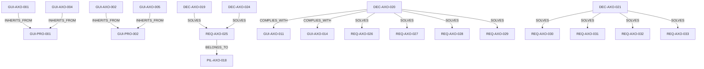

# SOLL Extraction

*Généré le : 2026-04-18 01:37:56*

*Portée : projet `AXO`*

## Topologie (Mermaid)

## Entités : Decision
### DEC-AXO-019 - Partitionnement Sémantique par Project Slug
**Description:** Centraliser le stockage (soll.db, ist.db, et données vectorielles) dans un dossier global (~/.local/share/axon/db/) avec un partitionnement strict basé sur le `project_slug`. Les tables (Symbol, File, Node, Edge, CALLS) incluront `project_slug` comme clé de partitionnement pour isoler les scopes tout en permettant des requêtes transverses (ex: scope GLOBAL).
**Status:** proposed
**Meta:** `{"rationale":"L'architecture 'Sidecar' empêche la réflexion croisée. Une BDD unique partitionnée par slug permet la vue globale et maintient l'isolation RBAC locale.","updated_at":1775491817244}`

### DEC-AXO-020 - Validation par Graphe des Invariants Architecturaux
**Description:** Implémentation de requêtes SQL récursives (CTE) et pathfinding sur le Property Graph (CALLS, CONTAINS) pour détecter formellement les boucles infinies, les fuites de domaine et les risques de blocage NIF. Transforme Axon en Linter Architectural Global.
**Status:** accepted
**Meta:** `{"priority":"P1","updated_at":1775494415789}`

### DEC-AXO-021 - L'Agent Experience (AX) comme Citoyen de Première Classe
**Description:** L'ingénierie du serveur MCP d'Axon doit garantir un déterminisme mathématique absolu pour maximiser le taux de confiance et d'utilisation par les agents IA. Le serveur doit être idempotent, auto-réparateur (Self-Healing) et hautement sémantique (DX/AX) pour devenir l'outil privilégié de l'heuristique agentique.
**Status:** accepted
**Meta:** `{"priority":"P1","updated_at":1775499126346}`

### DEC-AXO-022 - Migration C++ DuckPGQ (Option 3 - Dynamic Linking)
**Description:** Migration des requêtes SQL d'analyse de graphe (Heuristiques Avancées) des CTE récursives vers la syntaxe native SQL/PGQ (DuckPGQ). Cette décision implique le pontage dynamique (Option 3) et l'utilisation de l'extension C++ générée par le laboratoire hermétique (duckdb-graph) pour un requêtage optimal.
**Status:** accepted
**Meta:** `{"priority":"P1","updated_at":1775505975395}`

### DEC-AXO-023 - Intégration Hermétique DuckPGQ (Dynamic Linking et Syntaxe Tiret)
**Description:** Pour bénéficier des algorithmes de graphe haute performance (SQL/PGQ) sans subir de crash d'ABI C++ (std::bad_array_new_length), le moteur Axon doit abandonner la compilation statique (feature 'bundled') et basculer sur un pontage dynamique (Dynamic Linking) vers les artefacts du Laboratoire Hermétique (duckdb-graph). Toute requête SQL exploitant l'extension doit impérativement être préfixée d'un tiret (-) pour éviter un crash interne de DuckDB. Détails complets dans: docs/architecture/2026-04-06-duckpgq-hermetic-integration.md.
**Status:** accepted
**Meta:** `{"priority":"P1","updated_at":1775506148272}`

### DEC-AXO-024 - Workflow d'Enregistrement Explicite et Polling Réactif
**Description:** L'outil MCP axon_init_project prend désormais un project_path absolu. L'orchestrateur abandonne l'exploration disque statique au profit d'un polling réactif (1000ms) sur la table soll.ProjectCodeRegistry, lançant dynamiquement les Watchers/Scanners pour chaque nouveau projet enregistré.
**Status:** accepted
**Meta:** `{"priority":"P1","updated_at":1775511334279}`

### DEC-AXO-025 - Ajout tests E2E SOLL
**Description:** Nous devons ajouter des tests end-to-end pour la partie SOLL si la couverture actuelle s'avère insuffisante, afin de garantir la robustesse globale du pipeline intentionnel.
**Meta:** `{"status":"planned","updated_at":1775597550179}`

### DEC-AXO-026 - Refactoring des gros fichiers SOLL
**Description:** Il faut refactoriser les fichiers de code SOLL énormes qui accumulent de la dette technique pour faciliter la maintenance future et réduire la complexité cyclomatique.
**Meta:** `{"status":"planned","updated_at":1775597550190}`

## Entités : Guideline
### GUI-AXO-001 - TDD Obligatoire
**Description:** Les tests doivent être écrits avant ou avec le code source.
**Status:** active
**Meta:** `{"phase": "pre-code", "trigger_path": "src/axon-core/src/*", "required_path": "tests.rs", "enforcement": "strict"}`

### GUI-AXO-002 - Documentation MCP
**Description:** Toute modification de src/mcp/tools_*.rs nécessite la mise à jour de SKILL.md
**Status:** active
**Meta:** `{"phase": "post-code", "trigger_path": "src/axon-core/src/mcp/tools_*", "required_path": "SKILL.md", "enforcement": "strict"}`

### GUI-AXO-003 - Silent Dev Environment (Dual-Track Isolation)
**Description:** NEVER start the MCP server inside the development environment. Exposing two MCP servers with duplicate tool names crashes LLM clients. Development must be validated via `cargo test` in the isolated worktree, then merged to `main`.
**Status:** active
**Meta:** `{"enforcement":"soft","phase":"pre-execution","required_path":"","trigger_path":"*","updated_at":1775434919042}`

### GUI-AXO-004 - TDD Obligatoire
**Description:** Les tests doivent être écrits avant ou avec le code source.
**Status:** active
**Meta:** `{"phase": "pre-code", "trigger_path": "src/axon-core/src/*", "required_path": "tests.rs", "enforcement": "strict"}`

### GUI-AXO-005 - Documentation MCP
**Description:** Toute modification de src/mcp/tools_*.rs nécessite la mise à jour de SKILL.md
**Status:** active
**Meta:** `{"phase": "post-code", "trigger_path": "src/axon-core/src/mcp/tools_*", "required_path": "SKILL.md", "enforcement": "strict"}`

### GUI-AXO-006 - Zéro Warning & Fail-Fast
**Description:** Tout code doit compiler et passer l'analyse statique avec formellement zéro avertissement (ex: deny(warnings) en Rust, --strict en TS). La CI doit échouer immédiatement au premier avertissement détecté.
**Meta:** `{"enforcement":"strict","phase":"compile","updated_at":1775491909865}`

### GUI-AXO-007 - Vérité Physique (Zéro Mock I/O)
**Description:** Interdiction stricte d'utiliser des mocks ou stubs pour simuler les entrées/sorties (Réseau, FS, DB). Les tests d'intégration doivent instancier des ressources physiques isolées et éphémères (ex: DB temporaires sur disque) pour valider les comportements réels (verrous, WAL, concurrence).
**Meta:** `{"enforcement":"strict","phase":"test","updated_at":1775491909887}`

### GUI-AXO-008 - Séparation des Plans (Control vs Data Plane)
**Description:** Isolation architecturale obligatoire entre les processus gérant l'état/routage (Control Plane, asynchrone, faible latence) et les processus exécutant les calculs lourds ou la logique métier complexe (Data Plane, synchrone, intensif). Le Control Plane ne doit exécuter aucune logique bloquante.
**Meta:** `{"enforcement":"strict","phase":"architecture","updated_at":1775491909908}`

### GUI-AXO-009 - Builds Déterministes & Hermétiques
**Description:** La compilation d'un commit doit produire un artefact dont l'empreinte (SHA-256) est strictement identique partout (Tolérance 0%). 100% des dépendances (système et applicatives) doivent être épinglées via un fichier de verrouillage avec hash cryptographique. Le build doit réussir en isolation réseau (Air-Gap).
**Meta:** `{"enforcement":"strict","phase":"build","updated_at":1775491909930}`

### GUI-AXO-010 - Télémétrie Structurée Native
**Description:** 100% des événements applicatifs doivent être émis au format structuré (JSON/OTLP). Interdiction absolue des logs textuels bruts sur stdout nécessitant un parsing par regex. Propagation obligatoire des trace_id dans tous les appels RPC/IPC.
**Meta:** `{"enforcement":"strict","phase":"runtime","updated_at":1775491909952}`

### GUI-AXO-011 - Résilience Mécanique (Design for Failure)
**Description:** Les systèmes distribués doivent intégrer des patterns de résilience (Circuit Breakers, Back-pressure, Dégradation Gracieuse). Les seuils et mécanismes de défaillance doivent être spécifiés explicitement par des Décisions (DEC) ou Exigences (REQ) au niveau du projet.
**Meta:** `{"enforcement":"advisory","phase":"architecture","requires_local_decision":true,"updated_at":1775491909975}`

### GUI-AXO-012 - Performance comme Propriété Native
**Description:** La performance ne s'optimise pas a posteriori. Les budgets de latence (SLO/p99) et les contraintes de ressources (CPU/RAM) doivent être quantifiés et testés en CI pour chaque composant critique via des Exigences (REQ) locales du projet.
**Meta:** `{"enforcement":"advisory","phase":"architecture","requires_local_decision":true,"updated_at":1775491909999}`

### GUI-AXO-013 - Sécurité Shift-Left & Moindre Privilège
**Description:** La sécurité (scan de vulnérabilités, gestion des secrets) est automatisée dès la CI. L'accès aux ressources s'opère par RBAC granulaire. Les politiques exactes de rotation des secrets et d'authentification doivent être définies par les Décisions (DEC) du projet.
**Meta:** `{"enforcement":"advisory","phase":"security","requires_local_decision":true,"updated_at":1775491910022}`

### GUI-AXO-014 - Évolutivité Humaine & Accessibilité Cognitive
**Description:** L'architecture modulaire doit limiter la charge cognitive (DDD, Clean Architecture). Le nommage est un acte de design reflétant le métier. Le versioning des API doit être explicite. Les choix d'implémentation de ces frontières sont délégués aux projets.
**Meta:** `{"enforcement":"advisory","phase":"design","requires_local_decision":true,"updated_at":1775491910046}`

### GUI-AXO-015 - Infrastructure as Code (IaC) & Reproductibilité d'Environnement
**Description:** Les environnements doivent être éphémères et recréables à la demande. L'état de l'infrastructure est versionné (GitOps). L'outil d'automatisation (Nix, Terraform, Docker) est défini par les Décisions (DEC) spécifiques du projet.
**Meta:** `{"enforcement":"advisory","phase":"infrastructure","requires_local_decision":true,"updated_at":1775491910067}`

### GUI-AXO-016 - DRY (Don't Repeat Yourself) & Single Source of Truth
**Description:** Éviter de décrire deux fois la même chose. Chaque connaissance, logique ou règle métier doit posséder une représentation unique et non ambiguë dans le système pour éviter la désynchronisation.
**Meta:** `{"enforcement":"advisory","phase":"coding","requires_local_decision":false,"updated_at":1775491910090}`

### GUI-AXO-017 - SRP (Single Responsibility Principle) & Cohésion
**Description:** Une fonction, une classe ou un fichier ne doit avoir qu'une seule raison de changer. Les 'God Objects' (fichiers monolithiques) sont proscrits. Les responsabilités doivent être isolées.
**Meta:** `{"enforcement":"advisory","phase":"coding","requires_local_decision":false,"updated_at":1775491910112}`

### GUI-AXO-018 - KISS (Keep It Simple, Stupid) & YAGNI
**Description:** Ne pas sur-ingénieriser. Ne pas écrire de code 'au cas où' (You Aren't Gonna Need It) pour un besoin futur hypothétique. Privilégier la solution la plus simple et lisible permettant de résoudre le problème actuel.
**Meta:** `{"enforcement":"advisory","phase":"coding","requires_local_decision":false,"updated_at":1775491910142}`

### GUI-AXO-019 - Limites Cognitives & Complexité Cyclomatique
**Description:** Limitation stricte de l'imbrication et de la longueur des fonctions/fichiers. Une fonction doit idéalement être lisible sur un seul écran sans défilement mental complexe. Les seuils précis doivent être validés par les linters du projet.
**Meta:** `{"enforcement":"advisory","phase":"coding","requires_local_decision":true,"updated_at":1775491910171}`

### GUI-AXO-020 - Clean-As-You-Go (Zéro Code Mort)
**Description:** Le code obsolète, commenté ou remplacé doit être immédiatement supprimé une fois la nouvelle implémentation testée et validée en CI. La base de code ne doit contenir aucun code mort (fonctions/fichiers opérationnels sans appelants actifs). L'accumulation de code 'au cas où' est une violation de la sécurité et de la maintenabilité.
**Meta:** `{"enforcement":"strict","phase":"refactoring","requires_local_decision":false,"updated_at":1775492169608}`

## Entités : Milestone
### MIL-AXO-012 - Plan de Remédiation : Audit de Conformité d'Axon
**Description:** Campagne globale de remédiation visant à corriger les bugs analytiques du moteur d'audit d'Axon (faux positifs) et à éradiquer la véritable dette technique identifiée (expositions unsafe et God Objects).
**Status:** proposed
**Meta:** `{"priority":"P1","updated_at":1775499044479}`

## Entités : Pillar
### PIL-AXO-018 - Démon Central (Omniscience)
**Description:** La souveraineté sémantique exige un Treillis de Connaissance Vivant centralisé. Le système bascule vers un modèle de Démon Central (Omniscience) traitant, stockant et analysant simultanément les graphes de N projets (cross-project analysis).
**Meta:** `{"goal":"Briser l'isolation 'Sidecar' pour permettre la réflexion globale sur de multiples bases de code.","priority":"P1","updated_at":1775491776563}`

## Entités : Requirement
### REQ-AXO-025 - Service Global et Base de Données Unifiée
**Description:** Le démon Axon ne doit plus s'exécuter de manière isolée dans le dossier de travail. Il doit devenir un service système unique écoutant sur un port global dédié (44129) avec une base de données unifiée. Les requêtes MCP exigeront le passage en paramètre du project_slug ou le déduiront de l'URI.
**Status:** pending
**Meta:** `{"priority":"P1","updated_at":1775491792664}`

### REQ-AXO-026 - Détection de la Propagation du Risque (Unsafe Exposure)
**Description:** Détecter mécaniquement si une fonction publique expose silencieusement du code dangereux (ex: blocs unsafe, unwrap()) en profondeur dans le graphe d'appels. L'audit doit bloquer la CI si un chemin non protégé existe entre l'API publique et le code à risque.
**Status:** accepted
**Meta:** `{"priority":"P1","updated_at":1775496752436}`

### REQ-AXO-027 - Prévention des Risques de Blocage NIF (Scheduler Starvation)
**Description:** Détecter formellement les risques d'effondrement du Scheduler Erlang/BEAM en identifiant les appels synchrones Elixir -> Rust (CALLS_NIF) où la cible Rust possède une forte profondeur d'appels ou invoque des bibliothèques bloquantes sans traitement asynchrone explicite.
**Status:** accepted
**Meta:** `{"priority":"P1","updated_at":1775496990879}`

### REQ-AXO-028 - Détection des Dépendances Circulaires
**Description:** Détecter formellement les boucles infinies et les dépendances cycliques (A -> B -> C -> A) au sein du graphe d'appels. La présence d'une boucle doit pénaliser le score d'audit et bloquer la Quality Gate.
**Status:** accepted
**Meta:** `{"priority":"P1","updated_at":1775497240298}`

### REQ-AXO-029 - Détection des Fuites de Domaine (Domain Leakage)
**Description:** Garantir mathématiquement la Clean Architecture en interdisant toute dépendance directe d'un fichier du domaine (ex: src/domain/) vers un fichier d'infrastructure (ex: src/infra/). Toute fuite de domaine détectée doit faire échouer la Quality Gate.
**Status:** accepted
**Meta:** `{"priority":"P1","updated_at":1775497240323}`

### REQ-AXO-030 - Résilience des Connexions MCP (Auto-Healing)
**Description:** Le serveur Axon MCP doit implémenter un auto-reconnect robuste vers sa base de données. Un client MCP ne doit jamais recevoir d'erreur de topologie interne (ex: "Not connected") suite à une perte de connexion, garantissant la résilience des sessions IA.
**Status:** accepted
**Meta:** `{"priority":"P1","updated_at":1775499115287}`

### REQ-AXO-031 - Idempotence Absolue des Mutations MCP
**Description:** Les outils de mutation MCP (soll_apply_plan, etc.) doivent être strictement idempotents (Upsert). Une réexécution doit retourner "No changes" sans crasher ni exposer la complexité SQL sous-jacente au client.
**Status:** accepted
**Meta:** `{"priority":"P1","updated_at":1775499115330}`

### REQ-AXO-032 - Découvrabilité et Messages d'Erreur (AX/DX)
**Description:** Le serveur MCP doit appliquer le Fail-Fast avec Contexte. Une erreur sur un argument (ex: project_slug invalide) doit fournir l'état attendu et les valeurs valides disponibles pour permettre l'auto-correction immédiate de l'agent.
**Status:** accepted
**Meta:** `{"priority":"P1","updated_at":1775499115364}`

### REQ-AXO-033 - Cohérence du Scope et Requêtes Sémantiques MCP
**Description:** L'API MCP doit offrir des requêtes sémantiques de haut niveau pré-filtrées (ex: filtrer par statut, entité et projet simultanément) plutôt que d'obliger le client IA à extraire un graphe complet pour le filtrer en mémoire.
**Status:** accepted
**Meta:** `{"priority":"P2","updated_at":1775499115416}`

### REQ-AXO-034 - MCP Validate Requirement
**Description:** Synthetic MCP validation requirement
**Meta:** `{"priority":"P3","updated_at":1775865443440}`

### REQ-AXO-035 - MCP Validate Requirement
**Description:** Synthetic MCP validation requirement
**Meta:** `{"priority":"P3","updated_at":1775865572318}`

### REQ-AXO-036 - MCP Validate Requirement
**Description:** Synthetic MCP validation requirement
**Meta:** `{"priority":"P3","updated_at":1775910544147}`

### REQ-AXO-037 - MCP Validate Requirement
**Description:** Synthetic MCP validation requirement
**Meta:** `{"priority":"P3","updated_at":1775917033265}`

### REQ-AXO-038 - MCP Validate Requirement
**Description:** Synthetic MCP validation requirement
**Meta:** `{"priority":"P3","updated_at":1775920284586}`

### REQ-AXO-039 - MCP Validate Requirement
**Description:** Synthetic MCP validation requirement
**Meta:** `{"priority":"P3","updated_at":1775928757898}`

### REQ-AXO-040 - MCP Validate Requirement
**Description:** Synthetic MCP validation requirement
**Meta:** `{"priority":"P3","updated_at":1775929065569}`

### REQ-AXO-041 - MCP Validate Requirement
**Description:** Synthetic MCP validation requirement
**Meta:** `{"priority":"P3","updated_at":1775929630949}`

### REQ-AXO-042 - MCP Validate Requirement
**Description:** Synthetic MCP validation requirement
**Meta:** `{"priority":"P3","updated_at":1775930374495}`

### REQ-AXO-043 - MCP Validate Requirement
**Description:** Synthetic MCP validation requirement
**Meta:** `{"priority":"P3","updated_at":1775931165457}`

### REQ-AXO-044 - MCP Validate Requirement
**Description:** Synthetic MCP validation requirement
**Meta:** `{"priority":"P3","updated_at":1775931838214}`

### REQ-AXO-045 - MCP Validate Requirement
**Description:** Synthetic MCP validation requirement
**Meta:** `{"priority":"P3","updated_at":1775932312391}`

### REQ-AXO-046 - MCP Validate Requirement
**Description:** Synthetic MCP validation requirement
**Meta:** `{"priority":"P3","updated_at":1775933344034}`

### REQ-AXO-047 - MCP Validate Requirement
**Description:** Synthetic MCP validation requirement
**Meta:** `{"priority":"P3","updated_at":1775933952712}`

### REQ-AXO-048 - MCP Validate Requirement
**Description:** Synthetic MCP validation requirement
**Meta:** `{"priority":"P3","updated_at":1775934707707}`

### REQ-AXO-049 - MCP Validate Requirement
**Description:** Synthetic MCP validation requirement
**Meta:** `{"priority":"P3","updated_at":1775935079078}`

### REQ-AXO-050 - MCP Validate Requirement
**Description:** Synthetic MCP validation requirement
**Meta:** `{"priority":"P3","updated_at":1775935296976}`

## Entités : Vision
### VIS-AXO-001 - Vision HydraDB - The Resilient-First Sovereign Database
**Description:** Bâtir un moteur de base de données souverain, multi-modèle et haute performance, conçu pour l'investigation numérique complexe et la logistique industrielle 4.0. Priorise la survie aux pannes (mode îlot de 72h+), la traçabilité légale (chain of custody immuable) et l'économie de ressources.
**Status:** null
**Meta:** `{"updated_at":1775600408891}`

