# SOLL Extraction

*Généré le : 2026-04-19 00:42:57*

## Topologie (Mermaid)

```mermaid
graph TD;
  PIL-AXO-001 -- EPITOMIZES --> VIS-AXO-001;
  PIL-AXO-002 -- EPITOMIZES --> VIS-AXO-001;
  PIL-AXO-003 -- EPITOMIZES --> VIS-AXO-001;
  PIL-AXO-004 -- EPITOMIZES --> VIS-AXO-001;
  PIL-AXO-005 -- EPITOMIZES --> VIS-AXO-001;
  PIL-AXO-006 -- EPITOMIZES --> VIS-AXO-001;
  REQ-AXO-001 -- BELONGS_TO --> PIL-AXO-001;
  REQ-AXO-002 -- BELONGS_TO --> PIL-AXO-004;
  REQ-AXO-003 -- BELONGS_TO --> PIL-AXO-002;
  REQ-AXO-004 -- BELONGS_TO --> PIL-AXO-003;
  REQ-AXO-005 -- BELONGS_TO --> PIL-AXO-003;
  REQ-AXO-006 -- BELONGS_TO --> PIL-AXO-004;
  REQ-AXO-007 -- BELONGS_TO --> PIL-AXO-005;
  REQ-AXO-008 -- BELONGS_TO --> PIL-AXO-005;
  REQ-AXO-009 -- BELONGS_TO --> PIL-AXO-005;
  REQ-AXO-010 -- BELONGS_TO --> PIL-AXO-006;
  REQ-AXO-011 -- BELONGS_TO --> PIL-AXO-002;
  CPT-AXO-001 -- EXPLAINS --> REQ-AXO-001;
  CPT-AXO-002 -- EXPLAINS --> REQ-AXO-005;
  CPT-AXO-003 -- EXPLAINS --> REQ-AXO-003;
  CPT-AXO-004 -- EXPLAINS --> REQ-AXO-001;
  CPT-AXO-005 -- EXPLAINS --> REQ-AXO-004;
  CPT-AXO-006 -- EXPLAINS --> REQ-AXO-007;
  CPT-AXO-007 -- EXPLAINS --> REQ-AXO-011;
  CPT-AXO-008 -- EXPLAINS --> REQ-AXO-010;
  DEC-AXO-001 -- SOLVES --> REQ-AXO-001;
  DEC-AXO-002 -- REFINES --> REQ-AXO-001;
  DEC-AXO-003 -- SOLVES --> REQ-AXO-002;
  DEC-AXO-003 -- SOLVES --> REQ-AXO-006;
  DEC-AXO-004 -- SOLVES --> REQ-AXO-004;
  DEC-AXO-005 -- SOLVES --> REQ-AXO-011;
  DEC-AXO-005 -- REFINES --> REQ-AXO-002;
  DEC-AXO-006 -- SOLVES --> REQ-AXO-003;
  DEC-AXO-007 -- SOLVES --> REQ-AXO-007;
  DEC-AXO-007 -- SOLVES --> REQ-AXO-008;
  DEC-AXO-008 -- SOLVES --> REQ-AXO-010;
  DEC-AXO-009 -- SOLVES --> REQ-AXO-005;
  DEC-AXO-010 -- SOLVES --> REQ-AXO-009;
  MIL-AXO-001 -- TARGETS --> REQ-AXO-002;
  MIL-AXO-001 -- TARGETS --> REQ-AXO-006;
  MIL-AXO-002 -- TARGETS --> REQ-AXO-007;
  MIL-AXO-002 -- TARGETS --> REQ-AXO-008;
  MIL-AXO-003 -- TARGETS --> REQ-AXO-009;
  MIL-AXO-004 -- TARGETS --> REQ-AXO-004;
  MIL-AXO-004 -- TARGETS --> REQ-AXO-005;
  VAL-AXO-001 -- VERIFIES --> REQ-AXO-001;
  VAL-AXO-002 -- VERIFIES --> REQ-AXO-009;
  VAL-AXO-003 -- VERIFIES --> REQ-AXO-002;
  DEC-AXO-002 -- SOLVES --> REQ-AXO-001;
  GUI-AXO-001 -- INHERITS_FROM --> GUI-PRO-001;
  GUI-AXO-002 -- INHERITS_FROM --> GUI-PRO-001;
  GUI-AXO-003 -- INHERITS_FROM --> GUI-PRO-001;
  PIL-NTO-001 -- EPITOMIZES --> VIS-NTO-001;
  PIL-NTO-002 -- EPITOMIZES --> VIS-NTO-001;
  PIL-NTO-003 -- EPITOMIZES --> VIS-NTO-001;
  PIL-NTO-004 -- EPITOMIZES --> VIS-NTO-001;
  PIL-NTO-005 -- EPITOMIZES --> VIS-NTO-001;
  PIL-NTO-006 -- EPITOMIZES --> VIS-NTO-001;
  PIL-NTO-007 -- EPITOMIZES --> VIS-NTO-001;
  REQ-NTO-001 -- BELONGS_TO --> PIL-NTO-001;
  REQ-NTO-002 -- BELONGS_TO --> PIL-NTO-002;
  REQ-NTO-003 -- BELONGS_TO --> PIL-NTO-002;
  REQ-NTO-004 -- BELONGS_TO --> PIL-NTO-002;
  REQ-NTO-005 -- BELONGS_TO --> PIL-NTO-004;
  REQ-NTO-006 -- BELONGS_TO --> PIL-NTO-003;
  REQ-NTO-007 -- BELONGS_TO --> PIL-NTO-003;
  REQ-NTO-008 -- BELONGS_TO --> PIL-NTO-005;
  REQ-NTO-009 -- BELONGS_TO --> PIL-NTO-006;
  REQ-NTO-010 -- BELONGS_TO --> PIL-NTO-007;
  REQ-NTO-011 -- BELONGS_TO --> PIL-NTO-007;
  REQ-NTO-012 -- BELONGS_TO --> PIL-NTO-007;
  DEC-NTO-001 -- SOLVES --> REQ-NTO-012;
  DEC-NTO-002 -- SOLVES --> REQ-NTO-010;
  DEC-NTO-003 -- SOLVES --> REQ-NTO-011;
  DEC-NTO-004 -- SOLVES --> REQ-NTO-008;
  DEC-NTO-005 -- SOLVES --> REQ-NTO-007;
  DEC-NTO-006 -- SOLVES --> REQ-NTO-001;
  DEC-NTO-007 -- SOLVES --> REQ-NTO-005;
  DEC-NTO-008 -- SOLVES --> REQ-NTO-009;
  VAL-NTO-001 -- VERIFIES --> REQ-NTO-002;
  VAL-NTO-002 -- VERIFIES --> REQ-NTO-006;
  VAL-NTO-003 -- VERIFIES --> REQ-NTO-005;
  VAL-NTO-004 -- VERIFIES --> REQ-NTO-008;
  VAL-NTO-005 -- VERIFIES --> REQ-NTO-009;
  VAL-NTO-006 -- VERIFIES --> REQ-NTO-007;
  VAL-NTO-007 -- VERIFIES --> REQ-NTO-010;
  VAL-NTO-008 -- VERIFIES --> REQ-NTO-011;
  CPT-NTO-001 -- EXPLAINS --> REQ-NTO-003;
  CPT-NTO-002 -- EXPLAINS --> REQ-NTO-003;
  CPT-NTO-003 -- EXPLAINS --> REQ-NTO-002;
  CPT-NTO-004 -- EXPLAINS --> REQ-NTO-002;
  CPT-NTO-005 -- EXPLAINS --> REQ-NTO-004;
  CPT-NTO-006 -- EXPLAINS --> REQ-NTO-006;
  CPT-NTO-007 -- EXPLAINS --> REQ-NTO-006;
  CPT-NTO-008 -- EXPLAINS --> REQ-NTO-006;
  CPT-NTO-009 -- EXPLAINS --> REQ-NTO-007;
  CPT-NTO-010 -- EXPLAINS --> REQ-NTO-008;
  CPT-NTO-012 -- EXPLAINS --> REQ-NTO-005;
  CPT-NTO-011 -- EXPLAINS --> REQ-NTO-005;
  STK-NTO-001 -- ORIGINATES --> REQ-NTO-001;
  STK-NTO-002 -- ORIGINATES --> REQ-NTO-002;
  STK-NTO-003 -- ORIGINATES --> REQ-NTO-011;
  STK-NTO-004 -- ORIGINATES --> REQ-NTO-010;
  MIL-NTO-001 -- TARGETS --> REQ-NTO-001;
  MIL-NTO-001 -- TARGETS --> REQ-NTO-005;
  MIL-NTO-001 -- TARGETS --> REQ-NTO-007;
  MIL-NTO-001 -- TARGETS --> REQ-NTO-010;
  MIL-NTO-001 -- TARGETS --> REQ-NTO-012;
  REQ-NTO-001 -- BELONGS_TO --> PIL-NTO-002;
  DEC-NTO-004 -- SOLVES --> REQ-NTO-007;
  VAL-NTO-001 -- VERIFIES --> REQ-NTO-001;
  CPT-NTO-001 -- EXPLAINS --> REQ-NTO-001;
```

## Entités : Concept
### CPT-AXO-001 - IST
**Description:** The canonical indexed structural truth: files, symbols, calls, chunks, embeddings, and graph projections derived from the physical codebase.
**Status:** null
**Meta:** `{"rationale":"Implementation truth must stay reconstructible and distinct from intent."}`

### CPT-AXO-002 - SOLL
**Description:** The intentional graph that captures vision, pillars, requirements, decisions, milestones, validations, and project-level continuity.
**Status:** null
**Meta:** `{"rationale":"Conceptual truth must remain explicit, reviewable, exportable, and comparable against implementation."}`

### CPT-AXO-003 - Retrieve Context Packet
**Description:** The planner-driven evidence packet assembled by retrieve_context from exact anchors, bounded graph evidence, chunks, and optional SOLL rationale.
**Status:** null
**Meta:** `{"rationale":"LLM answerability requires bounded, explainable evidence rather than raw retrieval volume."}`

### CPT-AXO-004 - Runtime Identity
**Description:** The explicit runtime contract returned by status: instance kind, runtime identity, build, install generation, mutation policy, and data roots.
**Status:** null
**Meta:** `{"rationale":"A client must never infer whether it talks to live or dev."}`

### CPT-AXO-005 - Project Code Registry
**Description:** The canonical mapping of project_code, project_name, and project_path used to scope Axon operations and assign server-owned identities.
**Status:** null
**Meta:** `{"rationale":"Canonical identity prevents drift between path, name, and project scope."}`

### CPT-AXO-006 - Release Manifest
**Description:** The immutable manifest that binds Git source identity, package version, build id, artifact checksum, and qualification evidence for promotion or rollback.
**Status:** null
**Meta:** `{"rationale":"Live promotion must be artifact- and proof-driven."}`

### CPT-AXO-007 - Public MCP Surface
**Description:** The full Axon MCP product surface intended for LLM use, including advanced diagnostics and graph capabilities when they are part of the product value.
**Status:** null
**Meta:** `{"rationale":"Product tools must be publicly visible and not depend on guessing hidden names."}`

### CPT-AXO-008 - Resource Policy
**Description:** The instance-aware policy that controls background budget class, GPU access policy, watcher policy, and resource priority for live and dev.
**Status:** null
**Meta:** `{"rationale":"Two healthy runtimes still need explicit contention governance."}`

### CPT-NTO-001 - Weekly Food Plan
**Description:** The central product object: a contextualized weekly plan coordinating stock, purchases, meals, preparation, leftovers, nutritional balance, and user constraints across time.
**Meta:** `{"updated_at":1776549605372}`

### CPT-NTO-002 - Meal Slot
**Description:** A specific food moment within the week, such as Monday breakfast, Wednesday lunch, Friday dinner, or a relevant snack opportunity.
**Meta:** `{"updated_at":1776549605493}`

### CPT-NTO-003 - Pantry Item
**Description:** A food item already present in the home context, with approximate quantity, location, confidence level, and usage priority.
**Meta:** `{"updated_at":1776549605633}`

### CPT-NTO-004 - Shopping Candidate
**Description:** A product proposed for purchase to complement the current stock and complete the weekly plan in a realistic and cost-aware way.
**Meta:** `{"updated_at":1776549605763}`

### CPT-NTO-005 - Preparation Session
**Description:** A grouped cooking or preparation window, such as Sunday batch cooking, that supports execution of the weekly plan through reused bases, leftovers, freezing, or partial prep.
**Meta:** `{"updated_at":1776549605881}`

### CPT-NTO-006 - Adherence Signal
**Description:** A structured signal from lived experience, such as hunger, satiety, fatigue, satisfaction, frustration, complexity, or ease, used to adapt future planning.
**Meta:** `{"updated_at":1776549606012}`

### CPT-NTO-007 - Exception Event
**Description:** A real-life disruption affecting the plan, such as a restaurant meal, an unplanned drink, a skipped meal, a richer meal, or a schedule change.
**Meta:** `{"updated_at":1776549617365}`

### CPT-NTO-008 - Replan Action
**Description:** A recommended adaptation applied after an exception or feedback signal, such as replacing a meal, simplifying preparation, reusing stock differently, or shifting effort across the week.
**Meta:** `{"updated_at":1776549617537}`

### CPT-NTO-009 - Optimization Profile
**Description:** The user-specific arbitration profile that balances health, simplicity, cost, variety, satiety, available time, stock reuse, waste reduction, and pleasure.
**Meta:** `{"updated_at":1776549617710}`

### CPT-NTO-010 - Explanation Unit
**Description:** A pedagogical explanation attached to a planning decision, including rationale, tradeoff, expected impact, and possible alternatives.
**Meta:** `{"updated_at":1776549617880}`

### CPT-NTO-011 - Captured Food Evidence
**Description:** Raw user-provided food evidence such as barcode scans, label photos, OCR text, images, or quick declarations that the system interprets and structures.
**Meta:** `{"updated_at":1776549618041}`

### CPT-NTO-012 - Normalized Food Item
**Description:** A structured and confidence-aware representation of a captured food item after normalization of product identity, quantity, units, and usable nutritional fields.
**Meta:** `{"updated_at":1776549618186}`

### CPT-PRO-001 - MCP Validate Concept
**Description:** Synthetic MCP validation concept
**Meta:** `{"rationale":"Validation-only concept outside AXO scope","updated_at":1776540386039}`

### CPT-PRO-002 - MCP Validate Concept
**Description:** Synthetic MCP validation concept
**Meta:** `{"rationale":"Validation-only concept outside AXO scope","updated_at":1776540560943}`

### CPT-PRO-003 - MCP Validate Concept
**Description:** Synthetic MCP validation concept
**Meta:** `{"rationale":"Validation-only concept outside AXO scope","updated_at":1776544127923}`

## Entités : Decision
### DEC-AXO-001 - Rust is the canonical runtime and Elixir observes it
**Description:** Rust owns ingestion, IST, MCP, SQL, and release/runtime truth; Elixir/Phoenix serves visualization, telemetry, and read-oriented projections.
**Status:** accepted
**Meta:** `{"context":"Axon had diverging runtime responsibilities between control-plane and data-plane concerns.","rationale":"A single runtime authority reduces ambiguity and keeps dashboard concerns observational."}`

### DEC-AXO-002 - DuckDB is the current embedded daily backend
**Description:** The nominal daily path uses the embedded DuckDB-based graph/SQL backend rather than historical alternatives such as KuzuDB or HydraDB.
**Status:** accepted
**Meta:** `{"context":"The repo contains historical backends and architectural experiments.","rationale":"Current operational truth must reflect the backend actually used by the live runtime."}`

### DEC-AXO-003 - Live and dev share one MCP contract across two runtime identities
**Description:** Axon exposes the same MCP tool contract on live and dev while separating ports, state roots, run roots, and mutation posture.
**Status:** accepted
**Meta:** `{"context":"Axon must remain both a stable truth runtime and a mutable development environment.","rationale":"Clients learn one API and choose an instance explicitly rather than learning two different products."}`

### DEC-AXO-004 - Project codes and canonical IDs are assigned by the server
**Description:** project_code, preview_id, revision_id, and TYPE-CODE-NNN identifiers are server-owned; clients request work, then reuse the returned canonical identities.
**Status:** accepted
**Meta:** `{"context":"Historical drift existed between project_slug, project_name, and project_code.","rationale":"Canonical server-owned identity removes ambiguity and prevents LLM fabrication of critical identifiers."}`

### DEC-AXO-005 - Axon's product-value MCP tools are public by default
**Description:** Advanced graph, runtime, and diagnostic tools are treated as public product surface when they are part of Axon's value for LLMs, while only true transport and implementation primitives remain internal.
**Status:** accepted
**Meta:** `{"context":"The previous public/expert split hid useful product tools and encouraged detours.","rationale":"Public contract must match product value and runtime reality."}`

### DEC-AXO-006 - retrieve_context is planner-driven and pressure-aware
**Description:** retrieve_context uses explicit route selection, bounded graph expansion, conditional SOLL injection, and pressure-aware degradation instead of opaque retrieval heuristics.
**Status:** accepted
**Meta:** `{"context":"LLMs need bounded answerability rather than uncontrolled retrieval volume.","rationale":"Explainable planning and explicit degradation produce better agent ergonomics and safer runtime behavior."}`

### DEC-AXO-007 - Live promotion uses immutable manifests and runtime post-checks
**Description:** A pushed commit is not a production release; live promotion is driven by a qualified manifest, immutable archived artifact, restart, and MCP status verification.
**Status:** accepted
**Meta:** `{"context":"Development cadence and operational release cadence must remain distinct.","rationale":"Artifact lineage and post-checks make production identity explicit and reversible."}`

### DEC-AXO-008 - Resource governance is live-first and reuses existing runtime controls
**Description:** Resource contention between live and dev is managed by instance-aware policies layered on existing runtime tuning, queue budgets, and pressure guards instead of a new scheduler.
**Status:** accepted
**Meta:** `{"context":"Two healthy runtimes on one host can still interfere through CPU, RAM, GPU, and I/O.","rationale":"Reuse of proven runtime knobs minimizes complexity while preserving responsiveness."}`

### DEC-AXO-009 - SOLL remains separate from IST
**Description:** SOLL is the intentional documentation layer and must remain protected, exportable, and comparable against the reconstructible IST implementation truth.
**Status:** accepted
**Meta:** `{"context":"Conceptual drift and documentation loss require a durable intentional layer independent from re-indexable structure.","rationale":"Implementation truth and intentional truth serve different roles and should not collapse into one mutable substrate."}`

### DEC-AXO-010 - quality-mcp is the canonical operator gate for live MCP quality
**Description:** The unified qualification flow delegates to the underlying validators and measurement probes, then returns one operator verdict for core MCP quality and latency.
**Status:** accepted
**Meta:** `{"context":"Qualification scripts were historically fragmented and too easy to misread.","rationale":"One canonical entrypoint reduces operator ambiguity while preserving specialist probes underneath."}`

### DEC-NTO-001 - Accepted Material Decisions Must Be Recorded in SOLL
**Description:** Any important accepted project decision affecting product direction, architecture, or delivery doctrine must be recorded in SOLL promptly after stabilization. SOLL is the canonical entrenched memory of the project.
**Meta:** `{"updated_at":1776546794589}`

### DEC-NTO-002 - Elixir and Postgres as Product Core
**Description:** Nutri-Opti will be built as an Elixir-based SaaS application with Postgres as the transactional source of truth.
**Meta:** `{"updated_at":1776546804648}`

### DEC-NTO-003 - Nix and Devenv as Official Development Environment
**Description:** The official local development environment will be reproducible through Nix and Devenv.
**Meta:** `{"updated_at":1776546804776}`

### DEC-NTO-004 - LLM Is Not the Source of Truth
**Description:** LLMs will support dialogue, explanation, candidate generation, and interpretation of weakly structured food signals, but deterministic planning and scoring logic will remain authoritative.
**Meta:** `{"updated_at":1776546804897}`

### DEC-NTO-005 - Deterministic Planning and Optimization Core
**Description:** The planning engine will combine deterministic rules, constraint filtering, and optimization to maintain week-level coherence and human-tenable plans.
**Meta:** `{"updated_at":1776546805024}`

### DEC-NTO-006 - Visual and Conversational Product Interface
**Description:** The user experience will combine chat-like interaction with strongly visual planning views rather than relying on pure chat or pure forms.
**Meta:** `{"updated_at":1776546812882}`

### DEC-NTO-007 - Dedicated Food Capture and Normalization Context
**Description:** Food capture through barcode, label, OCR, image, and quick declarations will be normalized in a dedicated context with confidence-aware structured outputs.
**Meta:** `{"updated_at":1776546813075}`

### DEC-NTO-008 - Swiss-Actionable Product Positioning
**Description:** The product will prioritize realistic Swiss actionability over generic meal-planner conventions, including local availability, seasonality, and practical shopping behavior.
**Meta:** `{"updated_at":1776546813241}`

## Entités : Guideline
### GUI-AXO-001 - TDD Obligatoire
**Description:** Les tests doivent être écrits avant ou avec le code source.
**Status:** active
**Meta:** `{"phase": "pre-code", "trigger_path": "src/axon-core/src/*", "required_path": "tests.rs", "enforcement": "strict"}`

### GUI-AXO-002 - TDD Obligatoire
**Description:** Les tests doivent être écrits avant ou avec le code source.
**Status:** active
**Meta:** `{"phase": "pre-code", "trigger_path": "src/axon-core/src/*", "required_path": "tests.rs", "enforcement": "strict"}`

### GUI-AXO-003 - TDD Obligatoire
**Description:** Les tests doivent être écrits avant ou avec le code source.
**Status:** active
**Meta:** `{"phase": "pre-code", "trigger_path": "src/axon-core/src/*", "required_path": "tests.rs", "enforcement": "strict"}`

### GUI-PRO-001 - TDD Obligatoire
**Description:** Les tests doivent être écrits avant ou avec le code source.
**Status:** active
**Meta:** `{"phase": "pre-code", "trigger_path": "src/axon-core/src/*", "required_path": "tests.rs", "enforcement": "strict"}`

### GUI-PRO-002 - Documentation MCP
**Description:** Toute modification de src/mcp/tools_*.rs nécessite la mise à jour de SKILL.md
**Status:** active
**Meta:** `{"phase": "post-code", "trigger_path": "src/axon-core/src/mcp/tools_*", "required_path": "SKILL.md", "enforcement": "strict"}`

### GUI-PRO-003 - Zéro Warning & Fail-Fast
**Description:** Tout code doit compiler et passer l'analyse statique avec formellement zéro avertissement (ex: deny(warnings) en Rust, --strict en TS). La CI doit échouer immédiatement au premier avertissement détecté.
**Status:** active
**Meta:** `{"phase": "compile", "trigger_path": "*", "enforcement": "strict"}`

### GUI-PRO-004 - Vérité Physique (Zéro Mock I/O)
**Description:** Interdiction stricte d'utiliser des mocks ou stubs pour simuler les entrées/sorties (Réseau, FS, DB). Les tests d'intégration doivent instancier des ressources physiques isolées et éphémères (ex: DB temporaires sur disque) pour valider les comportements réels (verrous, WAL, concurrence).
**Status:** active
**Meta:** `{"phase": "test", "trigger_path": "*", "enforcement": "strict"}`

### GUI-PRO-005 - Séparation des Plans (Control vs Data Plane)
**Description:** Isolation architecturale obligatoire entre les processus gérant l'état/routage (Control Plane, asynchrone, faible latence) et les processus exécutant les calculs lourds ou la logique métier complexe (Data Plane, synchrone, intensif). Le Control Plane ne doit exécuter aucune logique bloquante.
**Status:** active
**Meta:** `{"phase": "architecture", "trigger_path": "*", "enforcement": "strict"}`

### GUI-PRO-006 - Builds Déterministes & Hermétiques
**Description:** La compilation d'un commit doit produire un artefact dont l'empreinte (SHA-256) est strictement identique partout (Tolérance 0%). 100% des dépendances (système et applicatives) doivent être épinglées via un fichier de verrouillage avec hash cryptographique. Le build doit réussir en isolation réseau (Air-Gap).
**Status:** active
**Meta:** `{"phase": "build", "trigger_path": "*", "enforcement": "strict"}`

### GUI-PRO-007 - Télémétrie Structurée Native
**Description:** 100% des événements applicatifs doivent être émis au format structuré (JSON/OTLP). Interdiction absolue des logs textuels bruts sur stdout nécessitant un parsing par regex. Propagation obligatoire des trace_id dans tous les appels RPC/IPC.
**Status:** active
**Meta:** `{"phase": "runtime", "trigger_path": "*", "enforcement": "strict"}`

### GUI-PRO-008 - Résilience Mécanique (Design for Failure)
**Description:** Les systèmes distribués doivent intégrer des patterns de résilience (Circuit Breakers, Back-pressure, Dégradation Gracieuse). Les seuils et mécanismes de défaillance doivent être spécifiés explicitement par des Décisions (DEC) ou Exigences (REQ) au niveau du projet.
**Status:** active
**Meta:** `{"phase": "architecture", "trigger_path": "*", "enforcement": "advisory", "requires_local_decision": true}`

### GUI-PRO-009 - Performance comme Propriété Native
**Description:** La performance ne s'optimise pas a posteriori. Les budgets de latence (SLO/p99) et les contraintes de ressources (CPU/RAM) doivent être quantifiés et testés en CI pour chaque composant critique via des Exigences (REQ) locales du projet.
**Status:** active
**Meta:** `{"phase": "architecture", "trigger_path": "*", "enforcement": "advisory", "requires_local_decision": true}`

### GUI-PRO-010 - Sécurité Shift-Left & Moindre Privilège
**Description:** La sécurité (scan de vulnérabilités, gestion des secrets) est automatisée dès la CI. L'accès aux ressources s'opère par RBAC granulaire. Les politiques exactes de rotation des secrets et d'authentification doivent être définies par les Décisions (DEC) du projet.
**Status:** active
**Meta:** `{"phase": "security", "trigger_path": "*", "enforcement": "advisory", "requires_local_decision": true}`

### GUI-PRO-011 - Évolutivité Humaine & Accessibilité Cognitive
**Description:** L'architecture modulaire doit limiter la charge cognitive (DDD, Clean Architecture). Le nommage est un acte de design reflétant le métier. Le versioning des API doit être explicite. Les choix d'implémentation de ces frontières sont délégués aux projets.
**Status:** active
**Meta:** `{"phase": "design", "trigger_path": "*", "enforcement": "advisory", "requires_local_decision": true}`

### GUI-PRO-012 - Infrastructure as Code (IaC) & Reproductibilité d'Environnement
**Description:** Les environnements doivent être éphémères et recréables à la demande. L'état de l'infrastructure est versionné (GitOps). L'outil d'automatisation (Nix, Terraform, Docker) est défini par les Décisions (DEC) spécifiques du projet.
**Status:** active
**Meta:** `{"phase": "infrastructure", "trigger_path": "*", "enforcement": "advisory", "requires_local_decision": true}`

### GUI-PRO-013 - DRY (Don't Repeat Yourself) & Single Source of Truth
**Description:** Éviter de décrire deux fois la même chose. Chaque connaissance, logique ou règle métier doit posséder une représentation unique et non ambiguë dans le système pour éviter la désynchronisation.
**Status:** active
**Meta:** `{"phase": "coding", "trigger_path": "*", "enforcement": "advisory", "requires_local_decision": false}`

### GUI-PRO-014 - SRP (Single Responsibility Principle) & Cohésion
**Description:** Une fonction, une classe ou un fichier ne doit avoir qu'une seule raison de changer. Les 'God Objects' (fichiers monolithiques) sont proscrits. Les responsabilités doivent être isolées.
**Status:** active
**Meta:** `{"phase": "coding", "trigger_path": "*", "enforcement": "advisory", "requires_local_decision": false}`

### GUI-PRO-015 - KISS (Keep It Simple, Stupid) & YAGNI
**Description:** Ne pas sur-ingénieriser. Ne pas écrire de code 'au cas où' (You Aren't Gonna Need It) pour un besoin futur hypothétique. Privilégier la solution la plus simple et lisible permettant de résoudre le problème actuel.
**Status:** active
**Meta:** `{"phase": "coding", "trigger_path": "*", "enforcement": "advisory", "requires_local_decision": false}`

### GUI-PRO-016 - Limites Cognitives & Complexité Cyclomatique
**Description:** Limitation stricte de l'imbrication et de la longueur des fonctions/fichiers. Une fonction doit idéalement être lisible sur un seul écran sans défilement mental complexe. Les seuils précis doivent être validés par les linters du projet.
**Status:** active
**Meta:** `{"phase": "coding", "trigger_path": "*", "enforcement": "advisory", "requires_local_decision": true}`

### GUI-PRO-017 - Clean-As-You-Go (Zéro Code Mort)
**Description:** Le code obsolète, commenté ou remplacé doit être immédiatement supprimé une fois la nouvelle implémentation testée. La base de code ne doit contenir aucun code mort (fonctions sans appelants actifs).
**Status:** active
**Meta:** `{"phase": "refactoring", "trigger_path": "*", "enforcement": "strict", "requires_local_decision": false}`

## Entités : Milestone
### MIL-AXO-001 - Dual-instance runtime is operational
**Description:** null
**Status:** completed
**Meta:** `{"scope": "runtime", "proof_hint": "status live/dev"}`

### MIL-AXO-002 - Live release promotion and rollback flow is operational
**Description:** null
**Status:** completed
**Meta:** `{"scope": "operations", "proof_hint": "manifest + current.json"}`

### MIL-AXO-003 - Live MCP quality gate is green
**Description:** null
**Status:** completed
**Meta:** `{"scope": "qualification", "proof_hint": "quality-mcp"}`

### MIL-AXO-004 - Canonical project identity hardening completed
**Description:** null
**Status:** completed
**Meta:** `{"scope": "soll+runtime", "proof_hint": "project_code normalization"}`

### MIL-NTO-001 - Concept Foundation Entrenched
**Description:** Foundational product vision, pillars, requirements, and architecture doctrine are recorded in SOLL for Nutri-Opti.
**Meta:** `{"updated_at":1776546844308}`

## Entités : Pillar
### PIL-AXO-001 - Shared Runtime Truth
**Description:** Axon must expose one operational truth about runtime state, indexed structure, and project scope across the shared server.
**Status:** null
**Meta:** `{"priority": "P1"}`

### PIL-AXO-002 - Agent-Native MCP Product Surface
**Description:** Axon must present a machine-stable MCP surface that is sufficient for LLM work without hidden product capabilities or undocumented detours.
**Status:** null
**Meta:** `{"priority": "P1"}`

### PIL-AXO-003 - Intentional Knowledge Continuity
**Description:** SOLL remains the explicit conceptual layer that documents why the system exists, what it must preserve, and how implementation should be compared against intent.
**Status:** null
**Meta:** `{"priority": "P1"}`

### PIL-AXO-004 - Dual-Instance Operational Discipline
**Description:** Axon runs as two explicit instances of the same MCP product surface: live as stable truth and dev as isolated experimentation and delivery space.
**Status:** null
**Meta:** `{"priority": "P1"}`

### PIL-AXO-005 - Qualified Release Lineage
**Description:** Promotion to live must be explicit, artifact-driven, versioned, and verified against runtime identity instead of inferred from a Git push.
**Status:** null
**Meta:** `{"priority": "P1"}`

### PIL-AXO-006 - Live-First Resource Governance
**Description:** When live and dev share the same host, live keeps responsiveness first and dev yields first under CPU, RAM, GPU, and I/O contention.
**Status:** null
**Meta:** `{"priority": "P1"}`

### PIL-NTO-001 - Human Value First
**Description:** The product must optimize for human value: less friction, better energy, better organization, more sustainable eating habits, and lower mental load. Users pay for clarity, actionability, and adherence, not for abstract nutrition.
**Meta:** `{"updated_at":1776546757886}`

### PIL-NTO-002 - Weekly System Over Isolated Recipes
**Description:** The core output is a contextualized weekly food plan that coordinates stock, purchases, meals, preparation, leftovers, and nutritional balance across time rather than optimizing isolated recipes.
**Meta:** `{"updated_at":1776546758036}`

### PIL-NTO-003 - Adherence Over Paper Perfection
**Description:** The system must prefer a realistic and tenable plan over a theoretically optimal plan that users are unlikely to follow. Flexibility, satiety, acceptable exceptions, and gradual adjustment are core design values.
**Meta:** `{"updated_at":1776546758203}`

### PIL-NTO-004 - Low-Friction Capture
**Description:** Users should not have to manually enter large amounts of food data. The system should structure lightweight signals such as chat, scans, labels, photos, and quick confirmations.
**Meta:** `{"updated_at":1776546758486}`

### PIL-NTO-005 - Explain and Teach
**Description:** Recommendations must be explainable and pedagogical. The user should understand why a choice is made, what tradeoff it reflects, and how to learn from it.
**Meta:** `{"updated_at":1776546794192}`

### PIL-NTO-006 - Swiss Local Actionability
**Description:** Planning must remain actionable in a Swiss context: realistic products, local availability, seasonality, budget awareness, and practical shopping patterns rather than generic or US-centric assumptions.
**Meta:** `{"updated_at":1776546794312}`

### PIL-NTO-007 - Evolvable Architecture
**Description:** The platform must remain highly evolvable through explicit interfaces, modular domain boundaries, replaceable adapters, deterministic planning cores, and a SaaS-ready architecture.
**Meta:** `{"updated_at":1776546794447}`

## Entités : Requirement
### REQ-AXO-001 - Runtime truth is queryable through status
**Description:** The status tool must expose runtime mode, runtime profile, instance_kind, runtime_identity, mutation policy, runtime version, public tools, and current pressure signals.
**Status:** current
**Meta:** `{"acceptance_criteria":["status returns instance_kind and runtime_identity","status returns runtime_version fields","status returns public_tools and mutation policy"],"priority":"P1"}`

### REQ-AXO-002 - Live and dev expose the same MCP product surface
**Description:** Axon live and Axon dev must expose the same public MCP tool contract while using different ports, sockets, and state roots.
**Status:** current
**Meta:** `{"acceptance_criteria":["live and dev list the same public tools","status distinguishes instance_kind live vs dev","state roots and ports remain distinct"],"priority":"P1"}`

### REQ-AXO-003 - Retrieve context returns a bounded evidence packet
**Description:** retrieve_context must return a planner-driven answerability packet with answer sketch, direct evidence, diagnostics, and explicit degraded reasons when semantic search is skipped.
**Status:** current
**Meta:** `{"acceptance_criteria":["packet includes planner route and direct evidence","packet exposes missing evidence and excluded reasons","pressure-aware degradation is explicit"],"priority":"P1"}`

### REQ-AXO-004 - Project identity is server-owned and canonical
**Description:** project_code and canonical TYPE-CODE-NNN identities are assigned by the server, not fabricated by the client or LLM.
**Status:** current
**Meta:** `{"acceptance_criteria":["axon_init_project assigns project_code server-side","mutating SOLL tools require canonical project_code","Registry and ProjectCodeRegistry stay normalized"],"priority":"P1"}`

### REQ-AXO-005 - SOLL remains separate, exportable, and restorable
**Description:** SOLL must remain protected from IST, exportable to reviewed Markdown, and restorable in merge mode without silent destructive repair.
**Status:** current
**Meta:** `{"acceptance_criteria":["soll_export produces canonical Markdown","restore_soll remains merge-oriented and non-destructive","soll_validate stays read-only"],"priority":"P1"}`

### REQ-AXO-006 - Live and dev keep isolated runtime state
**Description:** live and dev must never share ist.db, soll.db, WAL, pidfiles, sockets, or run roots.
**Status:** current
**Meta:** `{"acceptance_criteria":["live uses .axon/ roots","dev uses .axon-dev/ roots","ports and run roots differ explicitly"],"priority":"P1"}`

### REQ-AXO-007 - Live promotion is manifest-driven and post-checked
**Description:** Promotion to live must use a qualified immutable artifact, then verify runtime identity through live MCP status before marking the release promoted.
**Status:** current
**Meta:** `{"acceptance_criteria":["create-release-manifest archives an immutable artifact","promote-live verifies runtime identity against the manifest","rollback-live uses promoted manifests only"],"priority":"P1"}`

### REQ-AXO-008 - Live restart preserves promoted artifact lineage
**Description:** A normal live restart must rehydrate the promoted artifact instead of silently replacing it with the mutable workspace binary.
**Status:** current
**Meta:** `{"acceptance_criteria":["start-live rehydrates from current promoted manifest when present","runtime_version matches current.json after restart"],"priority":"P1"}`

### REQ-AXO-009 - Live MCP quality gate stays green
**Description:** The canonical quality gate must validate both semantic quality and latency for the live MCP surface.
**Status:** current
**Meta:** `{"acceptance_criteria":["quality-mcp returns quality ok","quality-mcp returns latency ok","measurement harness follows the negotiated MCP protocol"],"priority":"P1"}`

### REQ-AXO-010 - Live keeps responsiveness under dual-instance contention
**Description:** When live and dev share the same machine, Axon must apply live-first resource governance and degrade dev first.
**Status:** current
**Meta:** `{"acceptance_criteria":["live advertises critical resource priority","dev advertises best_effort resource priority","resource policy is visible in status"],"priority":"P1"}`

### REQ-AXO-011 - Advanced Axon capabilities remain publicly discoverable
**Description:** Advanced graph, diagnostic, and runtime-analysis tools that constitute Axon's product value must stay visible in the public MCP surface.
**Status:** current
**Meta:** `{"acceptance_criteria":["tools/list includes advanced graph and runtime tools","status.public_tools matches the public product surface"],"priority":"P1"}`

### REQ-NTO-001 - Dialogue-Driven Weekly Planning
**Description:** The system must generate a first coherent weekly plan and then refine it through dialogue with the user.
**Meta:** `{"acceptance_criteria":["A first weekly plan can be generated from user profile and week context.","The user can refine that plan through dialogue without restarting from scratch."],"updated_at":1776551325461}`

### REQ-NTO-002 - Stock and Shopping Co-Planning
**Description:** The system must integrate both existing home stock and planned weekly purchases when generating and revising plans.
**Meta:** `{"acceptance_criteria":["Planning incorporates both existing stock and planned purchases.","Shopping proposals complement stock instead of ignoring it."],"updated_at":1776551325454}`

### REQ-NTO-003 - Seven-Day Planning by Default
**Description:** The default planning mode must cover seven days, with an option to simplify to main meals only.
**Meta:** `{"acceptance_criteria":["The default mode covers seven days.","A simpler main-meals-only mode remains available."],"updated_at":1776551325503}`

### REQ-NTO-004 - Preparation and Batch Cooking Support
**Description:** The system must support grouped preparation sessions, leftovers, freezing, and Sunday-prep style weekly organization where relevant.
**Meta:** `{"acceptance_criteria":["The plan can include grouped preparation sessions.","The system can account for leftovers, freezing, or Sunday-prep style organization."],"updated_at":1776551325512}`

### REQ-NTO-005 - Low-Friction Food Capture
**Description:** The system must support lightweight food capture through scans, labels, images, and quick user confirmations rather than requiring heavy manual entry.
**Meta:** `{"acceptance_criteria":["The product supports lightweight food capture from scans, labels, photos, or quick confirmations.","Manual entry is not required as the dominant data-entry path."],"updated_at":1776551325520}`

### REQ-NTO-006 - Exception-Tolerant Replanning
**Description:** The system must absorb real-life exceptions such as restaurant meals, richer meals, skipped meals, schedule shifts, or unplanned drinks without punitive logic.
**Meta:** `{"acceptance_criteria":["The system can absorb common real-life exceptions without punitive logic.","A revised plan can be proposed after deviations while preserving week-level coherence."],"updated_at":1776551325528}`

### REQ-NTO-007 - Multi-Criteria Plan Scoring
**Description:** The planning core must score candidate plans across nutrition, satiety, feasibility, cost, variety, waste reduction, and adherence probability.
**Meta:** `{"acceptance_criteria":["Candidate plans are scored across multiple criteria including nutrition, feasibility, cost, variety, waste reduction, and adherence probability.","The chosen plan reflects the active optimization profile."],"updated_at":1776551335542}`

### REQ-NTO-008 - Pedagogical Explanation Layer
**Description:** Every important recommendation must be explainable in clear user language with rationale, impact, and alternatives when relevant.
**Meta:** `{"acceptance_criteria":["Important recommendations can be explained in clear user-facing language.","The explanation can express rationale, impact, and relevant alternatives."],"updated_at":1776551335639}`

### REQ-NTO-009 - Swiss Context Awareness
**Description:** The system must be designed to operate with Swiss nutritional practice, realistic local products, and Swiss shopping behavior.
**Meta:** `{"acceptance_criteria":["Planning assumptions remain realistic for a Swiss context.","The system avoids generic product suggestions that are locally impractical or unrealistic."],"updated_at":1776551335839}`

### REQ-NTO-010 - SaaS Security and Privacy Foundations
**Description:** The product must be multi-tenant and designed around Postgres, Row Level Security, GDPR constraints, and strong protection of sensitive user data.
**Meta:** `{"acceptance_criteria":["The product is designed as a multi-tenant SaaS.","Sensitive user data handling is compatible with Row Level Security and privacy-conscious operation."],"updated_at":1776551335852}`

### REQ-NTO-011 - Ports-and-Adapters Architecture
**Description:** The application core must be structured around stable domain interfaces and replaceable adapters for LLMs, capture tools, optimization engines, and external data sources.
**Meta:** `{"acceptance_criteria":["The core domain is structured around stable interfaces and replaceable adapters.","LLM, capture, optimization, and external integrations can evolve without breaking the domain model."],"updated_at":1776551335859}`

### REQ-NTO-012 - SOLL as Canonical Entrenched Intent
**Description:** Accepted material product and architecture decisions must be recorded in SOLL as the canonical project memory.
**Meta:** `{"acceptance_criteria":["Accepted material product and architecture decisions are recorded in SOLL.","SOLL acts as the canonical entrenched memory for stabilized project intent."],"updated_at":1776551335867}`

## Entités : Stakeholder
### STK-NTO-001 - Primary End User
**Description:** The main user of Nutri-Opti: a busy adult seeking realistic, healthier, and more organized food habits without excessive planning effort.
**Meta:** `{"updated_at":1776549626023}`

### STK-NTO-002 - Household Context
**Description:** The domestic food environment in which purchases, stock, preparation, and meal execution happen, including constraints of equipment, budget, and shared food organization.
**Meta:** `{"updated_at":1776549626160}`

### STK-NTO-003 - Platform Operator
**Description:** The team responsible for product evolution, system reliability, data protection, and the trustworthy operation of Nutri-Opti as a SaaS platform.
**Meta:** `{"updated_at":1776549626315}`

### STK-NTO-004 - Privacy and Security Authority
**Description:** The governing privacy, compliance, and security expectations that constrain handling of sensitive user data under GDPR-style principles and tenant isolation.
**Meta:** `{"updated_at":1776549626457}`

## Entités : Validation
### VAL-AXO-001 - null
**Description:** null
**Status:** passed
**Meta:** `{"method":"mcp_status_live","proof":"status 44129","updated_at":1776536305000}`

### VAL-AXO-002 - null
**Description:** null
**Status:** passed
**Meta:** `{"method":"quality-mcp","proof":"scripts/axon quality-mcp","updated_at":1776536305001}`

### VAL-AXO-003 - null
**Description:** null
**Status:** passed
**Meta:** `{"method":"mcp_status_live_dev","proof":"status 44129 + 44139","updated_at":1776536305002}`

### VAL-NTO-001 - Weekly Plan Coherence Validation
**Description:** Validate that a generated weekly plan remains coherent across stock, purchases, meals, preparation, leftovers, and nutritional balance at the week level.
**Meta:** `{"updated_at":1776549634059}`

### VAL-NTO-002 - Exception-Tolerant Replanning Validation
**Description:** Validate that real-life deviations can be absorbed and adapted without punitive logic or collapse of the weekly trajectory.
**Meta:** `{"updated_at":1776549634220}`

### VAL-NTO-003 - Low-Friction Capture Validation
**Description:** Validate that users can provide enough food context through scans, labels, photos, and short confirmations without heavy manual entry.
**Meta:** `{"updated_at":1776549634381}`

### VAL-NTO-004 - Pedagogical Explanation Validation
**Description:** Validate that key recommendations can be explained in clear, user-comprehensible language with rationale and practical tradeoffs.
**Meta:** `{"updated_at":1776549634521}`

### VAL-NTO-005 - Swiss Actionability Validation
**Description:** Validate that the proposed plans remain realistic in a Swiss context, including product realism, local shopping behavior, and practical food availability assumptions.
**Meta:** `{"updated_at":1776549641865}`

### VAL-NTO-006 - Adherence-Oriented Planning Validation
**Description:** Validate that the planning logic favors sustainable adherence, satiety, realism, and manageable effort over brittle paper-perfect optimization.
**Meta:** `{"updated_at":1776549642017}`

### VAL-NTO-007 - SaaS Privacy and Tenant Isolation Validation
**Description:** Validate that the architecture and data handling model support multi-tenant isolation, strong protection of sensitive user data, and privacy-conscious design.
**Meta:** `{"updated_at":1776549642168}`

### VAL-NTO-008 - Architecture Evolvability Validation
**Description:** Validate that the platform remains evolvable through stable domain interfaces, replaceable adapters, and separation between deterministic planning logic and LLM-assisted interaction.
**Meta:** `{"updated_at":1776549642345}`

## Entités : Vision
### VIS-AXO-001 - Axon Shared Structural Intelligence Runtime
**Description:** Axon is the Rust-first shared runtime that turns codebases into grounded structural truth, LLM-ready context, and durable intentional knowledge through MCP, SQL, dashboard projections, IST, and SOLL.
**Status:** current
**Meta:** `{"goal":"Make software reality queryable, explainable, and operationally promotable for agents and humans under bounded latency.","scope":"shared-server","source_of_truth":"runtime+repo","updated_from":"2026-04-18 live runtime"}`

### VIS-NTO-001 - A Personal Food Copilot That Makes Healthy Eating Actionable
**Description:** Nutri-Opti helps busy humans eat better, shop better, and organize food better with what they already have at home and what they can realistically buy nearby. The product combines dialogue, visual planning, weekly meal orchestration, nutrition-aware optimization, preparation support, and pedagogical explanations. Its purpose is not dietary perfection but a realistic, sustainable, and beneficial food trajectory adapted to real life, including work constraints, changing schedules, budget, taste, stock on hand, batch cooking, and acceptable exceptions.
**Meta:** `{"updated_at":1776546635310}`

