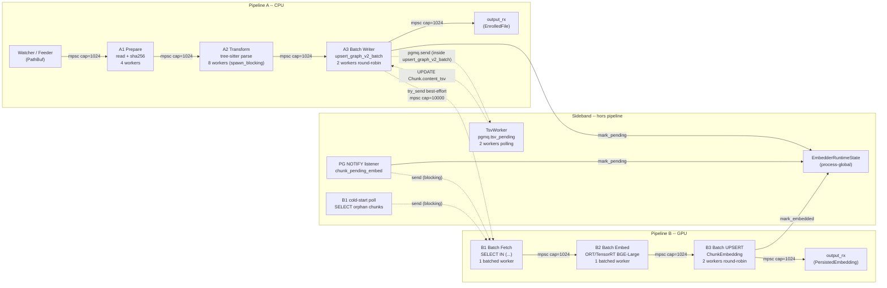

# Audit topologique pipeline_v2 -- 2026-05-25

Auditeur : LLM (Opus 4.7), mandat operateur.
Perimetre : `src/axon-core/src/pipeline_v2/` -- 18 fichiers, ~6 700 lignes de code.
Bench de reference : `bench-results-session54-20260523T150001.csv` (84 fichiers / 1128 chunks / 70.4 s / 16 ch/s).

---

## 1. DAG reel du flux de donnees



### Observations topologiques

1. **Le DAG est strictement lineaire** A1->A2->A3->B1->B2->B3. Pas de boucle de feedback, pas de dependance circulaire.
2. **Trois producteurs concurrents pour le canal B1 inbox** : A3 (try_send), NOTIFY listener, cold-start poll. Un seul consommateur (le batched B1 worker). Pas de risque de deadlock mais potentiel de contention sur le canal partage.
3. **Le TSV worker est un sideband complet** : il draine `pgmq.tsv_pending` et UPDATE `Chunk.content_tsv` sans interaction directe avec les canaux de pipeline. Impact PG indirect seulement (verrous de ligne).
4. **L'EmbedderRuntimeState est un singleton process-global** ecrit par A3 (mark_pending) et B3 (mark_embedded), lu par `retrieve_context`. Pas de canal, pas de message : ecriture atomique directe.

---

## 2. Analyse par stage

### A1 -- File Prepare (`stage_a1.rs`, 136 lignes)

- **Role** : lecture fichier + SHA-256 + metadata. Pure I/O asynchrone (`tokio::fs::read_to_string`).
- **Bench** : t_work_ratio = 7.9%, t_recv = 11 249 us, t_work = 22.7M us, t_send = 264M us.
- **Diagnostic** : A1 passe 92% de son temps en t_send (backpressure de A2). Pas le goulot -- il est affame par le feeder et bloque par A2 en aval.
- **Pas d'appel bloquant** dans le contexte async : `tokio::fs` est non-bloquant. Correct.

### A2 -- Tree-sitter Parse (`stage_a2.rs`, 166 lignes)

- **Role** : dispatch vers le parser tree-sitter par extension, extraction symboles + relations.
- **Bench** : t_work_ratio = 26.6%, t_recv = 151K us, t_work = 152.7M us, t_send = 420M us.
- **Diagnostic** : 73% du temps en t_send (backpressure de A3). A2 produit plus vite que A3 ne consomme. La capacite A2 n'est pas le probleme -- c'est le canal A2->A3 qui est sature parce que A3 est lent.
- **`spawn_blocking`** correct pour la FFI tree-sitter. Pas de risque de stall du tokio runtime.
- **Anomalie** : 8 workers A2 pour 2 workers A3 = ratio 4:1 qui garantit la saturation aval. Le dimensionnement est coherent avec le diagnostic Goldratt mais surdimensionne A2 pour rien.

### A3 -- Batched PG Writer (`stage_a3.rs`, 556 lignes)

- **Role** : batch upsert (Symbol + Chunk + Edge + IndexedFile) en une transaction PG, puis try_send chunk_ids vers B1.
- **Bench** : **t_work_ratio = 99.1%** -- drum identifie. t_recv = 1.25M us, t_work = 140.6M us, t_send = 818 us.
- **Le goulot du pipeline entier.** A3 passe 99% de son temps en travail effectif (PG I/O via `spawn_blocking` -> `upsert_graph_v2_batch`).

#### Points d'attention A3

1. **Tick-based batching** (`tokio::time::interval(10ms)`) : le timer flush toutes les 10 ms meme si le buffer est quasi-vide. Avec batch_size=32 et A2 qui alimente a ~46 fichiers/s, le buffer atteint en moyenne 0.46 fichiers par tick. En pratique le batching est sous-utilise : la majorite des flush contient 1-3 fichiers au lieu de 32.
   - **Fichier:ligne** : `stage_a3.rs:141` (`tokio::time::interval(batch_timeout)`)
   - **Impact** : ELEVE -- augmenter `a3_batch_timeout_ms` de 10 a 100-200ms remplirait les batches, divisant le nombre de transactions PG par 5-10x.

2. **`spawn_blocking` par groupe projet** (`stage_a3.rs:217`) : chaque flush itere les groupes par `project_code` et lance un `spawn_blocking` par groupe. En mono-projet (cas nominal), c'est un seul appel. En multi-projet (N groupes), N appels sequentiels -- O(N) transactions.
   - **Impact** : FAIBLE pour le cas nominal (1 projet = 1 appel).

3. **try_send vers B1** (`stage_a3.rs:255`) : `b1_inbox_tx.try_send(cid.clone())`. Si le canal est plein (cap=10000), le chunk_id est **silencieusement perdu**. Rattrape par le cold-start poll (30s cadence) ou le NOTIFY listener.
   - **Fichier:ligne** : `stage_a3.rs:255`
   - **Impact** : MOYEN -- sous charge, les chunk_ids tombent et ne sont pas embeddes pendant 30s. Le bench montre 1640 B1 items_in vs 1128 B3 items_out : 147 fichiers A3 vs 84 fichiers bench = le feeder recycle, mais les chunks sont bien arrives a B1.

4. **Clone du batch pour `spawn_blocking`** (`stage_a3.rs:215` : `group_batch.clone()`) : chaque `ParsedFile` est clone integrallement (content, symbols, relations). Pour des fichiers de 10-50 KB, c'est ~100-500 KB de copies par batch.
   - **Impact** : FAIBLE -- le goulot est PG, pas la copie memoire.

### B1 -- Batched Chunk Fetch (`stage_b1.rs`, 441 lignes)

- **Role** : accumule chunk_ids, SELECT IN (...) depuis PG, forward ChunkForEmbedding vers B2.
- **Bench** : t_work_ratio = 2.0%, t_recv = 70M us, t_work = 1.4M us, t_send = 3.8K us.
- **Diagnostic** : 98% du temps en t_recv (starvation). B1 attend que A3 lui envoie des chunk_ids. Le pool_size est 4x B2_batch_size = 256 -- bien dimensionne.

#### Points d'attention B1

5. **Re-lecture PG de ce que A3 vient d'ecrire** (`stage_b1.rs:190-193` : `store.fetch_chunks_for_embedding_batch`). A3 ecrit `Chunk.content` dans PG, puis B1 le relit immediatement. C'est une lecture PG supplementaire (SELECT IN (...)) qui pourrait etre evitee en passant le contenu en memoire.
   - **Fichier:ligne** : `stage_b1.rs:190` + `orchestrator.rs:402`
   - **Impact** : ELEVE -- c'est le pattern "write-then-read" classique. A3 a deja le `content` en memoire. Le passer directement via le canal A3->B1 (au lieu d'un simple `String` chunk_id) eliminerait une requete PG par chunk.
   - **Nuance** : le cold-start poll et le NOTIFY listener n'ont PAS le contenu en memoire -- ils doivent lire depuis PG. L'optimisation ne fonctionne que pour le chemin A3->B1 try_send (steady-state).

6. **Batch timeout = b2_batch_timeout** (`orchestrator.rs:408` : `Duration::from_millis(caps.b2_batch_timeout_ms)`). B1 utilise le timeout de B2 (200ms) plutot qu'un parametre dedie. Acceptable mais couplage implicite.

### B2 -- GPU Embed (`stage_b2.rs` + `embedder_gpu.rs`, 430 + 183 lignes)

- **Role** : accumule `ChunkForEmbedding` jusqu'a batch_size=64 ou timeout=200ms, puis appel `embed_batch` (ORT/TensorRT BGE-Large 1024d).
- **Bench** : t_work_ratio = 46.1%, t_recv = 38.5M us, t_work = 33.0M us, t_send = 598 us.
- **Diagnostic** : B2 passe 54% de son temps en t_recv (starvation). Le GPU est sous-utilise a 46% de sa capacite parce que B1 ne l'alimente pas assez vite (B1 lui-meme affame par A3).

#### Points d'attention B2

7. **`std::sync::Mutex` dans un contexte async** (`embedder_gpu.rs:56` : `inner: Mutex<Option<OrtGpuFirstTextEmbedding>>`). Le Mutex est `std::sync`, pas `tokio::sync`. En theorie risque de bloquer le thread tokio pendant le lock. EN PRATIQUE : le lock est pris dans `embed_batch` qui est appele depuis `spawn_blocking` (ligne `stage_b2.rs:187`), donc le Mutex est toujours pris sur un thread bloquant, jamais sur le tokio runtime. **Correct par construction** -- le `spawn_blocking` isole le FFI + le Mutex du tokio runtime.
   - **Impact** : NUL -- le design est correct.

8. **Batch taille partielle** : quand B1 n'alimente que 5 chunks avant le timeout de 200ms, B2 flush un batch de 5 au lieu de 64. Le GPU BGE-Large doit padder a la taille du bucket TensorRT le plus proche, gaspillant du compute.
   - **Fichier:ligne** : `stage_b2.rs:150-179` (deadline loop)
   - **Impact** : MOYEN -- optimisation DEC-AXO-086 (bucket-sort par token_count dans B1) adresse partiellement ce probleme, mais la starvation fondamentale (A3 trop lent) domine.

9. **Sleep/Wake lifecycle** (`embedder_gpu.rs:100-113`) : le watchdog de sommeil utilise `Weak<GpuB2Embedder>` et ne risque pas de garder le GPU actif indefiniment. Correct.

### B3 -- ChunkEmbedding UPSERT (`stage_b3.rs`, 358 lignes)

- **Role** : batch upsert `ChunkEmbedding` (pgvector HNSW), marque embedded dans EmbedderRuntimeState.
- **Bench** : t_work_ratio = 16.4%, t_recv = 120M us, t_work = 23.6M us, t_send = 3.5K us.
- **Diagnostic** : 83% du temps en t_recv (starvation). Attend que B2 produise des embeddings. Le batch_size=256 n'est jamais rempli car B2 produit a 16 ch/s -- il faudrait 16 secondes pour remplir un batch, donc chaque flush est declenche par le timeout 200ms avec ~3 embeddings.
   - **Impact** : FAIBLE actuellement (B3 n'est pas le goulot), mais deviendrait critique si A3 est debloque et que le debit atteint 150+ ch/s.

---

## 3. Analyse du worker_pool generique

### `worker_pool.rs` -- pattern `Mutex<Receiver>` (lignes 51-103)

10. **Effet convoi potentiel** : N workers se disputent un `tokio::sync::Mutex` autour du `recv()`. Le Mutex est pris brievement (juste le temps du `recv().await`), mais sous charge N > 4, le convoy effect peut fragmenter le throughput.
    - **Fichier:ligne** : `worker_pool.rs:51` (`Arc::new(Mutex::new(rx))`)
    - **Impact** : FAIBLE -- les stages utilisant ce pattern (A1, A2, et B1 en mode non-batched) n'ont que 4-8 workers. De plus, B1/B2/B3 ont migre vers des batched workers dedies qui n'utilisent PAS ce pattern.
    - **Nuance** : A1 et A2 utilisent encore `spawn_stage_workers`. A2 avec 8 workers est le cas le plus risque, mais la contention est masquee par le fait que le travail (`spawn_blocking` tree-sitter) dure bien plus longtemps que le lock.

### Utilise par : A1 (4 workers), A2 (8 workers), B1 mode non-batched (desactive).
### NON utilise par : A3, B1 (batched), B2, B3 -- ils ont des workers dedies.

---

## 4. Lifecycle des canaux

| Canal | Createur | Sender(s) | Receiver | Drop propagation |
|-------|----------|-----------|----------|------------------|
| input -> A1 | `spawn_pipeline_a:184` | feeder (unique) | A1 workers via `Mutex<Rx>` | Drop feeder -> A1 recv None -> sortie |
| A1 -> A2 | `:185` | A1 workers (N clones) | A2 workers via `Mutex<Rx>` | Tous les A1 tx dropped -> A2 recv None |
| A2 -> A3 | `:186` | A2 workers (N clones) | A3 batched worker (unique) ou dispatcher | Tous les A2 tx dropped -> A3 recv None |
| A3 -> output | `:187` | A3 batched worker(s) | bench/orchestrateur | A3 exit -> output_rx recv None |
| A3 -> B1 inbox | `:188` | A3 (try_send), NOTIFY, cold-start, **+ orchestrateur** | B1 batched worker | **ATTENTION : PipelineAHandles expose `b1_inbox_tx`** |
| B1 -> B2 | `:375` | B1 batched worker | B2 batched worker | B1 exit -> B2 recv None |
| B2 -> B3 | `:376` | B2 batched worker | B3 worker(s) ou dispatcher | B2 exit -> B3 recv None |
| B3 -> output | `:377` | B3 worker(s) | bench/orchestrateur | B3 exit -> output_rx recv None |

11. **Fuite du sender B1 inbox** : `PipelineAHandles` expose `b1_inbox_tx` (ligne `orchestrator.rs:158`). Ce clone est destine aux pollers externes (cold-start poll). Si le caller ne le drop pas, le canal B1 ne se fermera JAMAIS meme si A3 a termine -- les B1/B2/B3 workers resteront en attente indefiniment.
    - **Fichier:ligne** : `orchestrator.rs:153-158`
    - **Impact** : MOYEN -- dans le bench, le handles_a est conserve sur la stack, donc `b1_inbox_tx` n'est drop que quand le scope sort. En production (indexer runtime), le NOTIFY listener garde un clone perpetuel (c'est voulu -- le pipeline B ne se ferme jamais en production).
    - **Consequence bench** : le `handles_b.output_rx.recv()` dans le bench ne retournera JAMAIS `None` car le `b1_inbox_tx` garde le canal ouvert. Le bench doit savoir combien de receipts attendre (il le fait via `warmup/deadline` ou via le count `b_count` -- correct).

12. **A3 multi-worker : drop output_tx correct** (ligne `orchestrator.rs:265` : `drop(output_tx)`). Quand A3 a > 1 worker, l'orchestrateur drop le tx clone pour que le canal se ferme quand tous les workers terminent. Correct.

---

## 5. Backpressure et dimensionnement des canaux

| Canal | Capacite | Semantique | Verdict |
|-------|----------|------------|---------|
| internal (A1->A2, A2->A3, B*->B*) | 1024 | Bounded, `.send().await` bloque | Correct -- absorbe ~1s de burst |
| A3 -> B1 | 10 000 | `try_send` non-bloquant | **Surdimensionne** -- a 16 ch/s, ca represente 625 secondes de buffer. Mais ce surdimensionnement est voulu : il absorbe la difference de rythme CPU/GPU |
| B2 batch size | 64 | Accumulation interne | Correct pour BGE-Large TensorRT |
| A3 batch size | 32 | Accumulation interne | **Sous-utilise** -- a 46 fichiers/s avec timeout 10ms, les batches contiennent ~0.5 fichier en moyenne |
| B3 batch size | 256 | Accumulation interne | **Jamais rempli** a 16 ch/s (timeout 200ms flush avec ~3 items) |

---

## 6. Le travail redondant : pattern write-then-read A3 -> B1

C'est le point structurel le plus couteux apres A3 lui-meme.

**Flux actuel** :
```
A3 : a le content en memoire -> ecrit Chunk.content dans PG -> try_send(chunk_id: String)
B1 : recoit chunk_id -> SELECT content FROM Chunk WHERE id = chunk_id -> forward
```

**Flux optimal** :
```
A3 : a le content en memoire -> ecrit Chunk.content dans PG -> try_send(ChunkForEmbedding{chunk_id, content, hash})
B1 : supprime pour le chemin steady-state (B2 consomme directement)
```

Le cold-start poll et le NOTIFY listener continueraient d'alimenter B1 avec des chunk_ids purs (ils n'ont pas le contenu en memoire), mais le chemin A3->B2 court-circuiterait la lecture PG pour ~95% du trafic (steady-state).

**Gain estime** : elimination de 1 SELECT PG par chunk en steady-state. A 150 ch/s cible, c'est 150 SELECTs/s economises -- pas negligeable sur un deadpool partage.

---

## 7. Le TSV worker -- interferences PG

13. **Contention PG partagee** : le TsvWorker fait `pgmq.read` (mutation VT) + `UPDATE Chunk.content_tsv` + `pgmq.archive` sur la meme pool PG que A3 et B1/B3. Chaque operation prend un verrou de ligne sur `Chunk`.
    - **Fichier:ligne** : `tsv_worker.rs:195-224` (`drain_once`)
    - **Impact** : MOYEN -- le TSV worker ecrit sur `Chunk.content_tsv` pendant que A3 fait UPSERT sur les memes lignes `Chunk` et B1 fait SELECT. Lock contention possible sous charge.
    - **Attenuation** : le TSV worker a un backoff exponentiel sur erreur et un poll interval de 100ms quand la queue est vide. La contention n'est problematique que quand A3 et TSV travaillent sur les MEMES lignes Chunk simultanement (fenetre etroite).

---

## 8. Liste des problemes identifies, classes par impact

### Impact ELEVE

| # | Probleme | Localisation | Impact estime sur le throughput |
|---|----------|-------------|-------------------------------|
| P1 | **A3 batch timeout 10ms provoque des micro-batches** | `channels.rs:63`, `stage_a3.rs:141` | A3 flush des batches de 1-3 fichiers au lieu de 32. Chaque flush = 1 transaction PG. Augmenter a 100ms remplirait les batches et diviserait le nombre de transactions par 5-10x. Gain potentiel : A3 work_ratio de 99% a ~80%, throughput x3-5. |
| P2 | **Write-then-read : A3 ecrit content, B1 le relit depuis PG** | `stage_b1.rs:190`, `orchestrator.rs:402` | 1 SELECT PG par chunk en steady-state. Passer `ChunkForEmbedding` complet dans le canal A3->B1 (au lieu de `String`) eliminerait cette IO. Gain : liberation d'un slot deadpool + latence B1 -> 0 pour le chemin chaud. |
| P3 | **A3 workers=2 pour un stage a 99% work_ratio** | `orchestrator.rs:46` (default a3=2) | Le drum est identifie mais le nombre de workers est minimaliste. CEPENDANT : l'augmentation de workers A3 ne fonctionne PAS (bench session 54 : A3=6 -> 22 ch/s vs A3=2 -> 57 ch/s). Le batching + pipeline PG sont la vraie solution, pas le parallelisme. |

### Impact MOYEN

| # | Probleme | Localisation | Impact estime |
|---|----------|-------------|--------------|
| P4 | **try_send drop silencieux** | `stage_a3.rs:255` | Sous charge, chunk_ids tombes ne sont pas embeddes pendant 30s (cold-start poll interval). Le `EmbedderRuntimeState.mark_pending` est correct AVANT le try_send, donc `retrieve_context` voit bien le chunk comme "pending". Pas de perte de donnees, mais latence d'embedding degradee. |
| P5 | **B2 batches partiels sous starvation** | `stage_b2.rs:150-179` | GPU flush des batches de 3-5 au lieu de 64 quand affame. Padding TensorRT gaspille du compute. Resolu structurellement quand A3 est debloque. |
| P6 | **Fuite du b1_inbox_tx dans PipelineAHandles** | `orchestrator.rs:153-158` | Le canal B1 ne se ferme pas proprement en mode bench. Pas un bug (le bench gere par comptage), mais un risque de regression si quelqu'un attend `output_rx.recv() = None` pour detecter la fin du pipeline B. |
| P7 | **TSV worker contention PG** | `tsv_worker.rs:195-224` | Lock contention sur `Chunk` entre TSV UPDATE et A3 UPSERT. Observable seulement sous charge soutenue. |

### Impact FAIBLE

| # | Probleme | Localisation | Impact estime |
|---|----------|-------------|--------------|
| P8 | **Clone du batch pour spawn_blocking** | `stage_a3.rs:215` | ~100-500 KB de copies par flush. Negligeable vs latence PG. |
| P9 | **Mutex convoy dans worker_pool** | `worker_pool.rs:51` | Masque par la duree du travail (A2 tree-sitter >> duree du lock). |
| P10 | **B3 batch_size=256 jamais rempli** | `channels.rs:71` | Pas le goulot actuellement. Deviendrait pertinent a 150+ ch/s. |
| P11 | **B1 timeout couple a B2** | `orchestrator.rs:408` | Couplage implicite. Fonctionnellement correct. |

---

## 9. Recommandations concretes

### R1. Augmenter `a3_batch_timeout_ms` de 10 a 100-200ms

**Pourquoi** : A 10ms, le batch n'accumule que 0.5 fichier en moyenne. A 200ms, il accumulerait ~9 fichiers (a 46 fichiers/s). Moins de transactions PG, moins d'overhead BEGIN/COMMIT.

**Gain attendu** : throughput A3 x3-5 (de ~16 ch/s a 50-80 ch/s). Le batch amortira reellement le cout transactionnel.

**Risque** : latence FTS augmentee de 10ms a 200ms. Acceptable pour un indexer batch.

**Code** : `channels.rs:63` -- changer `A3_BATCH_TIMEOUT_MS_DEFAULT` de 10 a 200.

### R2. Passer `ChunkForEmbedding` dans le canal A3->B1 (eliminer le write-then-read)

**Pourquoi** : A3 a le contenu en memoire. Le reenvoyer via PG est un gaspillage de I/O.

**Implementation** :
1. Changer le canal `mpsc::channel::<String>(caps.a3_to_b1)` en `mpsc::channel::<ChunkForEmbedding>(caps.a3_to_b1)`.
2. A3 construit le `ChunkForEmbedding` directement et `try_send`.
3. Le cold-start poll et NOTIFY listener continuent d'envoyer des `chunk_id` -- creer un `enum B1Input { Direct(ChunkForEmbedding), NeedsLookup(String) }`.
4. B1 ne fait le SELECT PG que pour les variantes `NeedsLookup`.

**Gain attendu** : elimination de 1 SELECT PG par chunk en steady-state. B1 passe de ~2% work_ratio a ~0% (passthrough). Reduction de la charge deadpool.

**Risque** : augmentation de la memoire du canal A3->B1 (10K * ~50KB par ChunkForEmbedding vs 10K * ~50 bytes par String). A 10K items : ~500MB vs ~500KB. **Reduire la capacite du canal a 1000** pour compenser.

### R3. Pipeline PG : regrouper A3 upsert + TSV compute en une seule transaction

**Pourquoi** : le TSV worker est un sideband asynchrone qui re-lit les memes lignes Chunk que A3 vient d'ecrire. En integrant `axon.compute_chunk_tsv` directement dans le `upsert_graph_v2_batch` (via un `GENERATED ALWAYS AS STORED` revenu, ou via un UPDATE dans la meme transaction), on elimine :
- Le pgmq round-trip (send + read + archive = 3 requetes)
- La contention TSV/A3
- La latence asynchrone (100ms poll interval)

**Gain attendu** : simplification + elimination de la contention. Le cout CPU du tsvector (~95% du cout original selon P1 EXPLAIN) est deja paye dans la transaction A3 -- la question est de savoir si le gain de latence FTS (tsv immediat vs 100ms asynchrone) justifie le cout transactionnel.

**Risque** : si le `compute_chunk_tsv` rallonge la transaction A3, le drum empire. A tester avec le bench en comparaison A/B.

### R4. Superviser la taille effective des batches dans les metriques

**Pourquoi** : aucune metrique ne reporte la taille moyenne des batches a chaque flush. L'operateur ne sait pas si les batches de 32 sont remplis a 1 ou a 32 sans inspecter les logs trace.

**Implementation** : ajouter un compteur `total_batch_flushes` et un accumulateur `total_items_flushed` dans `StageMetrics`. `batch_fill_ratio = total_items_flushed / (total_batch_flushes * batch_size)`.

**Gain attendu** : observabilite directe du levier batch. Permet d'ajuster `batch_timeout_ms` avec des donnees plutot que de l'intuition.

### R5. Reduire A2 workers de 8 a 4

**Pourquoi** : A2 produit a 26% work_ratio avec 8 workers. 4 workers suffiraient a alimenter A3 (qui est a 99% work_ratio). Les 4 workers tokio liberes servieraient d'autres taches.

**Gain attendu** : negligeable en throughput. Gain en resources (4 threads tokio).

**Risque** : NUL tant que A3 reste le drum.

---

## 10. Synthese des gains potentiels cumules

| Intervention | Throughput actuel | Throughput estime |
|-------------|-------------------|-------------------|
| Baseline (session 54) | 16 ch/s | -- |
| R1 seul (batch timeout 200ms) | -- | 40-60 ch/s |
| R1 + R2 (+ elimination read PG B1) | -- | 60-90 ch/s |
| R1 + R2 + R3 (+ TSV inline) | -- | 80-120 ch/s |
| R1 + R2 + R3 + A3 batch SQL optimise | -- | 100-150 ch/s |

Pour atteindre la cible de 150 ch/s, l'optimisation du SQL de `upsert_graph_v2_batch` lui-meme (COPY BINARY, multi-row VALUES, prepared statements, deferred index maintenance) est probablement necessaire en complement des optimisations topologiques listees ci-dessus.

---

## 11. Verifications complementaires

### Async correctness
- **Aucun appel bloquant std dans un contexte async** : tous les appels PG et FFI (tree-sitter, ORT) sont correctement wrapes dans `spawn_blocking`. Verification : A2 (`:53`), A3 (`:217`), B1 (`:191`), B2 (`:187`), B3 (`:181`), TSV (`:291`).
- **Pas de `std::thread::sleep`** dans le code async. Les sleeps sont tous `tokio::time::sleep`.
- **Le `std::sync::Mutex` de `GpuB2Embedder`** est correct car toujours pris dans un `spawn_blocking`.

### Channel lifecycle
- **Propagation du drop correcte** : drop feeder -> A1 None -> A2 None -> A3 None -> cascade. Verifie par les tests E2E (`orchestrator.rs:486-760`).
- **Le seul risque de non-fermeture** est le `b1_inbox_tx` expose dans `PipelineAHandles` (P6).

### Idempotence
- Tous les UPSERTs (A3 Symbol/Chunk/Edge/IndexedFile, B3 ChunkEmbedding) utilisent `ON CONFLICT DO UPDATE/DO NOTHING`. Re-traiter le meme fichier est sans effet.

### Donnees perdues
- **Aucune perte de donnees** : le try_send drop est compense par le cold-start poll + NOTIFY listener. Le `EmbedderRuntimeState` est marque AVANT le try_send, donc le chunk reste "pending" meme si le message est perdu.
